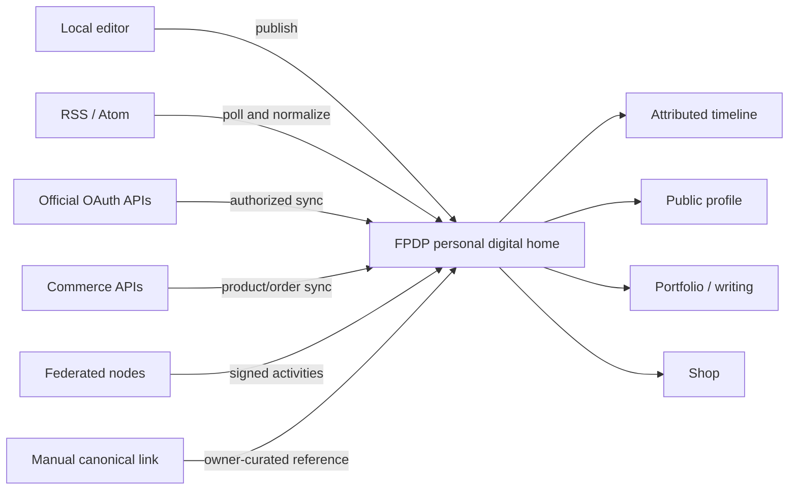
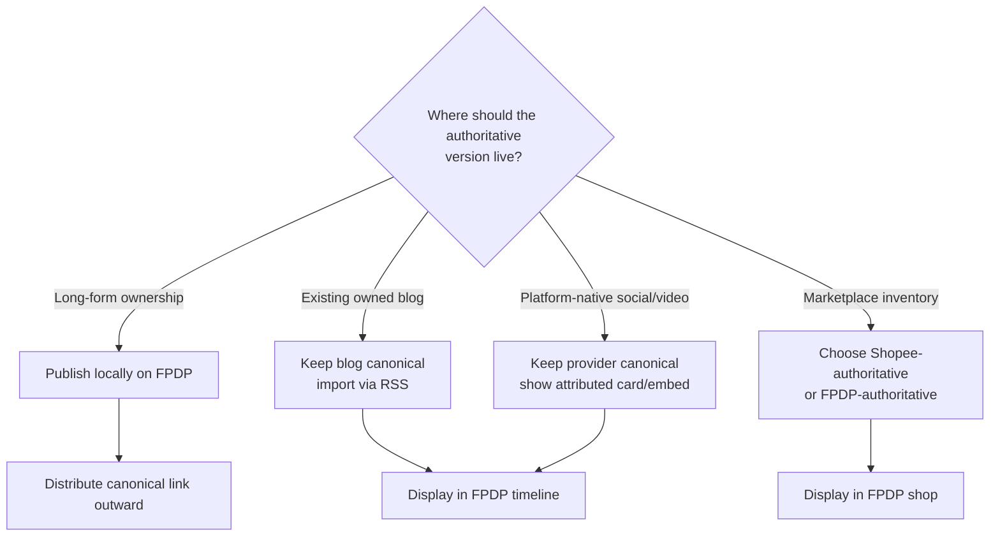
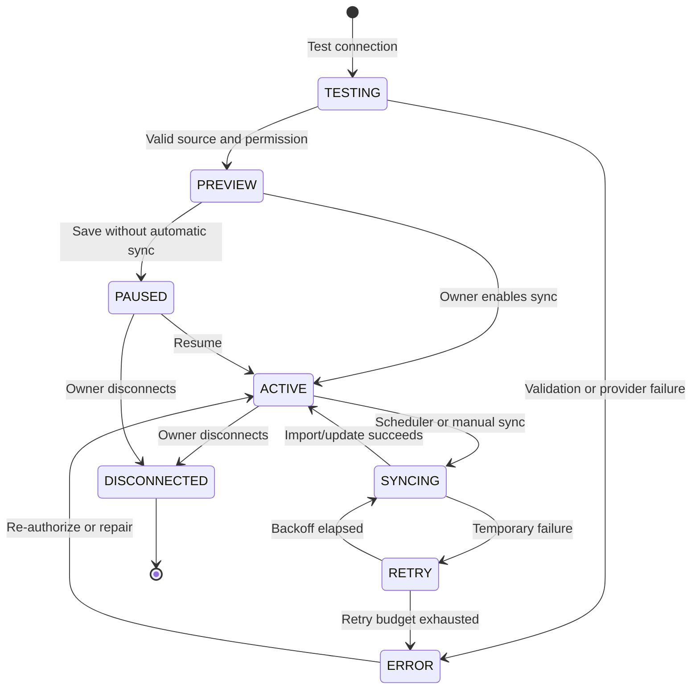

# Getting the Most from FPDP: Social Content Publishing and Aggregation Guide

## 1. Purpose

This guide explains how an FPDP owner can make their personal digital home useful by bringing together content they already own or manage across Facebook, LinkedIn, X, Threads, TikTok, Shopee, Instagram, blogs, newsletters, video platforms, marketplaces, and other services.

The goal is not to disguise copied content as local content. The goal is to create one coherent, user-controlled presentation while preserving:

- original author and account;
- origin platform or node;
- canonical source URL;
- original publication time;
- media and usage rights;
- update/deletion state;
- the distinction between local, external, and federated content.

Platform capabilities and permissions change frequently. The platform-specific guidance in this document reflects official developer documentation reviewed on **19 September 2026** and must be re-verified before implementation or production approval.

## 2. The recommended content model

FPDP should display three clearly different content classes:

| Content class | Created where? | Authoritative source | FPDP behavior |
|---|---|---|---|
| Local | FPDP node | User's FPDP domain | Store and publish complete local object |
| External | Social platform, blog, marketplace, or API | External canonical URL | Normalize and present with permanent attribution |
| Federated | Another independent node | Remote node/object URI | Receive signed activity and preserve remote identity |



## 3. What “publish on FPDP” can mean

Not every provider permits or technically supports the same kind of copying. FPDP should offer explicit publication modes:

| Mode | Stored by FPDP | Best use | Requirement |
|---|---|---|---|
| Canonical card | Title, image if permitted, short description, source link | Restricted APIs or owner-curated links | Reliable canonical URL and permitted metadata |
| Excerpt | Metadata plus a short excerpt | Articles and posts where API/terms allow | Attribution and content-use permission |
| Embed | Provider embed reference/code | Video and rich social content | Official embed capability and visitor privacy notice |
| Full authorized mirror | Normalized full text/media reference | User-owned content where API/rights allow copying | Explicit owner choice, API permission, retention support |
| Local republication | New local FPDP post with source disclosure | Owner intentionally republishes their own work | Owner confirms rights; canonical strategy selected |
| Commerce listing | Product snapshot linked to external or local checkout | Shopee or other marketplaces | Commerce adapter and clear seller/origin identity |

Default to the least invasive mode supported by the provider. A full mirror must not be the silent default.

## 4. User setup: the best way to start

### Step 1 — Establish the personal home

Before connecting social accounts, the owner should:

1. configure the primary domain;
2. complete the public profile and contact links;
3. choose a default language and timezone;
4. publish at least one local introduction or portfolio post;
5. choose default visibility for imported content;
6. decide which domain will hold canonical versions of future long-form content.

This ensures the node remains useful even when every external connector is unavailable.

### Step 2 — Inventory existing sources

Create a simple source inventory:

| Source | Account type | Content to show | Preferred method | Canonical owner |
|---|---|---|---|---|
| Personal blog | Owned domain | Articles | RSS/Atom | Personal blog or FPDP, choose one |
| Instagram | Business/Creator | Selected media | Official API | Instagram permalink |
| LinkedIn | Member/company | Professional posts | API only if approved; otherwise canonical cards | LinkedIn post |
| TikTok | User account | Public videos | Login Kit + Display API | TikTok video |
| Shopee | Authorized seller shop | Products | Open Platform commerce API | Shopee product or local product, choose per listing |

Do not connect every account merely because it is available. Add sources that improve the public profile's purpose.

### Step 3 — Connect and review consent

From **Dashboard → Integrations → Connect source**:

1. select the provider;
2. read account-type and approval requirements;
3. review requested scopes and intended data use;
4. continue to the provider's authorization page;
5. confirm that the returned account is the intended account/Page/shop;
6. select the content type and publication mode;
7. preview normalized items before saving;
8. select visibility, backfill window, and synchronization frequency;
9. explicitly enable the connection.

FPDP must never ask users to paste their platform password. Authorization must use an official provider flow or a user-controlled feed/API credential.

### Step 4 — Curate the first import

The owner should be able to:

- include or exclude content types;
- select individual items during the first import;
- set a maximum historical backfill;
- hide duplicate cross-posts;
- choose timeline/profile/portfolio/shop placement;
- preview attribution and canonical links;
- save the source as paused before enabling automatic sync.

### Step 5 — Monitor and maintain

Use the integration health screen to review:

- connection status and granted scopes;
- last and next synchronization time;
- imported, skipped, updated, and failed item counts;
- token expiry or re-authorization requirement;
- rate-limit or provider outage state;
- disconnect and retention options.

## 5. Recommended method by platform

No supported first-party account RSS feed was found for the seven named social/commerce platforms. Do not construct unofficial RSS URLs or scrape public HTML. Use the official API where available, or a safe fallback.

YouTube is the exception: every public channel exposes an official Atom feed (`youtube.com/feeds/videos.xml?channel_id=...`) with no OAuth required, so it can use the RSS/Atom connector FPDP already has. See [6.8 YouTube](#68-youtube).

| Platform | Best FPDP method | What can appear on FPDP | Important limitation | Safe fallback |
|---|---|---|---|---|
| Facebook | Facebook Login/Graph API for approved Page use | Page profile and approved Page content | Login token alone does not guarantee Page-post access; review and Page roles apply | Owner-curated canonical cards or official embeds |
| LinkedIn | OIDC for login; approved Posts API for content | Profile identity; approved member/company posts | Reading member posts requires restricted permission such as `r_member_social` | Manual canonical cards; publish long form locally first |
| TikTok | Login Kit + Display API | Authorized profile and public video list | Scopes such as `video.list` and app approval apply | Official embeds or canonical video cards |
| Shopee | Open Platform shop authorization | Product listings and selected commerce status | Seller/shop authorization, not general social login; varies by market/partner access | Manual product card linked to Shopee |
| Instagram | Instagram API with Instagram Login | Eligible professional profile and media | Designed around supported Business/Creator use cases and reviewed permissions | Official embeds or curated permalink cards |
| X | OAuth 2.0 PKCE/API v2 where supported | Authorized user identity and posts | API access, pricing, scopes, and rate limits apply | Canonical post cards or official embeds |
| Threads | Threads API authorization | Authorized profile and threads; publishing if approved | Separate Threads permissions/token flow; App Review applies | Curated permalink cards or official embeds |
| YouTube | Official channel Atom feed via the RSS/Atom connector (no OAuth); optional Data API v3 for extra metadata | Public videos from the channel/playlist the owner registers | The feed only lists the latest public uploads; private, unlisted, and age-restricted videos never appear; Data API v3 is quota-limited | Owner manually pastes one YouTube URL as a single embed |

See the detailed [social and commerce integration guide](SOCIAL-COMMERCE-INTEGRATIONS.en.md) for authorization architecture and official references.

## 6. Platform playbooks

### 6.1 Facebook

Best for FPDP: connect a Page the owner manages, not arbitrary personal-profile scraping.

```text
Connect Facebook Page → authorize requested permissions
→ select an eligible Page → preview permitted Page content
→ choose card/excerpt mode → synchronize with canonical Facebook URLs
```

Use separate connections for Facebook identity login and Page-content import. If permission approval is unavailable, let the owner add selected canonical links or supported embeds rather than promising automatic sync.

### 6.2 LinkedIn

Best for FPDP: use OIDC only for account login/linking; treat post import as a separately approved capability.

```text
Connect LinkedIn → sign in with OIDC
→ show identity connection as successful
→ check whether FPDP app has approved post-read permission
→ if approved, select member/organization and sync
→ otherwise enable canonical-card workflow
```

For reliable ownership, publish full articles locally on FPDP or an owned blog, then share their canonical URLs to LinkedIn. This reduces dependence on restricted read permissions.

### 6.3 TikTok

Best for FPDP: show video cards or embeds from the authorized user's public video list.

```text
Connect TikTok → Login Kit consent
→ request basic profile + approved video-list scope
→ preview videos → choose cards or embeds
→ sync new videos with TikTok canonical URLs
```

Do not download and re-host video files unless the API, platform terms, and owner's rights explicitly permit it. Provider-hosted media URLs may expire; store stable IDs and refresh metadata.

### 6.4 Shopee

Best for FPDP: treat Shopee as commerce, not a social timeline source.

```text
Connect Shopee shop → seller authorizes shop
→ fetch permitted product catalog
→ map categories, price, stock, images, and canonical listing
→ owner chooses external checkout or a separately managed local product
→ monitor authorization and product sync health
```

Avoid creating two sources of truth for inventory. For every product, explicitly select one model:

- **Shopee-authoritative:** FPDP displays a synchronized snapshot and links to Shopee checkout.
- **FPDP-authoritative:** FPDP owns product/order state; Shopee is a distribution channel handled by a future two-way commerce adapter.

### 6.5 Instagram

Best for FPDP: connect an eligible professional account and present selected media with permalink attribution.

```text
Connect Instagram → professional-account authorization
→ confirm profile → preview media
→ choose media types and destination section
→ publish attributed cards/grid → synchronize updates
```

Use a portfolio/grid placement for visual media instead of flooding the main timeline. Do not treat a short-lived media URL as the canonical identifier; persist the provider media ID and permalink.

### 6.6 X

Best for FPDP: import selected posts through the official API with controlled frequency.

```text
Connect X → OAuth 2.0 PKCE
→ identify authorized user → preview recent posts
→ filter replies/reposts if desired
→ sync with cursor, rate-limit, and cost controls
```

Let owners exclude replies, reposts, or low-context posts. Show current API usage/cost assumptions in the integration settings. If API access is not viable, use selected canonical links or supported embeds.

### 6.7 Threads

Best for FPDP: use a separate Threads connector and preserve each thread's permalink.

```text
Connect Threads → Threads authorization
→ retrieve profile and permitted threads
→ preview and select publication mode
→ sync with THREADS provider identity
```

Do not assume an Instagram token is valid for Threads. Store provider connections separately even if both are operated by Meta.

### 6.8 YouTube

Best for FPDP: connect the owner's public YouTube channel through its official Atom feed, then render each video as a privacy-enhanced embed on the public profile — not just a canonical link.

```text
Connect YouTube → Dashboard → Integrations → Connect a source → choose RSS/Atom
→ set source_url = https://www.youtube.com/feeds/videos.xml?channel_id=UCxxxxxxxx
→ preview the channel's latest videos → choose destination Video/Portfolio
→ periodic sync picks up new public uploads
```

How it works:

1. Every public YouTube channel and playlist has an official Atom feed that needs no API key or OAuth: `https://www.youtube.com/feeds/videos.xml?channel_id=CHANNEL_ID` (or `?playlist_id=PLAYLIST_ID`). Owners can find their `channel_id` on their channel's **About** page.
2. FPDP's existing `ATOM` connector (`App\Services\External\AtomConnector`) parses this feed. Each YouTube `<entry>` carries a `<yt:videoId>` element and a thumbnail inside `<media:group>`; the connector reads both directly instead of guessing a video ID from text.
3. The video ID is normalized into an embed descriptor by `App\Services\External\YouTubeEmbedResolver` and stored in `media_json` as:
   ```json
   {
     "type": "VIDEO",
     "provider": "YOUTUBE",
     "video_id": "jNQXAC9IVRw",
     "embed_url": "https://www.youtube-nocookie.com/embed/jNQXAC9IVRw",
     "thumbnail_url": "https://i.ytimg.com/vi/jNQXAC9IVRw/hqdefault.jpg"
   }
   ```
   Items with a video embed are tagged `post_type = MEDIA`; plain Atom entries without a video stay `ARTICLE`.
4. The public profile renders `embed_url` as an `<iframe>` inside an `aspect-ratio: 16/9` container, using the privacy-enhanced `youtube-nocookie.com` domain (not `youtube.com`) so a visitor who never plays the video isn't immediately profiled by YouTube, and `loading="lazy"` so the iframe doesn't load before the visitor scrolls to the Video section. See it working in the [mockup public profile's "Video" section](mockup/public-profile.html#video) and the [mockup navigation map](mockup/NAVIGATION-MAP.en.md).
5. Owners can also paste a single YouTube URL manually (without connecting a whole channel) for a one-off video; use the **Embed** publication mode from the table in Section 3 and store it as one `external_post` with `source_provider = YOUTUBE`.

Limitations owners should know about:

- The channel feed only lists the latest public uploads (typically the most recent ~15 items); private, unlisted, and age-restricted videos never appear.
- Never download or re-host the video file; FPDP stores only the video ID, title, canonical URL, and thumbnail. Playback still happens on YouTube's own infrastructure through the iframe.
- For advanced needs (view counts, captions, or pulling videos from several channels in one request), use the YouTube Data API v3 with an API key and respect its daily quota; this is optional and not required for basic embeds.
- Always keep `canonical_url` pointing at the original YouTube watch page so creator attribution stays visible next to the embed.

### 6.9 Blogs, podcasts, video channels, newsletters, and “etc.”

Use this priority order for any additional provider:

1. user-controlled RSS or Atom feed;
2. documented official API with delegated authorization;
3. documented public API that does not require user secrets;
4. official embed;
5. owner-curated canonical link/card;
6. file import/export supported by the provider and initiated by the owner.

Scraping and credential sharing are not supported integration methods.

## 7. Source-of-truth strategy

For every content category, the owner should choose one authoritative source:



Recommended strategy:

- publish durable long-form content locally first;
- distribute its canonical FPDP URL to social platforms;
- aggregate platform-native short content back as attributed cards;
- keep videos on the authorized provider when re-hosting is not allowed;
- select one inventory authority for each commerce listing.

## 8. Normalization contract

Every imported item should map to a provider-independent record:

```json
{
  "source_type": "EXTERNAL",
  "source_provider": "INSTAGRAM",
  "external_account_id": "provider-account-id",
  "external_post_id": "provider-item-id",
  "author": {
    "display_name": "Maya",
    "profile_url": "https://provider.example/maya"
  },
  "post_type": "MEDIA",
  "title": null,
  "content": "Provider-supplied caption or permitted excerpt",
  "media": [],
  "canonical_url": "https://provider.example/item/123",
  "published_at": "2026-09-19T02:30:00Z",
  "fetched_at": "2026-09-19T03:00:00Z",
  "visibility": "PUBLIC",
  "status": "ACTIVE"
}
```

Provider raw payloads should be retained only when necessary, sanitized, encrypted where sensitive, and deleted according to a documented retention period.

## 9. Deduplication and cross-post handling

The same content may appear on a blog, LinkedIn, Facebook, X, and Threads. FPDP should not show five indistinguishable copies by default.

Use layered deduplication:

1. exact provider key: `(provider, external_account_id, external_post_id)`;
2. exact canonical URL;
3. declared cross-post relationship selected by the owner;
4. normalized URL and content hash as a suggestion, never an irreversible automatic merge;
5. manual “group as cross-posts” control.

Grouped content should retain every source link while selecting one primary presentation.

## 10. Sync lifecycle



On every sync:

1. lock the source so only one worker processes it;
2. refresh credentials if required;
3. fetch with cursor/since marker and provider limits;
4. normalize and validate records;
5. deduplicate before insertion;
6. update existing content when the source changed;
7. apply deletions/tombstones according to provider signals and retention policy;
8. commit content and cursor atomically;
9. update health metrics without logging tokens or sensitive payloads.

## 11. User controls required in the dashboard

Each connected source needs:

- provider and connected account identity;
- connection and token status;
- granted scopes;
- publication mode;
- destination: timeline, profile, portfolio, writing, or shop;
- default visibility;
- content-type filters;
- sync frequency and backfill limit;
- last sync, next sync, imported/skipped/error counts;
- preview, manual sync, pause, reconnect, and disconnect actions;
- retention choice on disconnect;
- canonical-link and attribution preview.

## 12. Inbound aggregation vs outbound cross-publishing

These are separate capabilities:

```text
Inbound aggregation
External platform → FPDP

Outbound cross-publishing
FPDP local post → External platform
```

A read permission does not grant write permission. Outbound publishing requires provider-specific write scopes, additional review, media-upload rules, retry semantics, and user confirmation.

Recommended outbound workflow:

1. publish the canonical local post on FPDP;
2. choose destination platforms;
3. preview platform-specific text/media adaptations;
4. publish only after explicit confirmation;
5. store returned external IDs and URLs;
6. never auto-delete external posts when the local item changes without clear user policy.

Outbound cross-publishing should be a later feature. Reliable inbound attribution and local publishing come first.

## 13. Privacy, rights, and safety

- Import only content owned by or explicitly authorized to the connected user.
- Do not import private/friends-only content into a public timeline.
- Preserve source visibility where it can be represented; otherwise reject the import.
- Do not download/re-host media unless rights and provider terms allow it.
- Sanitize external HTML and never execute provider-supplied scripts.
- Fetch remote URLs through an SSRF-protected client with time and size limits.
- Encrypt tokens and credentials at rest.
- Provide data export, disconnect, and deletion controls.
- Respect provider deletion, revocation, and deauthorization events.
- Clearly disclose third-party embeds because they may contact the provider when viewed.

## 14. Failure and fallback behavior

| Situation | FPDP behavior |
|---|---|
| Provider approval unavailable | Mark automatic sync unavailable; offer canonical cards or approved embeds |
| Token expired | Pause sync and request re-authorization |
| Rate limit reached | Back off until reset; keep existing content visible with stale-state indicator if needed |
| API pricing is not viable | Lower frequency, owner-triggered sync, or canonical-card mode |
| Provider item deleted | Remove, tombstone, or mark unavailable according to policy |
| Media URL expired | Refresh metadata; do not treat temporary URL as canonical |
| Permission revoked | Stop jobs immediately and apply retention choice |
| Duplicate cross-post found | Suggest grouping; do not silently erase provenance |
| Provider unavailable | Local profile and local content continue to operate |

## 15. Recommended implementation order

1. Complete local profile and local post publishing.
2. Productionize RSS/Atom with safe HTTP fetching, persistence, preview, and deduplication.
3. Implement generic OAuth state, PKCE, encrypted token storage, refresh, and disconnect lifecycle.
4. Add normalized external-account and external-post repositories.
5. Implement one approved social connector end-to-end.
6. Add attribution UI, content placement, grouping, and health monitoring.
7. Add Shopee only after products/orders and `CommerceProviderInterface` exist.
8. Add more providers through the same certification checklist.
9. Implement outbound cross-publishing only after inbound behavior is reliable.

## 16. Connector certification checklist

Before exposing any connector to users, verify:

- official API or feed is documented and permitted;
- supported account types and markets are clear;
- required scopes and review status are recorded;
- authorization, refresh, revocation, and deletion flows work;
- test account and sandbox behavior are known;
- rate limits, pricing, pagination, and API-version retirement are monitored;
- normalized mapping and canonical URL are complete;
- duplicate, edit, deletion, and expired-media cases are tested;
- logs contain no code, token, credential, or sensitive payload;
- disconnect offers an understandable retention choice;
- English and Indonesian UI/help content are available.

## 17. Success criteria for users

A user is using FPDP effectively when:

- the public domain remains useful without any connector;
- one canonical identity and profile represent the owner;
- durable content is published locally or has an explicit external authority;
- every imported item shows unmistakable provenance;
- the timeline is curated rather than an uncontrolled firehose;
- duplicate cross-posts are grouped or filtered;
- connection health and permission state are understandable;
- a source can be paused or disconnected without data ambiguity;
- provider failure does not take the entire personal digital home offline.

