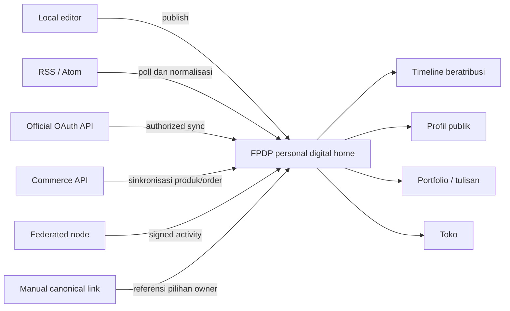
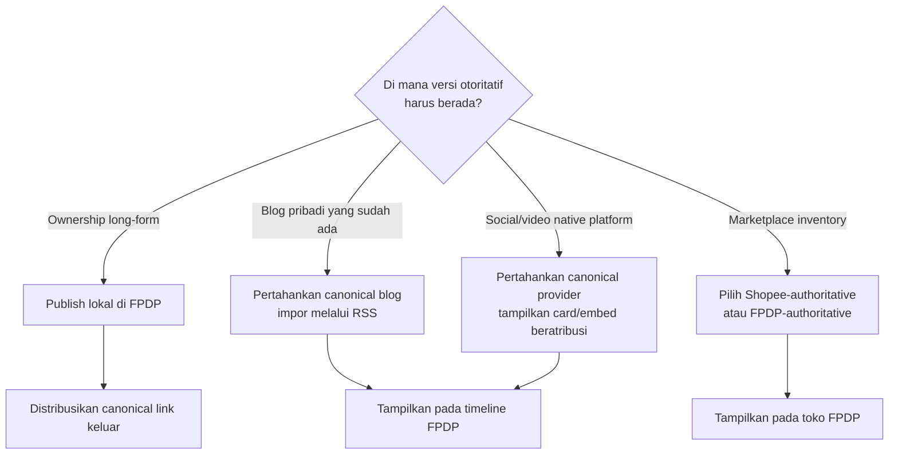
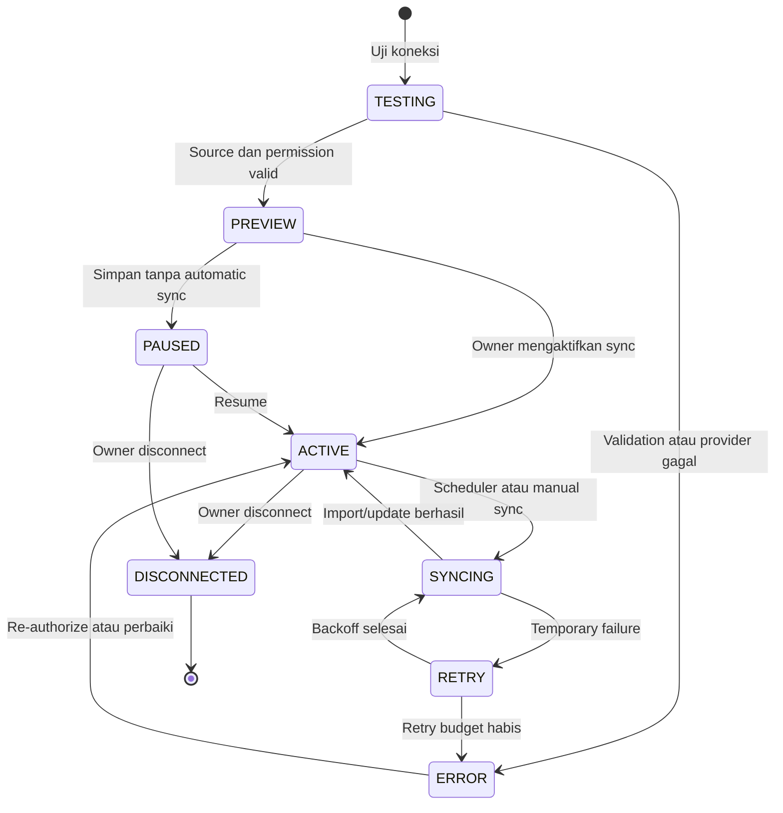

# Panduan Memaksimalkan FPDP: Publikasi dan Agregasi Konten Sosial

## 1. Tujuan

Panduan ini menjelaskan cara owner FPDP memaksimalkan personal digital home dengan menggabungkan konten yang sudah mereka miliki atau kelola pada Facebook, LinkedIn, X, Threads, TikTok, Shopee, Instagram, blog, newsletter, platform video, marketplace, dan layanan lain.

Tujuannya bukan menyamarkan konten salinan sebagai konten lokal. Tujuannya adalah membuat satu presentasi koheren yang dikendalikan pengguna sambil mempertahankan:

- author dan account asli;
- platform atau node asal;
- canonical source URL;
- waktu publikasi asli;
- hak penggunaan konten dan media;
- status update/deletion;
- perbedaan konten local, external, dan federated.

Capability dan permission platform sering berubah. Panduan spesifik platform pada dokumen ini mengacu pada dokumentasi developer resmi yang diperiksa pada **19 September 2026** dan harus diverifikasi kembali sebelum implementasi atau approval production.

## 2. Model konten yang disarankan

FPDP harus menampilkan tiga kelas konten yang berbeda dengan jelas:

| Kelas konten | Dibuat di mana? | Sumber otoritatif | Perilaku FPDP |
|---|---|---|---|
| Local | Node FPDP | Domain FPDP pengguna | Menyimpan dan menerbitkan local object lengkap |
| External | Social platform, blog, marketplace, atau API | External canonical URL | Menormalisasi dan menampilkan dengan atribusi permanen |
| Federated | Node independen lain | Remote node/object URI | Menerima signed activity dan mempertahankan remote identity |



## 3. Arti “terpublish di FPDP”

Tidak semua provider mengizinkan atau mendukung jenis penyalinan yang sama. FPDP harus menawarkan publication mode eksplisit:

| Mode | Data yang disimpan FPDP | Penggunaan terbaik | Syarat |
|---|---|---|---|
| Canonical card | Judul, gambar jika diizinkan, deskripsi singkat, source link | API terbatas atau link pilihan owner | Canonical URL andal dan metadata yang diizinkan |
| Excerpt | Metadata dan kutipan pendek | Artikel/post jika API dan ketentuan mengizinkan | Atribusi dan permission penggunaan konten |
| Embed | Referensi/kode embed provider | Video dan rich social content | Official embed dan privacy notice |
| Full authorized mirror | Full text/media reference ternormalisasi | Konten milik user jika API/hak mengizinkan copy | Pilihan owner, API permission, retention support |
| Local republication | Post lokal FPDP baru dengan disclosure sumber | Owner sengaja menerbitkan ulang karyanya | Owner mengonfirmasi hak; canonical strategy dipilih |
| Commerce listing | Snapshot produk dengan external/local checkout | Shopee atau marketplace lain | Commerce adapter dan identitas seller/origin jelas |

Gunakan mode paling minimal yang didukung provider sebagai default. Full mirror tidak boleh menjadi default tersembunyi.

## 4. Setup pengguna yang disarankan

### Langkah 1 — Bentuk personal home

Sebelum menghubungkan social account, owner harus:

1. mengatur primary domain;
2. melengkapi public profile dan contact link;
3. memilih default language dan timezone;
4. menerbitkan minimal satu local introduction atau portfolio post;
5. memilih default visibility konten impor;
6. menentukan domain yang akan menjadi canonical version konten long-form mendatang.

Dengan demikian, node tetap berguna meskipun seluruh external connector unavailable.

### Langkah 2 — Inventarisasi sumber

Buat source inventory sederhana:

| Sumber | Jenis account | Konten yang ditampilkan | Metode pilihan | Pemilik canonical |
|---|---|---|---|---|
| Blog personal | Owned domain | Artikel | RSS/Atom | Blog personal atau FPDP, pilih satu |
| Instagram | Business/Creator | Media terpilih | Official API | Instagram permalink |
| LinkedIn | Member/company | Post profesional | API jika disetujui; jika tidak canonical card | LinkedIn post |
| TikTok | User account | Video publik | Login Kit + Display API | TikTok video |
| Shopee | Authorized seller shop | Produk | Open Platform commerce API | Produk Shopee atau lokal, pilih per listing |

Jangan menghubungkan semua account hanya karena tersedia. Tambahkan sumber yang mendukung tujuan profil publik.

### Langkah 3 — Hubungkan dan tinjau consent

Dari **Dashboard → Integrasi → Hubungkan sumber**:

1. pilih provider;
2. baca persyaratan account type dan approval;
3. tinjau scope dan penggunaan data yang diminta;
4. lanjutkan ke authorization page milik provider;
5. pastikan account/Page/shop yang kembali adalah account yang dimaksud;
6. pilih content type dan publication mode;
7. preview normalized item sebelum menyimpan;
8. pilih visibility, backfill window, dan sync frequency;
9. aktifkan koneksi secara eksplisit.

FPDP tidak boleh meminta pengguna menempelkan password platform. Authorization harus memakai official provider flow atau feed/API credential yang dikendalikan user.

### Langkah 4 — Kurasi impor pertama

Owner harus dapat:

- memasukkan atau mengecualikan jenis konten;
- memilih item satu per satu saat first import;
- menetapkan maximum historical backfill;
- menyembunyikan cross-post duplikat;
- memilih placement timeline/profil/portfolio/shop;
- melihat preview atribusi dan canonical link;
- menyimpan source dalam kondisi paused sebelum automatic sync.

### Langkah 5 — Monitor dan pelihara

Gunakan integration health screen untuk memeriksa:

- connection status dan granted scope;
- waktu last sync dan next sync;
- jumlah imported, skipped, updated, dan failed item;
- token expiry atau kebutuhan re-authorization;
- rate limit atau provider outage;
- opsi disconnect dan retention.

## 5. Metode yang disarankan per platform

Tidak ditemukan first-party account RSS yang didukung untuk tujuh platform sosial/commerce tersebut. Jangan membuat RSS URL tidak resmi atau melakukan scraping HTML publik. Gunakan official API atau fallback aman.

YouTube adalah pengecualian: setiap channel publik memiliki official Atom feed (`youtube.com/feeds/videos.xml?channel_id=...`) tanpa memerlukan OAuth, sehingga dapat memakai connector RSS/Atom yang sudah tersedia pada FPDP. Lihat [6.8 YouTube](#68-youtube).

| Platform | Metode FPDP terbaik | Konten yang dapat tampil | Batasan penting | Fallback aman |
|---|---|---|---|---|
| Facebook | Facebook Login/Graph API untuk penggunaan Page yang disetujui | Profil Page dan konten Page yang diizinkan | Login token saja tidak menjamin akses Page post; review dan Page role berlaku | Canonical card pilihan owner atau official embed |
| LinkedIn | OIDC untuk login; Posts API jika disetujui untuk konten | Profile identity; member/company post yang disetujui | Pembacaan member post memerlukan restricted permission seperti `r_member_social` | Manual canonical card; publish long form lokal dahulu |
| TikTok | Login Kit + Display API | Authorized profile dan public video list | Scope seperti `video.list` dan app approval berlaku | Official embed atau canonical video card |
| Shopee | Open Platform shop authorization | Product listing dan commerce status tertentu | Seller/shop authorization, bukan social login umum; tergantung market/partner | Manual product card menuju Shopee |
| Instagram | Instagram API with Instagram Login | Professional profile dan media yang memenuhi syarat | Berfokus pada use case Business/Creator dan permission yang direview | Official embed atau permalink card terkurasi |
| X | OAuth 2.0 PKCE/API v2 jika didukung | Authorized user identity dan post | API access, pricing, scope, dan rate limit berlaku | Canonical post card atau official embed |
| Threads | Threads API authorization | Authorized profile dan thread; publishing jika disetujui | Flow token/permission Threads terpisah; App Review berlaku | Permalink card atau official embed |
| YouTube | Official channel Atom feed via connector RSS/Atom (tanpa OAuth); Data API v3 opsional untuk metadata tambahan | Video publik dari channel/playlist yang didaftarkan owner | Feed hanya memuat upload publik terbaru; video private/unlisted/age-restricted tidak muncul; Data API v3 dikenai quota | Owner menempelkan satu YouTube URL secara manual sebagai embed tunggal |

Lihat [panduan integrasi sosial dan commerce](SOCIAL-COMMERCE-INTEGRATIONS.id.md) untuk arsitektur authorization dan referensi resmi.

## 6. Playbook platform

### 6.1 Facebook

Penggunaan terbaik: hubungkan Page yang dikelola owner, bukan scraping profil personal.

```text
Hubungkan Facebook Page → authorize permission
→ pilih Page yang memenuhi syarat → preview konten yang diizinkan
→ pilih mode card/excerpt → sinkronisasi dengan canonical Facebook URL
```

Gunakan koneksi terpisah untuk Facebook identity login dan impor Page content. Jika approval permission tidak tersedia, izinkan owner menambahkan canonical link atau embed yang didukung dan jangan menjanjikan automatic sync.

### 6.2 LinkedIn

Penggunaan terbaik: gunakan OIDC hanya untuk login/account linking; perlakukan post import sebagai capability terpisah yang memerlukan approval.

```text
Hubungkan LinkedIn → login melalui OIDC
→ tandai identity connection berhasil
→ periksa apakah FPDP memiliki approved post-read permission
→ jika disetujui, pilih member/organization dan sync
→ jika tidak, aktifkan canonical-card workflow
```

Untuk ownership andal, terbitkan artikel lengkap secara lokal di FPDP atau blog milik sendiri, lalu bagikan canonical URL-nya ke LinkedIn. Ini mengurangi ketergantungan pada restricted read permission.

### 6.3 TikTok

Penggunaan terbaik: tampilkan video card atau embed dari public video list user yang terotorisasi.

```text
Hubungkan TikTok → consent Login Kit
→ minta basic profile + approved video-list scope
→ preview video → pilih card atau embed
→ sync video baru dengan canonical TikTok URL
```

Jangan download dan re-host video kecuali API, ketentuan platform, dan hak owner mengizinkannya. Provider-hosted media URL dapat kedaluwarsa; simpan stable ID dan refresh metadata.

### 6.4 Shopee

Penggunaan terbaik: perlakukan Shopee sebagai commerce dan bukan sumber social timeline.

```text
Hubungkan Shopee shop → seller mengotorisasi shop
→ ambil katalog produk yang diizinkan
→ mapping kategori, harga, stok, gambar, dan canonical listing
→ owner memilih external checkout atau produk lokal terpisah
→ monitor authorization dan product sync health
```

Hindari dua source of truth untuk inventory. Untuk setiap produk, pilih satu model eksplisit:

- **Shopee-authoritative:** FPDP menampilkan synchronized snapshot dan mengarah ke Shopee checkout.
- **FPDP-authoritative:** FPDP memiliki product/order state; Shopee menjadi distribution channel melalui future two-way commerce adapter.

### 6.5 Instagram

Penggunaan terbaik: hubungkan professional account yang memenuhi syarat dan tampilkan media pilihan dengan permalink attribution.

```text
Hubungkan Instagram → professional-account authorization
→ konfirmasi profil → preview media
→ pilih media type dan destination section
→ publish card/grid beratribusi → sinkronisasi update
```

Gunakan placement portfolio/grid untuk visual media agar main timeline tidak dibanjiri. Jangan gunakan short-lived media URL sebagai canonical identifier; simpan provider media ID dan permalink.

### 6.6 X

Penggunaan terbaik: impor post terpilih melalui official API dengan frekuensi terkontrol.

```text
Hubungkan X → OAuth 2.0 PKCE
→ identifikasi authorized user → preview post terbaru
→ filter reply/repost jika diperlukan
→ sync dengan cursor, rate-limit, dan cost control
```

Izinkan owner mengecualikan reply, repost, atau post minim konteks. Tampilkan asumsi penggunaan/biaya API pada pengaturan integrasi. Jika API access tidak layak, gunakan canonical link pilihan atau embed yang didukung.

### 6.7 Threads

Penggunaan terbaik: gunakan connector Threads terpisah dan pertahankan permalink setiap thread.

```text
Hubungkan Threads → Threads authorization
→ ambil profil dan thread yang diizinkan
→ preview dan pilih publication mode
→ sync dengan provider identity THREADS
```

Jangan menganggap token Instagram valid untuk Threads. Simpan koneksi provider secara terpisah meskipun keduanya dioperasikan Meta.

### 6.8 YouTube

Penggunaan terbaik: hubungkan channel YouTube publik owner melalui official Atom feed milik channel tersebut, lalu tampilkan setiap video sebagai embed privacy-enhanced pada public profile (bukan sekadar canonical link).

```text
Hubungkan YouTube → Dashboard → Integrasi → Hubungkan sumber → pilih RSS/Atom
→ isi source_url = https://www.youtube.com/feeds/videos.xml?channel_id=UCxxxxxxxx
→ preview video terbaru channel → pilih destination Video/Portfolio
→ sinkronisasi berkala mengambil upload publik terbaru
```

Cara kerja teknis:

1. Setiap channel dan playlist YouTube publik memiliki official Atom feed tanpa API key atau OAuth: `https://www.youtube.com/feeds/videos.xml?channel_id=CHANNEL_ID` (atau `?playlist_id=PLAYLIST_ID`). Owner dapat menemukan `channel_id` dari halaman **About** channel miliknya.
2. Connector `ATOM` yang sudah ada pada FPDP (`App\Services\External\AtomConnector`) mem-parsing feed ini. Setiap `<entry>` YouTube memuat elemen `<yt:videoId>` dan thumbnail pada `<media:group>`; connector membaca keduanya secara langsung, tanpa perlu menebak video ID dari teks.
3. Video ID dinormalisasi menjadi descriptor embed oleh `App\Services\External\YouTubeEmbedResolver`, disimpan pada `media_json` dengan bentuk:
   ```json
   {
     "type": "VIDEO",
     "provider": "YOUTUBE",
     "video_id": "jNQXAC9IVRw",
     "embed_url": "https://www.youtube-nocookie.com/embed/jNQXAC9IVRw",
     "thumbnail_url": "https://i.ytimg.com/vi/jNQXAC9IVRw/hqdefault.jpg"
   }
   ```
   Item dengan embed video ditandai `post_type = MEDIA`; item Atom biasa tanpa video tetap `ARTICLE`.
4. Public profile me-render `embed_url` sebagai `<iframe>` di dalam kontainer `aspect-ratio: 16/9`, memakai domain privacy-enhanced `youtube-nocookie.com` (bukan `youtube.com`) agar visitor yang belum memutar video tidak langsung diprofilkan oleh YouTube, dan `loading="lazy"` agar iframe tidak memuat sebelum discroll ke bagian Video. Lihat contoh berjalan pada [mockup public profile, bagian “Video”](mockup/public-profile.html#video) dan [peta navigasi mockup](mockup/NAVIGATION-MAP.id.md).
5. Owner tetap dapat menempelkan satu YouTube URL secara manual (tanpa menghubungkan seluruh channel) untuk video tunggal; gunakan mode publikasi **Embed** pada tabel Bagian 3 dan simpan sebagai satu `external_post` dengan `source_provider = YOUTUBE`.

Batasan yang perlu diketahui owner:

- Feed channel hanya memuat upload publik terbaru (biasanya ±15 item terbaru); video private, unlisted, atau age-restricted tidak akan muncul.
- Jangan mengunduh atau me-rehost file video; hanya video ID, judul, canonical URL, dan thumbnail yang disimpan FPDP. Pemutaran tetap terjadi di infrastruktur YouTube melalui iframe.
- Untuk kebutuhan lanjutan (statistik, caption, atau video dari beberapa channel sekaligus dalam satu request), gunakan YouTube Data API v3 dengan API key dan hormati quota harian; ini bersifat opsional dan tidak diperlukan untuk embed dasar.
- Selalu pertahankan `canonical_url` menuju halaman watch YouTube asli agar atribusi kreator tetap terlihat jelas di samping embed.

### 6.9 Blog, podcast, video channel, newsletter, dan “lainnya”

Gunakan prioritas berikut untuk provider tambahan:

1. RSS atau Atom yang dikendalikan user;
2. official API terdokumentasi dengan delegated authorization;
3. public API terdokumentasi tanpa user secret;
4. official embed;
5. canonical link/card pilihan owner;
6. file import/export yang didukung provider dan dimulai owner.

Scraping dan credential sharing bukan metode integrasi yang didukung.

## 7. Strategi source of truth

Untuk setiap kategori konten, owner harus memilih satu sumber otoritatif:



Strategi yang disarankan:

- publish durable long-form content secara lokal terlebih dahulu;
- distribusikan canonical FPDP URL ke social platform;
- agregasikan platform-native short content kembali sebagai attributed card;
- pertahankan video pada authorized provider jika re-hosting tidak diizinkan;
- pilih satu inventory authority untuk setiap commerce listing.

## 8. Kontrak normalisasi

Setiap item impor harus dipetakan ke record provider-independent:

```json
{
  "source_type": "EXTERNAL",
  "source_provider": "INSTAGRAM",
  "external_account_id": "provider-account-id",
  "external_post_id": "provider-item-id",
  "author": {
    "display_name": "Maya",
    "profile_url": "https://provider.example/maya"
  },
  "post_type": "MEDIA",
  "title": null,
  "content": "Caption provider atau excerpt yang diizinkan",
  "media": [],
  "canonical_url": "https://provider.example/item/123",
  "published_at": "2026-09-19T02:30:00Z",
  "fetched_at": "2026-09-19T03:00:00Z",
  "visibility": "PUBLIC",
  "status": "ACTIVE"
}
```

Raw payload provider hanya disimpan jika diperlukan, disanitasi, dienkripsi jika sensitif, dan dihapus berdasarkan retention period terdokumentasi.

## 9. Deduplication dan cross-post

Konten yang sama dapat muncul pada blog, LinkedIn, Facebook, X, dan Threads. FPDP tidak boleh menampilkan lima salinan yang sulit dibedakan secara default.

Gunakan deduplication berlapis:

1. exact provider key: `(provider, external_account_id, external_post_id)`;
2. exact canonical URL;
3. declared cross-post relationship yang dipilih owner;
4. normalized URL dan content hash sebagai saran, bukan automatic merge permanen;
5. kontrol manual “group as cross-posts”.

Konten yang dikelompokkan tetap mempertahankan semua source link dan memilih satu presentasi utama.

## 10. Lifecycle sinkronisasi



Pada setiap sinkronisasi:

1. lock source agar hanya satu worker memprosesnya;
2. refresh credential jika diperlukan;
3. fetch memakai cursor/since marker dan batas provider;
4. normalisasi dan validasi record;
5. lakukan deduplication sebelum insert;
6. update konten jika source berubah;
7. terapkan deletion/tombstone sesuai provider signal dan retention policy;
8. commit konten dan cursor secara atomik;
9. perbarui health metric tanpa mencatat token atau payload sensitif.

## 11. Kontrol wajib pada dashboard

Setiap connected source membutuhkan:

- provider dan identitas account terhubung;
- connection serta token status;
- granted scope;
- publication mode;
- destination: timeline, profile, portfolio, writing, atau shop;
- default visibility;
- filter content type;
- sync frequency dan backfill limit;
- last sync, next sync, jumlah imported/skipped/error;
- aksi preview, manual sync, pause, reconnect, dan disconnect;
- retention choice saat disconnect;
- preview canonical link dan atribusi.

## 12. Inbound aggregation dan outbound cross-publishing

Keduanya merupakan capability berbeda:

```text
Inbound aggregation
External platform → FPDP

Outbound cross-publishing
FPDP local post → External platform
```

Read permission tidak memberikan write permission. Outbound publishing membutuhkan write scope spesifik provider, review tambahan, media-upload rule, retry semantic, dan konfirmasi user.

Workflow outbound yang disarankan:

1. publish canonical local post pada FPDP;
2. pilih destination platform;
3. preview adaptasi teks/media spesifik platform;
4. publish hanya setelah konfirmasi eksplisit;
5. simpan external ID dan URL yang dikembalikan;
6. jangan auto-delete external post ketika local item berubah tanpa policy user yang jelas.

Outbound cross-publishing merupakan fitur tahap lanjut. Reliable inbound attribution dan local publishing harus didahulukan.

## 13. Privasi, hak, dan keamanan

- Impor hanya konten yang dimiliki atau secara eksplisit diizinkan kepada user terhubung.
- Jangan impor konten private/friends-only ke public timeline.
- Pertahankan source visibility jika dapat direpresentasikan; jika tidak, tolak impor.
- Jangan download/re-host media kecuali hak dan ketentuan provider mengizinkan.
- Sanitasi external HTML dan jangan menjalankan script dari provider.
- Ambil remote URL melalui client dengan proteksi SSRF, timeout, dan size limit.
- Enkripsi token dan credential ketika disimpan.
- Sediakan kontrol data export, disconnect, dan deletion.
- Hormati deletion, revocation, dan deauthorization event provider.
- Jelaskan third-party embed karena embed dapat menghubungi provider saat ditampilkan.

## 14. Failure dan fallback

| Situasi | Perilaku FPDP |
|---|---|
| Provider approval tidak tersedia | Tandai automatic sync unavailable; tawarkan canonical card atau approved embed |
| Token expired | Pause sync dan minta re-authorization |
| Rate limit tercapai | Backoff sampai reset; pertahankan konten dengan stale indicator jika perlu |
| Harga API tidak layak | Turunkan frekuensi, owner-triggered sync, atau canonical-card mode |
| Item provider dihapus | Hapus, tombstone, atau tandai unavailable sesuai policy |
| Media URL expired | Refresh metadata; jangan anggap temporary URL sebagai canonical |
| Permission dicabut | Hentikan job segera dan terapkan retention choice |
| Duplicate cross-post ditemukan | Sarankan grouping; jangan hapus provenance diam-diam |
| Provider unavailable | Profil dan konten lokal tetap berjalan |

## 15. Urutan implementasi

1. Selesaikan local profile dan local post publishing.
2. Productionize RSS/Atom dengan safe HTTP fetching, persistence, preview, dan deduplication.
3. Implementasikan generic OAuth state, PKCE, encrypted token storage, refresh, dan disconnect lifecycle.
4. Tambahkan normalized external-account dan external-post repository.
5. Implementasikan satu approved social connector end-to-end.
6. Tambahkan attribution UI, content placement, grouping, dan health monitoring.
7. Tambahkan Shopee setelah product/order dan `CommerceProviderInterface` tersedia.
8. Tambahkan provider lain melalui certification checklist yang sama.
9. Implementasikan outbound cross-publishing setelah inbound behavior andal.

## 16. Checklist sertifikasi connector

Sebelum connector ditampilkan kepada user, pastikan:

- official API atau feed terdokumentasi dan diizinkan;
- account type dan market yang didukung jelas;
- required scope dan review status tercatat;
- authorization, refresh, revocation, dan deletion flow berfungsi;
- test account dan sandbox behavior diketahui;
- rate limit, pricing, pagination, dan penghentian versi API dimonitor;
- normalized mapping dan canonical URL lengkap;
- duplicate, edit, deletion, serta expired-media case diuji;
- log tidak berisi code, token, credential, atau payload sensitif;
- disconnect menawarkan retention choice yang mudah dipahami;
- UI/help content English dan Bahasa Indonesia tersedia.

## 17. Kriteria keberhasilan pengguna

User menggunakan FPDP secara maksimal ketika:

- public domain tetap berguna tanpa connector;
- satu canonical identity dan profil merepresentasikan owner;
- durable content diterbitkan lokal atau memiliki external authority eksplisit;
- setiap item impor menunjukkan provenance yang jelas;
- timeline dikurasi dan bukan uncontrolled firehose;
- duplicate cross-post dikelompokkan atau difilter;
- connection health dan permission state mudah dipahami;
- source dapat di-pause atau disconnect tanpa data ambiguity;
- kegagalan provider tidak mematikan seluruh personal digital home.

