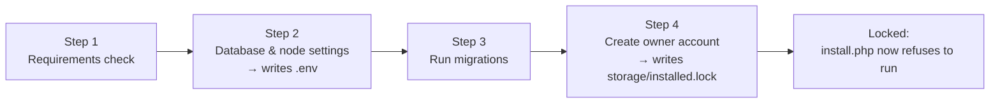

# FPDP Deployment Guide — English

## 1. Scope

This guide covers deploying FPDP to a **VPS** (full server access) and to **shared hosting** (cPanel/Plesk-style, usually no SSH), and explains the **web install wizard** (`public/install.php`) that turns an uploaded copy of the code into a running node: it checks the environment, writes `.env`, runs database migrations, and creates the first owner account.

It assumes the [repository README](../README.md) quick start already works on your own machine. Nothing here requires Composer packages — the app ships its own PSR-4 autoloader (`vendor/autoload.php`) with zero external dependencies, which is why it also runs on shared hosts with no Composer or SSH access.

## 2. Requirements

- PHP 8.2 or newer, with the `pdo_mysql`, `simplexml`, `json`, and `mbstring` extensions enabled.
- MySQL 8 (or a compatible MariaDB version) with a database and a user that has full privileges on it.
- The web server's document root pointed at the repository's `public/` folder (see [§5](#5-shared-hosting-deployment) if your host will not let you change it).
- HTTPS in production — FPDP sends bearer tokens and passwords over HTTP, so plain HTTP is only acceptable for local development.

## 3. Choose a path

For a container-managed VPS, use the dedicated [Dokploy deployment guide](DOKPLOY-DEPLOYMENT.en.md). It includes Compose, health checks, persistent volumes, automatic migrations, and first-owner bootstrap.

| | VPS | Shared hosting |
|---|---|---|
| Shell/SSH access | Yes | Usually no |
| Who sets the document root | You (Nginx/Apache config) | The hosting panel (cPanel/Plesk) |
| How you run migrations | CLI: `php database/migrate.php` | Web installer (no CLI needed) |
| How you create the owner account | CLI `curl` against the API, or the web installer | Web installer |
| TLS | You configure it (e.g. Certbot) | Usually provided by the panel |

Both paths converge on the same three things: get the code onto the server, point the document root at `public/`, and either run `public/install.php` in a browser or do the equivalent steps by hand over SSH.

## 4. VPS deployment

Example uses Ubuntu 22.04+, Nginx, and PHP-FPM; adapt package names for your distribution.

### 4.1 Install packages

```bash
sudo apt update
sudo apt install -y nginx mysql-server php8.2-fpm php8.2-mysql php8.2-xml php8.2-mbstring git
```

### 4.2 Create the database

```bash
sudo mysql -e "CREATE DATABASE fpdp CHARACTER SET utf8mb4 COLLATE utf8mb4_unicode_ci;"
sudo mysql -e "CREATE USER 'fpdp'@'localhost' IDENTIFIED BY 'change-this-password';"
sudo mysql -e "GRANT ALL PRIVILEGES ON fpdp.* TO 'fpdp'@'localhost'; FLUSH PRIVILEGES;"
```

### 4.3 Get the code

```bash
sudo mkdir -p /var/www/fpdp
sudo chown "$USER" /var/www/fpdp
git clone <your-fork-or-repo-url> /var/www/fpdp
cd /var/www/fpdp
```

If Composer is available, run `composer install && composer dump-autoload` to keep the autoloader in sync with `composer.json`; it is optional today since the checked-in `vendor/autoload.php` already works standalone.

### 4.4 Configure Nginx

```nginx
server {
    listen 80;
    server_name your-domain.example;
    root /var/www/fpdp/public;
    index index.php;

    location ~ /\. {
        deny all;
    }

    location / {
        try_files $uri $uri/ /index.php?$query_string;
    }

    location ~ \.php$ {
        include snippets/fastcgi-php.conf;
        fastcgi_pass unix:/run/php/php8.2-fpm.sock;
    }
}
```

Reload with `sudo nginx -t && sudo systemctl reload nginx`. (Apache on a VPS can reuse the `public/.htaccess` file already in the repository — point `DocumentRoot` at `public/` and make sure `AllowOverride All` is set for that directory.)

### 4.5 Add TLS

```bash
sudo apt install -y certbot python3-certbot-nginx
sudo certbot --nginx -d your-domain.example
```

### 4.6 Run the installer over SSH (recommended on a VPS)

You can use the web wizard (§6) here too, but on a VPS it is usually simpler — and keeps `install.php` from ever being reachable on the public internet — to do the equivalent steps by hand:

```bash
cp .env.example .env
# edit .env: set DB_HOST/DB_DATABASE/DB_USERNAME/DB_PASSWORD, NODE_DOMAIN, APP_ENV=production
php -r "echo bin2hex(random_bytes(32));"   # paste the result into APP_KEY in .env

php database/migrate.php

curl -s -X POST https://your-domain.example/api/v1/auth/register \
  -H 'Content-Type: application/json' \
  -d '{"display_name":"Your Name","handle":"yourhandle","email":"you@example.com","password":"a-strong-password-12+chars","locale":"en"}'
```

The `curl` call is the exact same `AuthService::register()` path the web installer's last step calls — it hashes the password, creates the node/user/profile rows, and returns a bearer token. Save that token or discard it and log in again with `POST /api/v1/auth/login`.

Finally, mark the node installed so `install.php` (if it is ever reached) refuses to run:

```bash
mkdir -p storage
touch storage/installed.lock
```

### 4.7 File permissions

```bash
sudo chown -R www-data:www-data /var/www/fpdp
chmod 600 /var/www/fpdp/.env
```

## 5. Shared hosting deployment

Steps use cPanel terminology; Plesk and other panels have equivalent screens.

### 5.1 Create the database

In cPanel → **MySQL Databases**: create a database, a user, a strong password, and add the user to the database with **All Privileges**. Note the full database name and username — shared hosts usually prefix them with your account name (e.g. `cpaneluser_fpdp`).

### 5.2 Upload the code

- If your host offers SSH and Git, `git clone` the repository as in §4.3.
- Otherwise, download or build a zip of the repository and upload it through **File Manager**, then extract it.

### 5.3 Point the document root at `public/`

This is the important step: FPDP's entry point is `public/index.php`, not the repository root.

- **Addon domain or subdomain:** cPanel → **Domains** lets you set a custom **Document Root** when creating the (sub)domain — set it to the `public/` folder inside your uploaded copy (e.g. `fpdp/public`). This is the cleanest option and needs no extra files.
- **Main domain, root folder only (`public_html`) and no way to change it:** upload the repository *outside* `public_html` (for example as a sibling folder `fpdp/`) and add a small shim so `public_html` only ever exposes the front controller:

  `public_html/index.php`:
  ```php
  <?php
  require __DIR__ . '/../fpdp/public/index.php';
  ```

  `public_html/install.php`:
  ```php
  <?php
  require __DIR__ . '/../fpdp/public/install.php';
  ```

  `public_html/.htaccess` (routes everything else through the shim, same pattern as `public/.htaccess`):
  ```apache
  RewriteEngine On
  RewriteCond %{REQUEST_FILENAME} -f [OR]
  RewriteCond %{REQUEST_FILENAME} -d
  RewriteRule ^ - [L]
  RewriteRule ^ index.php [L]
  ```

  Only use this fallback when you truly cannot set a custom document root — a dedicated (sub)domain document root is simpler and keeps `app/`, `database/`, and `documentation/` outside any web-servable folder entirely.

The repository already includes `public/.htaccess`, which rewrites requests to `public/index.php` and denies direct access to dotfiles — no extra configuration is needed once the document root is correct.

### 5.4 Set the PHP version

In cPanel → **MultiPHP Manager** (or similar), select PHP 8.2+ for the domain and enable `pdo_mysql`, `simplexml`, `mbstring` under **PHP Extensions** if they are not already on.

### 5.5 Run the web installer

Visit `https://your-domain.example/install.php` and follow the four steps in §6 — this replaces the CLI steps from §4.6, since shared hosting usually has no shell access to run `php database/migrate.php` or Composer directly.

## 6. Using the install mechanism (`public/install.php`)

The installer is a self-contained wizard that does **not** depend on `.env` or the database existing yet, so it works on a completely fresh copy of the code.



1. **Requirements check.** Verifies the PHP version, the `pdo_mysql`/`simplexml`/`json`/`mbstring` extensions, that the project root is writable (to create `.env`), and that `storage/` is writable (for the install lock). Nothing is written yet. Fix any `FAIL` row before continuing — the "Continue" button stays disabled until every check passes.
2. **Database & node settings.** Enter the database host/port/name/username/password (the database must already exist — the installer creates its *tables*, not the database itself) plus the node's domain, display name, default locale, and timezone. On submit the installer opens a real connection to confirm the credentials work, then writes `.env` (including a freshly generated `APP_KEY`) — it never proceeds past this step with untested credentials.
3. **Run migrations.** Applies every file in `database/migrations/` in order, the same `MigrationRunner` the CLI (`php database/migrate.php`) uses. This step is safe to click more than once: already-applied migrations are tracked in a `migrations` table and skipped.
4. **Create the owner account.** Collects display name, handle, email, and password, and calls the same `AuthService::register()` code path as `POST /api/v1/auth/register` (bcrypt hashing, a node/user/profile created together, a bearer token issued). On success the installer writes `storage/installed.lock` and shows the access token **once**.

After step 4, every visit to `install.php` — including a plain reload — shows an "already installed" page instead of the wizard, because `storage/installed.lock` now exists. This is the installer's only safeguard against someone reaching it after you have finished setup, so:

- **Delete `public/install.php`** once you are done (simplest option), or
- keep it but **block public access** at the web-server level (an IP allowlist or HTTP Basic Auth in front of `install.php` during the setup window), and rely on the lock file otherwise.

To intentionally reinstall (for example onto a fresh staging copy), delete `storage/installed.lock` and reload the page — nothing else needs to be reset, since step 2 will happily overwrite `.env` again and step 3's migrations are idempotent.

### Troubleshooting

| Symptom | Likely cause | Fix |
|---|---|---|
| Step 1 shows `FAIL` on an extension | Extension not enabled for the PHP version the site actually runs | Enable it in `php.ini` or the host's PHP Extensions panel, for the *same* PHP version selected for the domain |
| Step 1 shows `FAIL` on "project root is writable" | Web server user cannot write to the repository root | `chmod`/`chown` the folder so the PHP process (e.g. `www-data`) can write `.env`, or ask your host to fix folder ownership |
| Step 2: "Could not connect to that database" | Wrong host/port/credentials, or the database does not exist yet | Re-check the values from §5.1/§4.2; on shared hosts the DB host is often `localhost` and the DB/user names are prefixed with your account name |
| Step 3 fails with a duplicate-table or syntax error | Migrations were partially applied by another method, or the database already has non-FPDP tables with the same names | Use a dedicated, empty database for FPDP; if migrations were already applied by hand, `php database/migrate.php` and this step both skip files already recorded in the `migrations` table |
| Step 4: "Email or handle is already registered" | An owner account already exists (perhaps from a previous attempt before the lock was written) | Log in via `POST /api/v1/auth/login` instead, or pick a different email/handle |
| `install.php` immediately shows "already installed" | `storage/installed.lock` exists from a previous run | Expected once setup is done; delete that file only if you deliberately want to run the wizard again |

## 7. Post-deployment checklist

- `curl https://your-domain.example/api/v1/health` returns a success envelope.
- `.env` is not publicly reachable (`curl https://your-domain.example/.env` must **not** return its contents — `public/.htaccess` already denies this once the document root is correct).
- `public/install.php` is deleted, or provably blocked and covered by `storage/installed.lock`.
- `.env` has `APP_ENV=production` and `APP_DEBUG=false`.
- `.env` file permissions are restrictive (`chmod 600` on a VPS; on shared hosting, keep it out of any web-servable folder as described in §5.3).
- You can log in as the owner account created during installation.

## 8. Updating a deployed node

```bash
cd /var/www/fpdp   # or wherever the code lives
git pull
php database/migrate.php   # safe to run repeatedly; only pending migrations apply
```

On shared hosting without SSH, re-upload the changed files through File Manager/FTP, then either re-run `install.php` step 3 only (it is safe — delete `storage/installed.lock`, click through steps 1–2 with the *same* database values so `.env` is rewritten identically, run step 3, then stop — do not repeat step 4) or apply the SQL in any new `database/migrations/*.sql` files by hand through phpMyAdmin.

## 9. References

- [Repository README](../README.md) — local quick start and current implementation status.
- [Development progress report](PROGRESS-REPORT.en.md) — what is and is not implemented yet.
- [Roadmap](ROADMAP.en.md) — Phase 4 ("Operations and MVP hardening") covers the deployment hardening still ahead (CI, backups, rollback drills).
