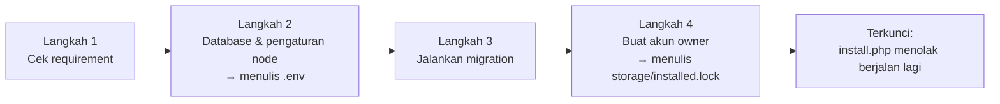

# Panduan Deployment FPDP — Bahasa Indonesia

## 1. Ruang lingkup

Panduan ini membahas deployment FPDP ke **VPS** (akses server penuh) dan ke **shared hosting** (gaya cPanel/Plesk, biasanya tanpa SSH), serta menjelaskan **web install wizard** (`public/install.php`) yang mengubah kode yang sudah diunggah menjadi node yang berjalan: memeriksa environment, menulis `.env`, menjalankan migration database, dan membuat akun owner pertama.

Panduan ini mengasumsikan quick start pada [README repository](../README.md) sudah berhasil dijalankan di komputer Anda sendiri. Tidak ada langkah di sini yang membutuhkan package Composer — aplikasi ini sudah membawa autoloader PSR-4 sendiri (`vendor/autoload.php`) tanpa dependency eksternal, sehingga juga bisa berjalan di shared hosting tanpa Composer atau akses SSH.

## 2. Kebutuhan sistem

- PHP 8.2 atau lebih baru, dengan ekstensi `pdo_mysql`, `simplexml`, `json`, dan `mbstring` aktif.
- MySQL 8 (atau versi MariaDB yang kompatibel) dengan sebuah database dan user yang memiliki full privilege pada database tersebut.
- Document root web server diarahkan ke folder `public/` pada repository ini (lihat [§5](#5-deployment-di-shared-hosting) bila hosting Anda tidak mengizinkan perubahan document root).
- HTTPS di production — FPDP mengirim bearer token dan password lewat HTTP, sehingga HTTP polos hanya boleh dipakai untuk development lokal.

## 3. Pilih jalur deployment

Untuk VPS yang dikelola dengan container, gunakan [panduan deployment Dokploy](DOKPLOY-DEPLOYMENT.id.md). Panduan tersebut mencakup Compose, health check, persistent volume, migration otomatis, dan bootstrap owner pertama.

| | VPS | Shared hosting |
|---|---|---|
| Akses shell/SSH | Ya | Biasanya tidak |
| Siapa yang mengatur document root | Anda (konfigurasi Nginx/Apache) | Panel hosting (cPanel/Plesk) |
| Cara menjalankan migration | CLI: `php database/migrate.php` | Web installer (tanpa CLI) |
| Cara membuat akun owner | `curl` CLI ke API, atau web installer | Web installer |
| TLS | Anda konfigurasi sendiri (mis. Certbot) | Biasanya sudah disediakan panel |

Kedua jalur bertemu pada tiga hal yang sama: pindahkan kode ke server, arahkan document root ke `public/`, lalu jalankan `public/install.php` lewat browser atau lakukan langkah setara secara manual lewat SSH.

## 4. Deployment di VPS

Contoh memakai Ubuntu 22.04+, Nginx, dan PHP-FPM; sesuaikan nama paket untuk distro Anda.

### 4.1 Instal paket

```bash
sudo apt update
sudo apt install -y nginx mysql-server php8.2-fpm php8.2-mysql php8.2-xml php8.2-mbstring git
```

### 4.2 Buat database

```bash
sudo mysql -e "CREATE DATABASE fpdp CHARACTER SET utf8mb4 COLLATE utf8mb4_unicode_ci;"
sudo mysql -e "CREATE USER 'fpdp'@'localhost' IDENTIFIED BY 'ganti-password-ini';"
sudo mysql -e "GRANT ALL PRIVILEGES ON fpdp.* TO 'fpdp'@'localhost'; FLUSH PRIVILEGES;"
```

### 4.3 Ambil kode

```bash
sudo mkdir -p /var/www/fpdp
sudo chown "$USER" /var/www/fpdp
git clone <url-fork-atau-repo-anda> /var/www/fpdp
cd /var/www/fpdp
```

Bila Composer tersedia, jalankan `composer install && composer dump-autoload` agar autoloader selaras dengan `composer.json`; ini opsional saat ini karena `vendor/autoload.php` yang sudah ada di repository sudah berfungsi mandiri.

### 4.4 Konfigurasi Nginx

```nginx
server {
    listen 80;
    server_name domain-anda.example;
    root /var/www/fpdp/public;
    index index.php;

    location ~ /\. {
        deny all;
    }

    location / {
        try_files $uri $uri/ /index.php?$query_string;
    }

    location ~ \.php$ {
        include snippets/fastcgi-php.conf;
        fastcgi_pass unix:/run/php/php8.2-fpm.sock;
    }
}
```

Reload dengan `sudo nginx -t && sudo systemctl reload nginx`. (Apache pada VPS dapat memakai file `public/.htaccess` yang sudah ada di repository — arahkan `DocumentRoot` ke `public/` dan pastikan `AllowOverride All` aktif untuk direktori tersebut.)

### 4.5 Tambahkan TLS

```bash
sudo apt install -y certbot python3-certbot-nginx
sudo certbot --nginx -d domain-anda.example
```

### 4.6 Jalankan instalasi lewat SSH (disarankan di VPS)

Anda tetap bisa memakai web wizard (§6) di sini, tapi di VPS biasanya lebih sederhana — dan membuat `install.php` tidak pernah bisa diakses dari internet publik — dengan melakukan langkah setara secara manual:

```bash
cp .env.example .env
# edit .env: isi DB_HOST/DB_DATABASE/DB_USERNAME/DB_PASSWORD, NODE_DOMAIN, APP_ENV=production
php -r "echo bin2hex(random_bytes(32));"   # tempel hasilnya ke APP_KEY di .env

php database/migrate.php

curl -s -X POST https://domain-anda.example/api/v1/auth/register \
  -H 'Content-Type: application/json' \
  -d '{"display_name":"Nama Anda","handle":"handleanda","email":"anda@example.com","password":"password-kuat-min-12-karakter","locale":"id"}'
```

Perintah `curl` di atas memanggil jalur kode `AuthService::register()` yang sama persis dengan langkah terakhir web installer — password di-hash, baris node/user/profile dibuat sekaligus, dan bearer token dikembalikan. Simpan token tersebut, atau abaikan dan login ulang lewat `POST /api/v1/auth/login`.

Terakhir, tandai node sebagai sudah terinstal agar `install.php` (bila suatu saat diakses) menolak berjalan:

```bash
mkdir -p storage
touch storage/installed.lock
```

### 4.7 Permission file

```bash
sudo chown -R www-data:www-data /var/www/fpdp
chmod 600 /var/www/fpdp/.env
```

## 5. Deployment di shared hosting

Langkah memakai istilah cPanel; Plesk dan panel lain punya layar yang setara.

### 5.1 Buat database

Di cPanel → **MySQL Databases**: buat database, user, password yang kuat, lalu tambahkan user ke database tersebut dengan **All Privileges**. Catat nama database dan username lengkapnya — shared hosting biasanya memberi prefix nama akun Anda (mis. `cpaneluser_fpdp`).

### 5.2 Unggah kode

- Bila hosting Anda menyediakan SSH dan Git, jalankan `git clone` seperti pada §4.3.
- Bila tidak, unduh atau buat file zip dari repository lalu unggah lewat **File Manager**, kemudian ekstrak.

### 5.3 Arahkan document root ke `public/`

Ini langkah paling penting: entry point FPDP adalah `public/index.php`, bukan root repository.

- **Addon domain atau subdomain:** cPanel → **Domains** memungkinkan Anda mengatur **Document Root** kustom saat membuat (sub)domain — arahkan ke folder `public/` di dalam hasil unggahan Anda (mis. `fpdp/public`). Ini opsi paling bersih dan tidak butuh file tambahan.
- **Domain utama, hanya punya folder root (`public_html`) dan tidak bisa mengubahnya:** unggah repository *di luar* `public_html` (misalnya sebagai folder tetangga `fpdp/`), lalu tambahkan shim kecil agar `public_html` hanya pernah mengekspos front controller-nya:

  `public_html/index.php`:
  ```php
  <?php
  require __DIR__ . '/../fpdp/public/index.php';
  ```

  `public_html/install.php`:
  ```php
  <?php
  require __DIR__ . '/../fpdp/public/install.php';
  ```

  `public_html/.htaccess` (meneruskan permintaan lain lewat shim, pola yang sama dengan `public/.htaccess`):
  ```apache
  RewriteEngine On
  RewriteCond %{REQUEST_FILENAME} -f [OR]
  RewriteCond %{REQUEST_FILENAME} -d
  RewriteRule ^ - [L]
  RewriteRule ^ index.php [L]
  ```

  Gunakan fallback ini hanya bila Anda benar-benar tidak bisa mengatur document root kustom — document root (sub)domain khusus lebih sederhana dan membuat `app/`, `database/`, dan `documentation/` sepenuhnya berada di luar folder yang bisa diakses web.

Repository sudah menyertakan `public/.htaccess`, yang meneruskan request ke `public/index.php` dan menolak akses langsung ke dotfile — tidak perlu konfigurasi tambahan begitu document root sudah benar.

### 5.4 Atur versi PHP

Di cPanel → **MultiPHP Manager** (atau serupa), pilih PHP 8.2+ untuk domain tersebut dan aktifkan `pdo_mysql`, `simplexml`, `mbstring` di **PHP Extensions** bila belum aktif.

### 5.5 Jalankan web installer

Buka `https://domain-anda.example/install.php` dan ikuti empat langkah pada §6 — ini menggantikan langkah CLI pada §4.6, karena shared hosting biasanya tidak punya akses shell untuk menjalankan `php database/migrate.php` atau Composer secara langsung.

## 6. Cara menggunakan mekanisme install (`public/install.php`)

Installer ini adalah wizard mandiri yang **tidak** bergantung pada `.env` atau database yang sudah ada, sehingga tetap berfungsi pada salinan kode yang benar-benar baru.



1. **Cek requirement.** Memverifikasi versi PHP, ekstensi `pdo_mysql`/`simplexml`/`json`/`mbstring`, apakah root project dapat ditulis (untuk membuat `.env`), dan apakah `storage/` dapat ditulis (untuk install lock). Belum ada yang ditulis pada tahap ini. Perbaiki setiap baris `FAIL` sebelum melanjutkan — tombol "Continue" tetap nonaktif sampai semua pemeriksaan lolos.
2. **Database & pengaturan node.** Isi host/port/nama/username/password database (database harus sudah ada — installer membuat *tabel*-nya, bukan database itu sendiri) plus domain node, nama tampilan, locale default, dan zona waktu. Saat submit, installer membuka koneksi sungguhan untuk memastikan kredensial benar, baru kemudian menulis `.env` (termasuk `APP_KEY` yang baru dibuat) — installer tidak akan pernah lanjut ke tahap berikutnya dengan kredensial yang belum teruji.
3. **Jalankan migration.** Menerapkan setiap file pada `database/migrations/` secara berurutan, memakai `MigrationRunner` yang sama dengan CLI (`php database/migrate.php`). Tahap ini aman diklik berkali-kali: migration yang sudah diterapkan tercatat pada tabel `migrations` dan akan dilewati.
4. **Buat akun owner.** Mengumpulkan nama tampilan, handle, email, dan password, lalu memanggil jalur kode `AuthService::register()` yang sama dengan `POST /api/v1/auth/register` (hashing bcrypt, node/user/profile dibuat sekaligus, bearer token diterbitkan). Setelah berhasil, installer menulis `storage/installed.lock` dan menampilkan access token **satu kali saja**.

Setelah langkah 4, setiap kunjungan ke `install.php` — termasuk reload biasa — akan menampilkan halaman "sudah terinstal" alih-alih wizard, karena `storage/installed.lock` sudah ada. Ini satu-satunya pengaman installer terhadap orang lain yang mengaksesnya setelah Anda selesai setup, jadi:

- **Hapus `public/install.php`** setelah selesai (opsi paling sederhana), atau
- biarkan tapi **blokir akses publik** di level web server (IP allowlist atau HTTP Basic Auth di depan `install.php` selama masa setup), dan andalkan lock file untuk sisanya.

Untuk sengaja menginstal ulang (misalnya pada salinan staging baru), hapus `storage/installed.lock` lalu muat ulang halaman — tidak ada yang perlu direset lagi, karena langkah 2 akan menimpa `.env` lagi tanpa masalah dan migration pada langkah 3 bersifat idempotent.

### Troubleshooting

| Gejala | Kemungkinan penyebab | Solusi |
|---|---|---|
| Langkah 1 menampilkan `FAIL` pada sebuah ekstensi | Ekstensi tidak aktif untuk versi PHP yang sebenarnya dipakai situs | Aktifkan di `php.ini` atau panel PHP Extensions hosting, untuk versi PHP yang *sama* dengan yang dipilih untuk domain tersebut |
| Langkah 1 menampilkan `FAIL` pada "project root is writable" | User web server tidak bisa menulis ke root repository | `chmod`/`chown` folder agar proses PHP (mis. `www-data`) bisa menulis `.env`, atau minta hosting memperbaiki kepemilikan folder |
| Langkah 2: "Could not connect to that database" | Host/port/kredensial salah, atau database belum ada | Cek ulang nilai dari §5.1/§4.2; di shared hosting, host DB sering kali `localhost` dan nama DB/user diberi prefix nama akun Anda |
| Langkah 3 gagal dengan error tabel duplikat atau syntax error | Migration sudah sebagian diterapkan lewat cara lain, atau database sudah punya tabel non-FPDP dengan nama yang sama | Gunakan database khusus yang kosong untuk FPDP; bila migration sudah diterapkan manual, baik `php database/migrate.php` maupun langkah ini sama-sama melewati file yang sudah tercatat di tabel `migrations` |
| Langkah 4: "Email or handle is already registered" | Akun owner sudah ada (mungkin dari percobaan sebelumnya sebelum lock tertulis) | Login lewat `POST /api/v1/auth/login`, atau pilih email/handle lain |
| `install.php` langsung menampilkan "already installed" | `storage/installed.lock` sudah ada dari proses sebelumnya | Wajar setelah setup selesai; hapus file tersebut hanya bila Anda memang sengaja ingin menjalankan wizard lagi |

## 7. Checklist pasca-deployment

- `curl https://domain-anda.example/api/v1/health` mengembalikan envelope sukses.
- `.env` tidak dapat diakses publik (`curl https://domain-anda.example/.env` **tidak boleh** mengembalikan isinya — `public/.htaccess` sudah menolak ini begitu document root benar).
- `public/install.php` sudah dihapus, atau terbukti terblokir dan tercakup oleh `storage/installed.lock`.
- `.env` memiliki `APP_ENV=production` dan `APP_DEBUG=false`.
- Permission file `.env` ketat (`chmod 600` di VPS; di shared hosting, jaga agar tetap di luar folder yang bisa diakses web seperti dijelaskan di §5.3).
- Anda bisa login sebagai akun owner yang dibuat saat instalasi.

## 8. Memperbarui node yang sudah di-deploy

```bash
cd /var/www/fpdp   # atau lokasi kode Anda
git pull
php database/migrate.php   # aman dijalankan berulang; hanya migration pending yang diterapkan
```

Di shared hosting tanpa SSH, unggah ulang file yang berubah lewat File Manager/FTP, lalu jalankan ulang `install.php` hanya sampai langkah 3 (aman — hapus `storage/installed.lock`, lewati langkah 1–2 dengan nilai database yang *sama* persis agar `.env` ditulis ulang identik, jalankan langkah 3, lalu berhenti — jangan ulangi langkah 4), atau terapkan SQL pada file `database/migrations/*.sql` yang baru secara manual lewat phpMyAdmin.

## 9. Referensi

- [README repository](../README.md) — quick start lokal dan status implementasi saat ini.
- [Laporan progres pengembangan](PROGRESS-REPORT.id.md) — apa yang sudah dan belum diimplementasikan.
- [Roadmap](ROADMAP.id.md) — Phase 4 ("Operasional & hardening MVP") mencakup hardening deployment yang masih tersisa (CI, backup, latihan rollback).
