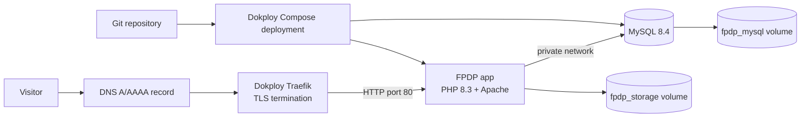
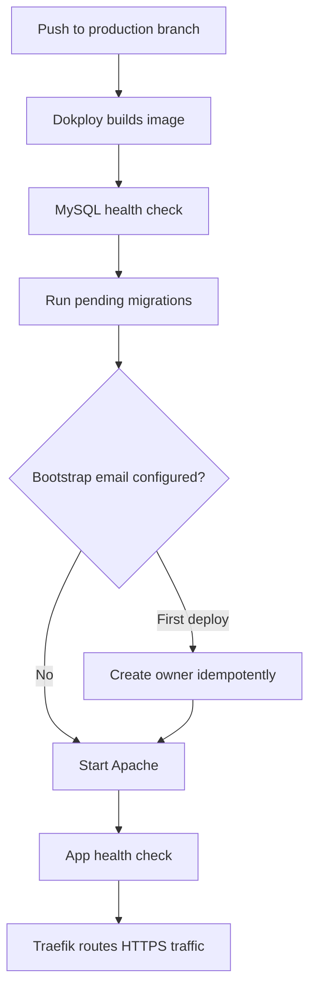

# Deploying FPDP with Dokploy

## 1. What this deployment provides

The repository includes a production-oriented Dokploy Compose deployment:

- PHP 8.3 with Apache and the required PHP extensions;
- MySQL 8.4 on a private Compose network;
- automatic, repeatable database migrations before Apache starts;
- optional idempotent first-owner bootstrap;
- persistent volumes for MySQL and `storage/` (including CV documents and the install lock);
- app and database health checks;
- no host port binding, `container_name`, or hand-written Traefik labels;
- production defaults with the web installer locked.

Files:

- `Dockerfile`
- `dokploy-compose.yml`
- `.env.dokploy.example`
- `docker/apache-vhost.conf`
- `docker/entrypoint.sh`
- `database/bootstrap-owner.php`

## 2. Architecture



Only the `app` service should receive a public domain. MySQL has no published host port.

## 3. Prerequisites

- A working Dokploy server.
- A Git repository accessible to Dokploy.
- A domain with an `A` record pointing to the Dokploy server; add `AAAA` only when IPv6 is configured correctly.
- Ports 80 and 443 reachable on the Dokploy server.
- Strong, distinct application, database-user, and MySQL-root secrets.

## 4. Create the Compose service

1. In Dokploy, create or open a Project and Environment.
2. Add a **Docker Compose** service—not Docker Stack, because this repository uses `build`.
3. Select the Git provider/repository and production branch.
4. Set **Compose Path** to `./dokploy-compose.yml`.
5. Keep a single app replica. Startup migrations and the local `storage` volume are intentionally single-node in the current MVP.
6. Enable isolated deployments if desired. Domain routing is configured through Dokploy in section 6; no manual Traefik labels are required.

Dokploy writes Compose variables to a `.env` file beside the Compose definition. The Compose file explicitly uses `env_file: .env`, because variables saved by Dokploy are not automatically injected into containers unless Compose references or loads them.

## 5. Configure environment variables

Copy the values from `.env.dokploy.example` into the Compose service's Environment editor and replace every placeholder.

Required security-sensitive values:

```dotenv
APP_KEY=<at-least-64-random-hex-characters>
DB_PASSWORD=<strong-database-user-password>
MYSQL_ROOT_PASSWORD=<different-strong-root-password>
NODE_DOMAIN=example.com
```

Generate an application key locally:

```bash
php -r "echo bin2hex(random_bytes(32)), PHP_EOL;"
```

For the first deployment, also set:

```dotenv
BOOTSTRAP_OWNER_EMAIL=owner@example.com
BOOTSTRAP_OWNER_PASSWORD=<at-least-12-characters>
BOOTSTRAP_OWNER_HANDLE=profile
BOOTSTRAP_OWNER_DISPLAY_NAME=Node Owner
BOOTSTRAP_OWNER_LOCALE=en
```

The startup process waits for MySQL, runs migrations, and creates this owner before Apache accepts traffic. Bootstrap is idempotent: subsequent starts detect the existing email and skip creation. After the first successful login, remove `BOOTSTRAP_OWNER_PASSWORD` and the other `BOOTSTRAP_OWNER_*` variables, then redeploy. Do not keep a reusable password in deployment configuration.

The current registration model derives the node host as `<handle>.<NODE_DOMAIN>`. The example therefore produces `profile.example.com`; configure that same hostname in Dokploy. Set DNS and these two variables consistently.

Keep these fixed values unless changing the Compose topology:

```dotenv
APP_ENV=production
APP_DEBUG=false
DB_CONNECTION=mysql
DB_HOST=db
DB_PORT=3306
```

Optional Google visitor login requires `GOOGLE_CLIENT_ID` and `GOOGLE_CLIENT_SECRET`. The authorized callback must be registered as:

```text
https://profile.example.com/api/v1/profiles/{handle}/visitor-auth/google/callback
```

## 6. Configure domain and HTTPS

Use Dokploy's native Domains feature:

1. Open the Compose service's **Domains** tab.
2. Add `profile.example.com`.
3. Select service **app**.
4. Set the container port to **80**.
5. Use `/` as the path.
6. Enable HTTPS and certificate provisioning.
7. Save and redeploy after changing a domain.

Dokploy adds the required Traefik routing internally. Do not add `ports: "80:80"`; the Compose service uses `expose: 80` so MySQL and Apache do not create unnecessary host-port conflicts.

## 7. First deployment

Click **Deploy** and follow the logs. A successful first startup includes messages similar to:

```text
Applied: 0020_create_posts.sql
Owner bootstrap completed. Remove BOOTSTRAP_OWNER_PASSWORD from Dokploy and redeploy.
```

Verify:

```bash
curl --fail https://profile.example.com/api/v1/health
```

Then log in through the post editor at:

```text
https://profile.example.com/dashboard/posts
```

After login succeeds:

1. remove every `BOOTSTRAP_OWNER_*` variable, especially the password;
2. redeploy;
3. confirm health and login again;
4. verify `https://profile.example.com/.env` is not accessible;
5. verify `/install.php` reports that installation is locked.

## 8. Deployment lifecycle



Migrations are forward-only and run automatically. Before deploying a migration that changes or removes data, take a database backup and define its rollback strategy. Do not scale `app` beyond one replica until migration locking and shared/object storage are implemented.

## 9. Updating and rolling back

### Normal update

1. Back up MySQL and the storage volume.
2. Push or merge the tested revision into the configured branch.
3. Deploy from Dokploy.
4. Watch build, migration, Apache, and health-check logs.
5. Run a health check and a short login/post smoke test.

### Application rollback

Redeploy a previously known-good Git commit/image from Dokploy. Code rollback does not automatically reverse database migrations. Only roll back across schema changes when that migration's documented compatibility and restore plan allow it.

### Database rollback

Restore from the pre-deployment backup when a destructive/incompatible migration cannot be corrected forward. Restore MySQL and `fpdp_storage` from the same recovery point when records reference stored documents.

## 10. Backup and restore

At minimum, back up both named volumes:

- `fpdp_mysql`: database and migration state;
- `fpdp_storage`: CV documents, runtime files, and install lock.

A logical database backup can be created from the Dokploy terminal or server shell:

```bash
docker compose -f dokploy-compose.yml exec -T db \
  mysqldump -u root -p"$MYSQL_ROOT_PASSWORD" --single-transaction --routines --triggers fpdp \
  > fpdp-$(date +%F-%H%M).sql
```

Keep backups outside the same server/volume and encrypt them at rest. Test restoration on staging regularly. Container recreation is expected; data survival depends on the volumes, not on a running container.

## 11. Troubleshooting

| Symptom | Check |
|---|---|
| Build fails while installing PHP extensions | Inspect the Docker build log; rebuild without cache after confirming repository files are current |
| App repeatedly says it is waiting for MySQL | Confirm `DB_HOST=db`, database credentials match the MySQL service variables, and the `db` health check passes |
| Domain returns 404/502 | Domain must target service `app`, port `80`; redeploy after domain changes and confirm app health check |
| Migration fails | Inspect the exact migration in logs; do not delete the database volume as a shortcut; restore or correct forward |
| Owner bootstrap fails | Password must be 12–128 characters; handle must match lowercase letters/numbers/hyphens and be 3–63 characters |
| CV disappears after redeploy | Confirm `fpdp_storage:/var/www/html/storage` is attached and was not deleted |
| App exposes debug details | Set `APP_ENV=production` and `APP_DEBUG=false`, then redeploy |
| Installer is reachable | `DISABLE_WEB_INSTALLER=true` creates the persistent install lock during every startup |

## 12. Security checklist

- Keep MySQL private; never add a host `ports` mapping to `db`.
- Use different values for `DB_PASSWORD` and `MYSQL_ROOT_PASSWORD`.
- Remove bootstrap credentials after first deployment.
- Store secrets in Dokploy variables or a supported external secret provider, never in Git.
- Keep `APP_DEBUG=false` and enforce HTTPS.
- Restrict Dokploy dashboard access and enable its own backups/updates.
- Back up and restore-test both persistent volumes.
- Review logs without copying access tokens, OAuth secrets, or database passwords into tickets.

## 13. Dokploy references

- [Docker Compose in Dokploy](https://docs.dokploy.com/docs/core/docker-compose)
- [Compose domains](https://docs.dokploy.com/docs/core/docker-compose/domains)
- [Environment variables](https://docs.dokploy.com/docs/core/variables)
- [Domain troubleshooting](https://docs.dokploy.com/docs/core/troubleshooting/domains)
