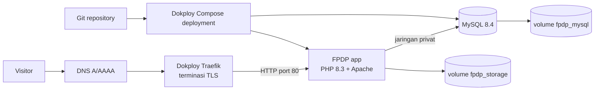
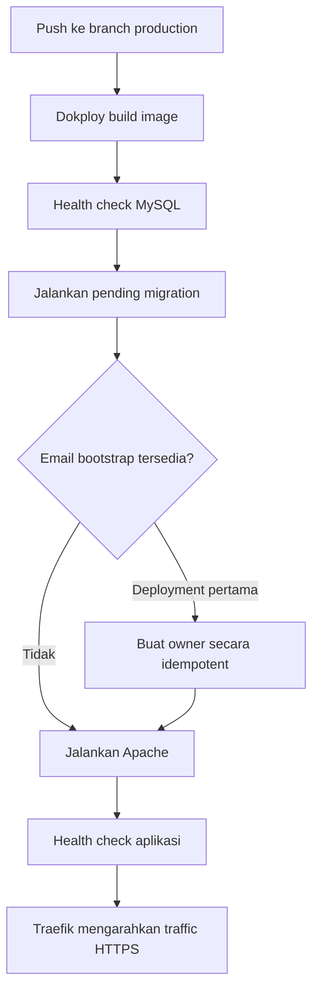

# Deployment FPDP Menggunakan Dokploy

## 1. Hasil yang disediakan

Repository menyediakan deployment Dokploy berbasis Docker Compose dengan:

- PHP 8.3, Apache, dan extension PHP wajib;
- MySQL 8.4 pada jaringan Compose privat;
- migration otomatis dan repeatable sebelum Apache berjalan;
- bootstrap owner pertama yang opsional dan idempotent;
- persistent volume untuk MySQL dan `storage/`;
- health check aplikasi dan database;
- worker `federation-worker` yang berjalan terus-menerus untuk mengirim activity ActivityPub yang tertunda (follow, accept, post, dsb.) ke inbox remote — tanpa ini, permintaan follow akan tersimpan sebagai PENDING tapi tidak pernah benar-benar terkirim;
- tanpa host-port binding, `container_name`, atau label Traefik manual;
- default production dengan web installer terkunci.

File utama: `Dockerfile`, `dokploy-compose.yml`, `.env.dokploy.example`, `docker/apache-vhost.conf`, `docker/entrypoint.sh`, dan `database/bootstrap-owner.php`.

## 2. Arsitektur



Hanya service `app` yang mendapat domain publik. MySQL tidak mempublikasikan port host.

## 3. Prasyarat

- Server Dokploy yang aktif.
- Repository Git yang dapat diakses Dokploy.
- Domain dengan record `A` menuju server Dokploy; gunakan `AAAA` hanya jika IPv6 benar-benar dikonfigurasi.
- Port 80 dan 443 dapat diakses.
- Secret aplikasi, user database, dan root MySQL yang kuat serta berbeda.

## 4. Membuat service Compose

1. Buat atau buka Project dan Environment di Dokploy.
2. Tambahkan service **Docker Compose**, bukan Docker Stack karena repository memakai `build`.
3. Pilih repository dan branch production.
4. Isi **Compose Path** dengan `./dokploy-compose.yml`.
5. Gunakan satu replica app. Migration startup dan volume `storage` lokal pada MVP belum dirancang untuk multi-replica.
6. Isolated deployment boleh diaktifkan. Routing domain memakai fitur Domains Dokploy, tanpa label Traefik manual.

Dokploy menulis variable Compose ke `.env` di samping file Compose. `dokploy-compose.yml` memakai `env_file: .env` secara eksplisit karena variable dari editor Dokploy tidak otomatis masuk ke container jika tidak direferensikan atau dimuat oleh Compose.

## 5. Mengatur environment variable

Salin `.env.dokploy.example` ke editor Environment service Compose, lalu ganti seluruh placeholder.

Secret wajib:

```dotenv
APP_KEY=<minimal-64-karakter-hex-acak>
DB_PASSWORD=<password-user-database-kuat>
MYSQL_ROOT_PASSWORD=<password-root-berbeda-dan-kuat>
NODE_DOMAIN=example.com
```

Membuat application key:

```bash
php -r "echo bin2hex(random_bytes(32)), PHP_EOL;"
```

Khusus deployment pertama, isi:

```dotenv
BOOTSTRAP_OWNER_EMAIL=owner@example.com
BOOTSTRAP_OWNER_PASSWORD=<minimal-12-karakter>
BOOTSTRAP_OWNER_HANDLE=profile
BOOTSTRAP_OWNER_DISPLAY_NAME=Node Owner
BOOTSTRAP_OWNER_LOCALE=id
```

Startup menunggu MySQL, menjalankan migration, lalu membuat owner sebelum Apache menerima traffic. Proses ini idempotent: startup berikutnya menemukan email yang sama dan melewati pembuatan. Setelah login pertama berhasil, hapus semua variable `BOOTSTRAP_OWNER_*`, terutama password, lalu deploy ulang.

Model registrasi saat ini membentuk hostname node sebagai `<handle>.<NODE_DOMAIN>`. Contoh di atas menghasilkan `profile.example.com`; gunakan hostname yang sama pada Domains Dokploy. DNS dan kedua variable tersebut harus konsisten.

Pertahankan nilai berikut kecuali topologi Compose diubah:

```dotenv
APP_ENV=production
APP_DEBUG=false
DB_CONNECTION=mysql
DB_HOST=db
DB_PORT=3306
```

Google visitor login memerlukan `GOOGLE_CLIENT_ID` dan `GOOGLE_CLIENT_SECRET`. Daftarkan callback dengan mengganti `HANDLE` menjadi handle owner yang sebenarnya:

```text
https://profile.example.com/api/v1/profiles/HANDLE/visitor-auth/google/callback
```

Google tidak mendukung wildcard pada redirect URI. Panduan pembuatan credential, consent screen, callback lokal/production, dan troubleshooting tersedia di [Konfigurasi Google OAuth](GOOGLE-OAUTH-SETUP.id.md).

## 6. Domain dan HTTPS

Gunakan fitur Domains native Dokploy:

1. Buka tab **Domains** pada service Compose.
2. Tambahkan `profile.example.com`.
3. Pilih service **app**.
4. Gunakan container port **80** dan path `/`.
5. Aktifkan HTTPS serta provisioning certificate.
6. Simpan dan redeploy setelah perubahan domain.

Dokploy menambahkan routing Traefik secara internal. Jangan menambahkan `ports: "80:80"`; Compose memakai `expose: 80` agar tidak menyebabkan konflik port host.

## 7. Deployment pertama

Klik **Deploy** dan pantau log. Startup sukses akan menampilkan migration yang diterapkan dan pesan bootstrap owner tanpa mencetak password atau access token.

Verifikasi:

```bash
curl --fail https://profile.example.com/api/v1/health
```

Login melalui:

```text
https://profile.example.com/dashboard/posts
```

Setelah berhasil:

1. hapus semua variable `BOOTSTRAP_OWNER_*`;
2. redeploy;
3. uji health dan login kembali;
4. pastikan `/.env` tidak dapat diakses;
5. pastikan `/install.php` menyatakan instalasi terkunci.

## 8. Lifecycle deployment



Migration bersifat forward-only dan dijalankan otomatis. Ambil backup sebelum migration yang mengubah atau menghapus data. Jangan menambah replica `app` sebelum migration locking dan shared/object storage tersedia.

## 9. Update dan rollback

### Update normal

1. Backup MySQL dan volume storage.
2. Push atau merge revisi yang sudah diuji ke branch production.
3. Deploy melalui Dokploy.
4. Pantau log build, migration, Apache, dan health check.
5. Jalankan health check serta smoke test login/post.

### Rollback aplikasi

Deploy ulang commit/image terakhir yang diketahui stabil. Rollback kode tidak membalikkan migration database. Rollback lintas perubahan schema hanya aman jika compatibility dan restore plan migration mengizinkannya.

### Rollback database

Pulihkan backup sebelum deployment jika migration destruktif tidak dapat diperbaiki secara forward. Pulihkan MySQL dan `fpdp_storage` dari recovery point yang sama ketika record mereferensikan dokumen tersimpan.

## 10. Backup dan restore

Minimal backup kedua named volume:

- `fpdp_mysql`: database dan migration state;
- `fpdp_storage`: dokumen CV, runtime files, dan install lock.

Contoh logical backup dari terminal Dokploy atau shell server:

```bash
docker compose -f dokploy-compose.yml exec -T db \
  mysqldump -u root -p"$MYSQL_ROOT_PASSWORD" --single-transaction --routines --triggers fpdp \
  > fpdp-$(date +%F-%H%M).sql
```

Simpan backup di luar server/volume yang sama, enkripsi saat disimpan, dan uji restore secara rutin di staging. Container boleh dibuat ulang; ketahanan data bergantung pada volume.

## 11. Troubleshooting

| Gejala | Pemeriksaan |
|---|---|
| Build extension PHP gagal | Periksa build log dan rebuild tanpa cache setelah memastikan repository terbaru |
| App terus menunggu MySQL | Pastikan `DB_HOST=db`, credential sama dengan variable service MySQL, dan health check `db` lulus |
| Domain 404/502 | Domain harus menuju service `app`, port `80`; redeploy dan periksa health app |
| Migration gagal | Periksa migration spesifik pada log; jangan menghapus volume database sebagai jalan pintas |
| Bootstrap owner gagal | Password 12–128 karakter; handle huruf kecil/angka/hyphen sepanjang 3–63 karakter |
| CV hilang setelah redeploy | Pastikan volume `fpdp_storage:/var/www/html/storage` tetap terpasang |
| Detail debug terlihat | Atur `APP_ENV=production`, `APP_DEBUG=false`, lalu redeploy |
| Installer dapat dijalankan | `DISABLE_WEB_INSTALLER=true` membuat install lock persisten setiap startup |

## 12. Checklist keamanan

- Jangan tambahkan mapping `ports` pada service `db`.
- Gunakan nilai berbeda untuk `DB_PASSWORD` dan `MYSQL_ROOT_PASSWORD`.
- Hapus credential bootstrap setelah deployment pertama.
- Simpan secret pada variable Dokploy atau external secret provider, bukan Git.
- Gunakan `APP_DEBUG=false` dan HTTPS.
- Batasi akses dashboard Dokploy.
- Backup dan uji restore kedua persistent volume.
- Jangan menyalin token, OAuth secret, atau password database dari log ke ticket.

## 13. Referensi Dokploy

- [Docker Compose di Dokploy](https://docs.dokploy.com/docs/core/docker-compose)
- [Domain untuk Compose](https://docs.dokploy.com/docs/core/docker-compose/domains)
- [Environment variables](https://docs.dokploy.com/docs/core/variables)
- [Troubleshooting domain](https://docs.dokploy.com/docs/core/troubleshooting/domains)
