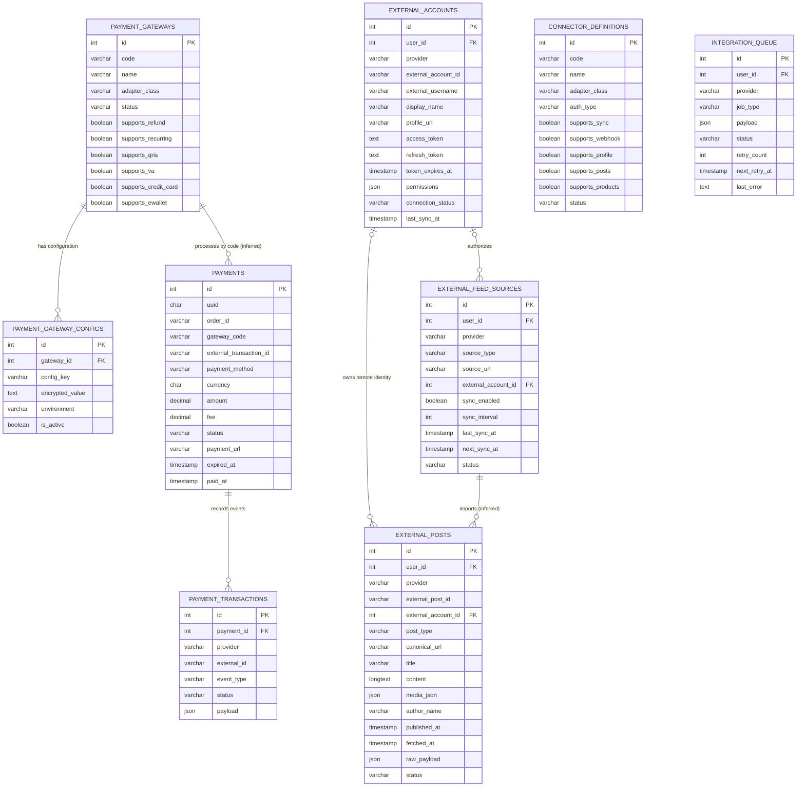
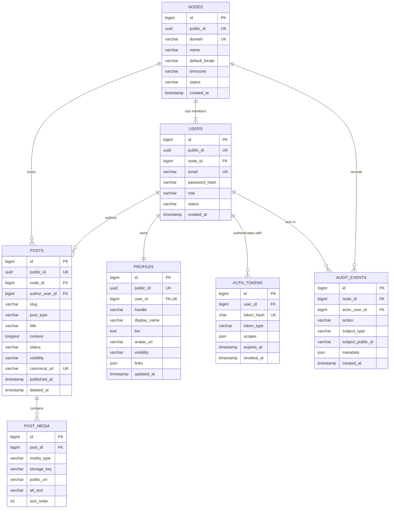
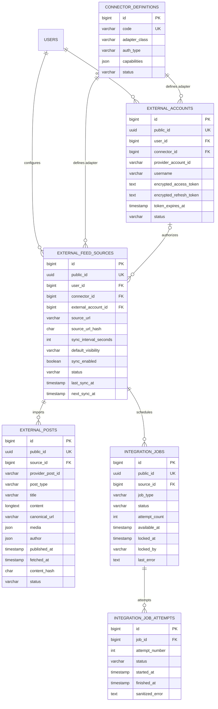
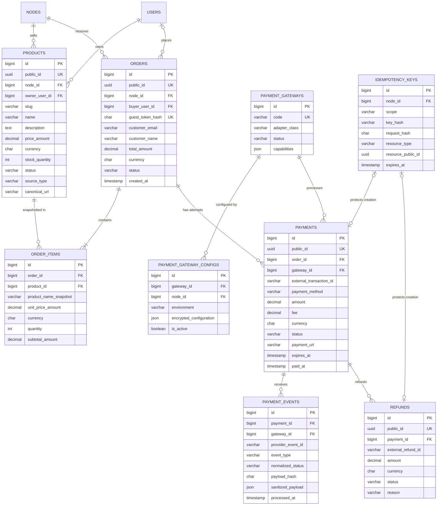
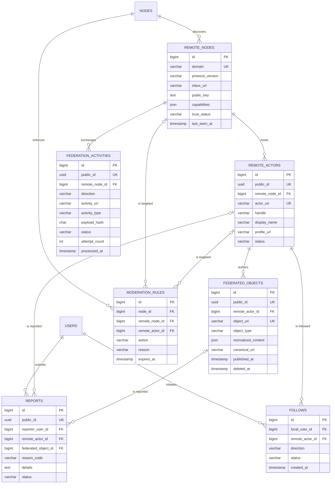

# FPDP Entity Relationship Diagram (English)

## 1. Purpose and scope

This document describes both:

1. the **current physical schema** in [`database/schema.sql`](../database/schema.sql); and
2. the **target logical data model** required by the product requirements, OpenAPI contract, and development roadmap.

The distinction is important: the target entities are a design proposal and do not yet exist in the application. Fields shown in target diagrams are the minimum relationship fields, not a complete migration specification.

## 2. Legend and conventions

| Marker | Meaning |
|---|---|
| Current | Table exists in `database/schema.sql` |
| Planned | Table is required by the target product but not yet implemented |
| `PK` | Primary key |
| `FK` | Foreign key |
| `UK` | Unique key or unique constraint |
| `||` | Exactly one |
| `o|` | Zero or one |
| `o{` | Zero or many |
| `|{` | One or many |

Recommended database conventions for new migrations:

- Use one ID strategy consistently. The API exposes UUIDs; either use UUIDs as database primary keys or keep internal numeric keys plus a unique public UUID.
- Store timestamps in UTC and render them in the user's timezone.
- Use fixed-precision `DECIMAL`, never floating point, for money.
- Encrypt provider credentials and tokens at rest.
- Use soft deletion only when retention or recovery requires it.
- Add foreign keys, unique constraints, and indexes through ordered migrations.
- Keep canonical source data immutable where it is required for attribution or order history.

## 3. Current physical ERD

The current SQL file creates nine tables. Relationships below are inferred from column names because the schema does not currently declare foreign-key constraints.

### Current schema gaps

- `users` and `orders` do not exist even though `user_id` and `order_id` are used.
- No explicit foreign-key constraint is declared.
- Gateway and connector codes are not unique.
- The existing external-post uniqueness rule is composite: `(provider, external_post_id)`.
- `external_posts` has no `external_feed_source_id`, so the exact importing source cannot be enforced.
- Payment records use `gateway_code` instead of a constrained gateway foreign key.
- Payment event idempotency is not guaranteed by a unique provider event key.
- Credentials exist as generic text columns; application-level encryption is not yet implemented.
- Queue locking, attempt history, and dead-letter state are not modeled.
- Several operational lookup indexes are missing.

## 4. Target domain model overview

| Domain | Planned entities | Existing entities reused or migrated |
|---|---|---|
| Identity and node | `nodes`, `users`, `profiles`, `auth_tokens`, `audit_events` | None |
| Local content | `posts`, `post_media` | None |
| External integration | `external_accounts`, `external_feed_sources`, `external_posts`, `integration_jobs`, `integration_job_attempts`, `connector_definitions` | Existing integration tables |
| Commerce | `products`, `orders`, `order_items` | None |
| Payments | `payment_gateways`, `payment_gateway_configs`, `payments`, `payment_events`, `refunds`, `idempotency_keys` | Existing payment tables |
| Federation | `remote_nodes`, `remote_actors`, `federated_objects`, `federation_activities`, `follows`, `moderation_rules`, `reports` | None |

## 5. Target ERD — identity and local content

Important constraints:

- `profiles.user_id` is unique: one current profile per user.
- `(node_id, handle)` and `(node_id, slug)` are unique.
- Passwords and bearer tokens are never stored in plaintext.
- A post's local canonical URL must remain stable after publication.
- Private or soft-deleted posts must be excluded by repository-level visibility rules.

## 6. Target ERD — external integrations

Important constraints:

- `(connector_id, provider_account_id, user_id)` is unique when an account ID exists.
- `(user_id, connector_id, source_url_hash)` prevents duplicate source configuration.
- `(source_id, provider_post_id)` is unique and is the primary import deduplication key.
- Only encrypted credentials are persisted; masked values may be returned to administrators.
- Job claiming must use an atomic lock/update strategy.
- Raw payload retention must be bounded and must not retain secrets.

## 7. Target ERD — commerce and payments

Important constraints:

- Order items preserve product name and price snapshots; historical orders do not depend on mutable product prices.
- All order items in one order use the order currency unless multi-currency settlement is explicitly designed later.
- `(gateway_id, external_transaction_id)` is unique when the provider supplies an ID.
- `(gateway_id, provider_event_id)` is unique to make webhook handling idempotent.
- `(node_id, scope, key_hash)` is unique for idempotent API operations.
- Payment and order status changes occur in one database transaction where applicable.
- Refund totals may not exceed the captured payment amount.

## 8. Target ERD — federation and moderation

Important constraints:

- Remote URIs are globally unique and are never treated as trusted solely because they are syntactically valid.
- Incoming activities are deduplicated by stable activity URI or a documented sender + payload hash strategy.
- Exactly one moderation target is required when a rule targets a remote node or actor.
- Tombstones preserve enough identity to prevent deleted remote objects from being re-imported accidentally.
- Raw signed activity payload retention and personal-data retention require explicit policies.

## 9. Relationship and deletion policy

| Relationship | Recommended deletion behavior |
|---|---|
| Node → users/profiles/posts/products/orders | Restrict node deletion; use a controlled export and retirement workflow |
| User → profile | Cascade only during a verified hard-delete workflow |
| User → posts | Preserve or anonymize based on ownership/export policy |
| External source → external posts | Default soft disconnect; optional explicit purge |
| Order → order items/payments | Restrict hard deletion; retain for financial/audit policy |
| Payment → events/refunds | Restrict hard deletion |
| Remote node → actors/objects | Prefer trust-state change or tombstone over deletion |
| Token/session | Hard delete or revoke after retention window |
| Integration job → attempts | Cascade after operational retention expires |

## 10. Index and constraint checklist

Minimum indexes should support:

- login by normalized email;
- public profile by `(node_id, handle)`;
- public post by `(node_id, slug)` and timeline by `(visibility, published_at, id)`;
- due feed sources by `(sync_enabled, status, next_sync_at)`;
- external post deduplication by `(source_id, provider_post_id)`;
- available jobs by `(status, available_at)` and stale locks by `locked_at`;
- products by `(node_id, status)`;
- orders by `(node_id, status, created_at)`;
- payments by `order_id`, status, and unique external transaction ID;
- payment events by unique provider event ID;
- remote actors and objects by unique URI;
- federation activity delivery by `(direction, status, available_at)` when delivery scheduling is added.

## 11. Recommended migration order

1. Migration framework and baseline current tables.
2. `nodes`, `users`, `profiles`, `auth_tokens`, and `audit_events`.
3. `posts` and `post_media`.
4. Refactor external tables to reference users, connectors, and feed sources explicitly.
5. Replace `integration_queue` with robust jobs and attempt history, or migrate it compatibly.
6. Add products, orders, and immutable order items.
7. Refactor payments, add events, refunds, and idempotency keys.
8. Add federation and moderation entities only after protocol selection.
9. Backfill data, validate constraints, then enable foreign-key enforcement.

Every migration must include a forward test, rollback strategy, data-backfill plan when required, and an update to this ERD.
