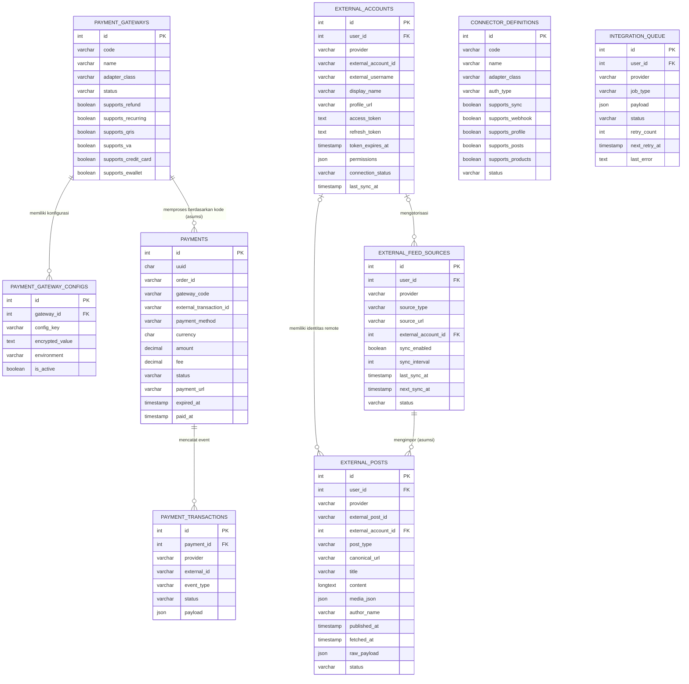
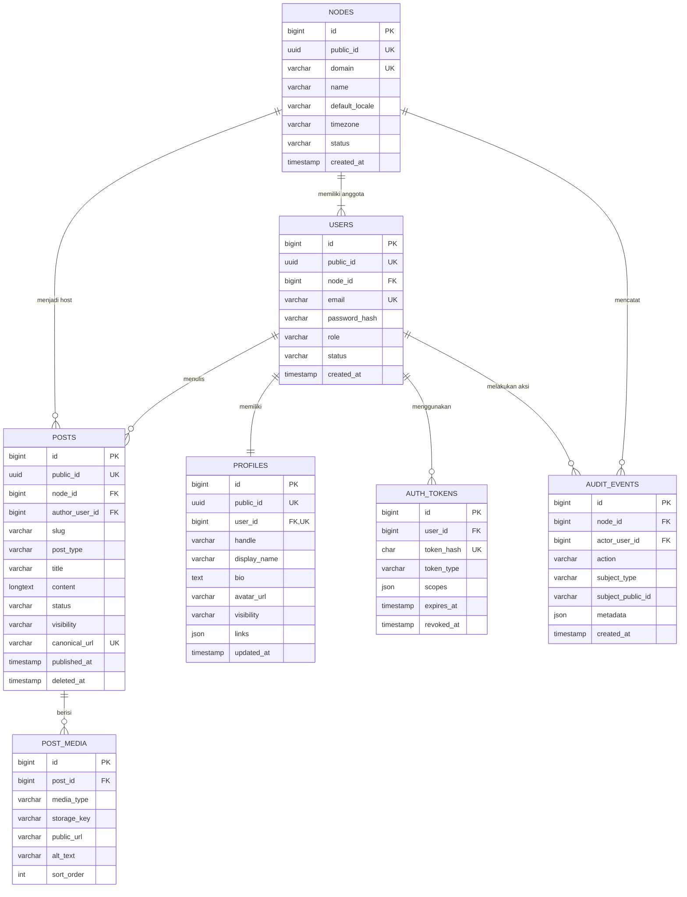
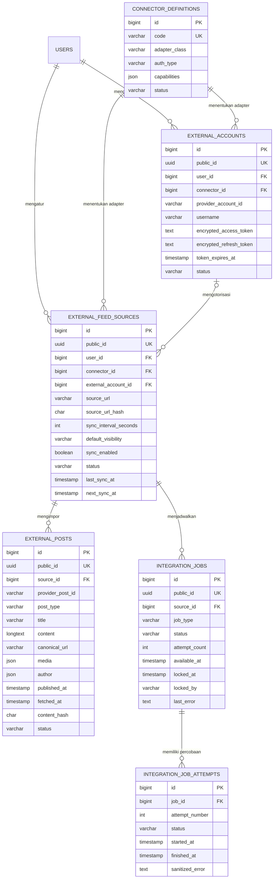
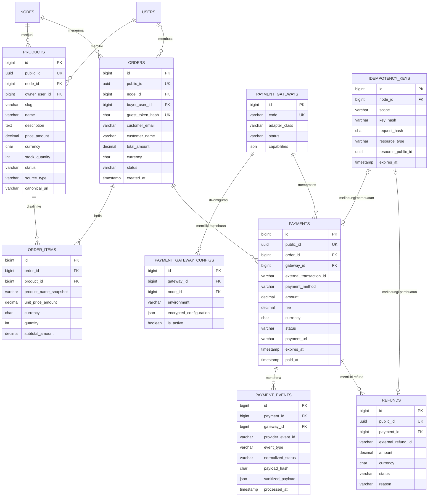
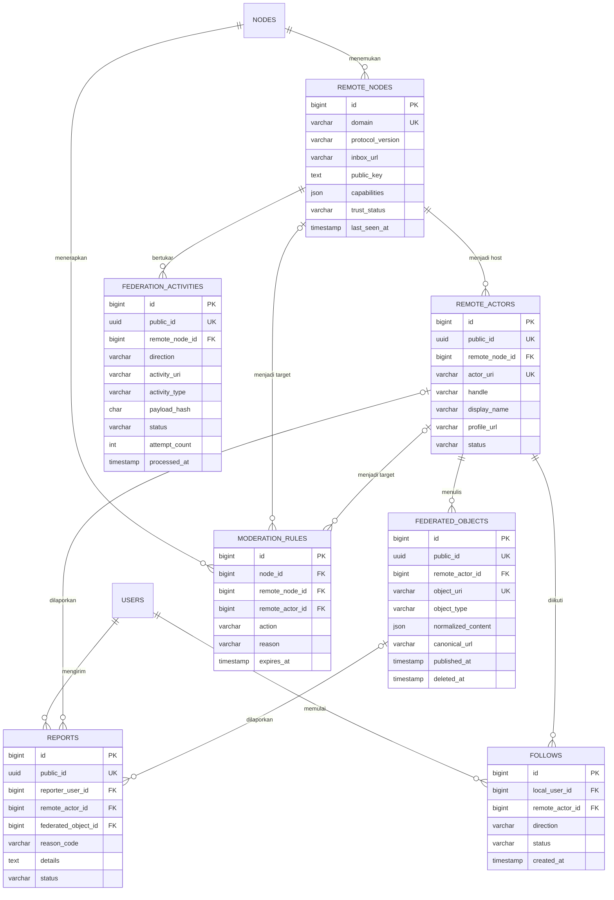
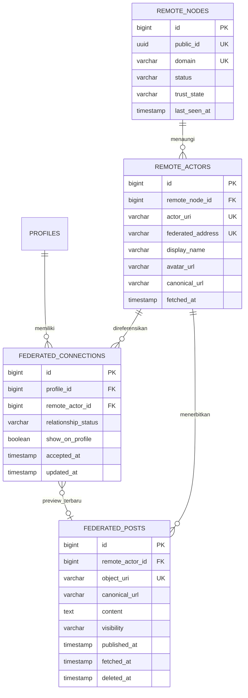

# Entity Relationship Diagram (ERD) FPDP — Bahasa Indonesia

## 1. Tujuan dan cakupan

Dokumen ini menjelaskan:

1. **skema fisik saat ini** pada [`database/schema.sql`](../database/schema.sql); dan
2. **model data logis target** yang dibutuhkan oleh product requirements, kontrak OpenAPI, dan roadmap pengembangan.

Pembedaan tersebut penting: entity target merupakan rancangan dan belum tersedia pada aplikasi. Field pada diagram target menunjukkan field relasi minimum, bukan spesifikasi migration lengkap.

## 2. Legenda dan konvensi

| Penanda | Arti |
|---|---|
| Saat ini | Tabel tersedia pada `database/schema.sql` |
| Direncanakan | Tabel diperlukan produk target tetapi belum diimplementasikan |
| `PK` | Primary key |
| `FK` | Foreign key |
| `UK` | Unique key atau unique constraint |
| `||` | Tepat satu |
| `o|` | Nol atau satu |
| `o{` | Nol atau banyak |
| `|{` | Satu atau banyak |

Konvensi database yang disarankan untuk migration baru:

- Gunakan satu strategi ID secara konsisten. API mengekspos UUID; gunakan UUID sebagai primary key database atau gunakan numeric key internal dengan UUID publik yang unik.
- Simpan timestamp dalam UTC dan tampilkan sesuai timezone pengguna.
- Gunakan `DECIMAL` fixed-precision, bukan floating point, untuk uang.
- Enkripsi credential dan token provider ketika disimpan.
- Gunakan soft deletion hanya jika dibutuhkan oleh retention atau recovery.
- Tambahkan foreign key, unique constraint, dan index melalui migration berurutan.
- Jaga canonical source data tetap immutable ketika diperlukan untuk atribusi atau histori order.

## 3. ERD fisik saat ini

File SQL saat ini membuat sembilan tabel. Relasi berikut disimpulkan dari nama kolom karena schema belum mendeklarasikan foreign-key constraint.

### Gap pada schema saat ini

- `users` dan `orders` belum tersedia walaupun `user_id` dan `order_id` digunakan.
- Belum ada foreign-key constraint eksplisit.
- Kode gateway dan connector belum memiliki unique constraint.
- Unique rule external post saat ini bersifat komposit: `(provider, external_post_id)`.
- `external_posts` tidak memiliki `external_feed_source_id`, sehingga sumber pengimpor tidak dapat dipastikan.
- Payment menggunakan `gateway_code` dan bukan constrained gateway foreign key.
- Idempotency payment event belum dijamin oleh unique provider event key.
- Credential masih berupa kolom text generik; enkripsi pada application layer belum tersedia.
- Queue locking, attempt history, dan dead-letter state belum dimodelkan.
- Beberapa index untuk query operasional belum tersedia.

## 4. Ringkasan model domain target

| Domain | Entity direncanakan | Entity saat ini yang digunakan/migrasi |
|---|---|---|
| Identity dan node | `nodes`, `users`, `profiles`, `auth_tokens`, `audit_events` | Tidak ada |
| Konten lokal | `posts`, `post_media` | Tidak ada |
| Integrasi eksternal | `external_accounts`, `external_feed_sources`, `external_posts`, `integration_jobs`, `integration_job_attempts`, `connector_definitions` | Tabel integrasi yang ada |
| Commerce | `products`, `orders`, `order_items` | Tidak ada |
| Payment | `payment_gateways`, `payment_gateway_configs`, `payments`, `payment_events`, `refunds`, `idempotency_keys` | Tabel payment yang ada |
| Federasi | `remote_nodes`, `remote_actors`, `federated_objects`, `federation_activities`, `follows`, `moderation_rules`, `reports` | Tidak ada |

## 5. ERD target — identity dan konten lokal

Constraint penting:

- `profiles.user_id` unik: satu profil aktif untuk setiap user.
- `(node_id, handle)` dan `(node_id, slug)` unik.
- Password dan bearer token tidak pernah disimpan sebagai plaintext.
- Canonical URL post lokal harus stabil setelah publikasi.
- Post private atau soft-deleted harus dikecualikan oleh visibility rule pada repository.

## 6. ERD target — integrasi eksternal

Constraint penting:

- `(connector_id, provider_account_id, user_id)` unik ketika account ID tersedia.
- `(user_id, connector_id, source_url_hash)` mencegah konfigurasi sumber duplikat.
- `(source_id, provider_post_id)` unik dan menjadi kunci deduplikasi impor utama.
- Hanya credential terenkripsi yang disimpan; admin hanya menerima nilai yang dimasking.
- Job claiming harus memakai strategi lock/update atomik.
- Retention raw payload harus dibatasi dan tidak boleh menyimpan secret.

## 7. ERD target — commerce dan payment

Constraint penting:

- Order item menyimpan snapshot nama dan harga; histori order tidak bergantung pada harga produk yang dapat berubah.
- Seluruh item dalam satu order menggunakan currency order kecuali multi-currency settlement dirancang kemudian.
- `(gateway_id, external_transaction_id)` unik ketika provider memberikan ID.
- `(gateway_id, provider_event_id)` unik agar pemrosesan webhook idempotent.
- `(node_id, scope, key_hash)` unik untuk operasi API idempotent.
- Perubahan status payment dan order dijalankan dalam satu transaksi database jika relevan.
- Total refund tidak boleh melebihi captured payment amount.

## 8. ERD target — federasi dan moderasi

Constraint penting:

- Remote URI unik secara global dan tidak dipercaya hanya karena formatnya valid.
- Incoming activity dideduplikasi melalui stable activity URI atau strategi sender + payload hash yang terdokumentasi.
- Tepat satu moderation target wajib tersedia jika rule menargetkan remote node atau actor.
- Tombstone menyimpan identitas minimum agar object remote yang sudah dihapus tidak diimpor kembali.
- Retention raw signed activity dan personal data membutuhkan policy eksplisit.

## 9. Kebijakan relasi dan penghapusan

| Relasi | Perilaku penghapusan yang disarankan |
|---|---|
| Node → user/profil/post/produk/order | Batasi penghapusan node; gunakan workflow export dan retirement terkontrol |
| User → profil | Cascade hanya dalam workflow hard-delete yang terverifikasi |
| User → post | Pertahankan atau anonimisasi sesuai policy ownership/export |
| Sumber eksternal → external post | Default soft disconnect; purge hanya melalui aksi eksplisit |
| Order → order item/payment | Batasi hard delete; pertahankan sesuai policy keuangan/audit |
| Payment → event/refund | Batasi hard delete |
| Remote node → actor/object | Gunakan perubahan trust state atau tombstone daripada delete |
| Token/session | Hard delete atau revoke setelah retention window |
| Integration job → attempt | Cascade setelah masa retention operasional berakhir |

## 10. Checklist index dan constraint

Index minimum harus mendukung:

- login melalui email ternormalisasi;
- profil publik melalui `(node_id, handle)`;
- post publik melalui `(node_id, slug)` dan timeline melalui `(visibility, published_at, id)`;
- feed yang jatuh tempo melalui `(sync_enabled, status, next_sync_at)`;
- deduplikasi external post melalui `(source_id, provider_post_id)`;
- job tersedia melalui `(status, available_at)` dan stale lock melalui `locked_at`;
- produk melalui `(node_id, status)`;
- order melalui `(node_id, status, created_at)`;
- payment melalui `order_id`, status, dan external transaction ID yang unik;
- payment event melalui provider event ID yang unik;
- remote actor dan object melalui URI unik;
- delivery federation activity melalui `(direction, status, available_at)` ketika scheduling ditambahkan.

## 11. Urutan migration yang disarankan

1. Migration framework dan baseline tabel saat ini.
2. `nodes`, `users`, `profiles`, `auth_tokens`, dan `audit_events`.
3. `posts` dan `post_media`.
4. Refactor tabel eksternal agar mereferensikan user, connector, dan feed source secara eksplisit.
5. Ganti `integration_queue` dengan job serta attempt history yang kuat, atau lakukan migration kompatibel.
6. Tambahkan product, order, dan order item immutable.
7. Refactor payment, lalu tambahkan event, refund, dan idempotency key.
8. Tambahkan entity federasi dan moderasi hanya setelah pemilihan protokol.
9. Backfill data, validasi constraint, kemudian aktifkan foreign-key enforcement.

Setiap migration wajib memiliki forward test, rollback strategy, data-backfill plan jika diperlukan, dan pembaruan ERD ini.

## 12. Addendum — Koneksi Federasi pada Profil Publik

Model target ini mendukung discovery koneksi publik dan preview post terbaru dari cache. Bagian ini adalah desain target, bukan klaim bahwa persistence federasi sudah diimplementasikan.

Constraint dan aturan query:

- Unique `(profile_id, remote_actor_id)` mencegah edge duplikat; edge bersifat directional dan siklus tetap sah.
- `relationship_status`: `PENDING`, `FOLLOWING`, `CONNECTED`, `MUTED`, `BLOCKED`, atau `DISCONNECTED`.
- Query publik mensyaratkan `show_on_profile=true`, status hubungan yang diizinkan, trust state node yang diizinkan, dan post publik yang belum dihapus.
- Preview terbaru dipilih dari cache lokal; render profil publik tidak melakukan remote fetch yang blocking.
- Index `(profile_id, show_on_profile, relationship_status, id)` mendukung cursor pagination; index `(remote_actor_id, published_at, id)` mendukung lookup post terbaru.
