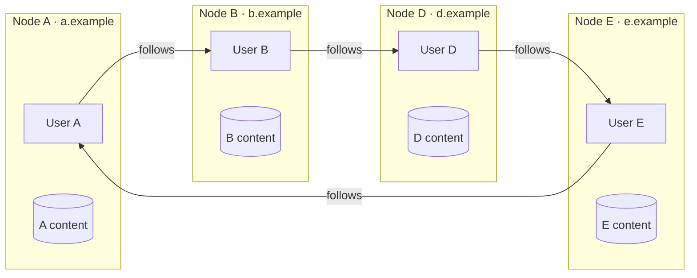
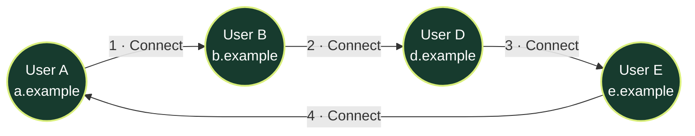
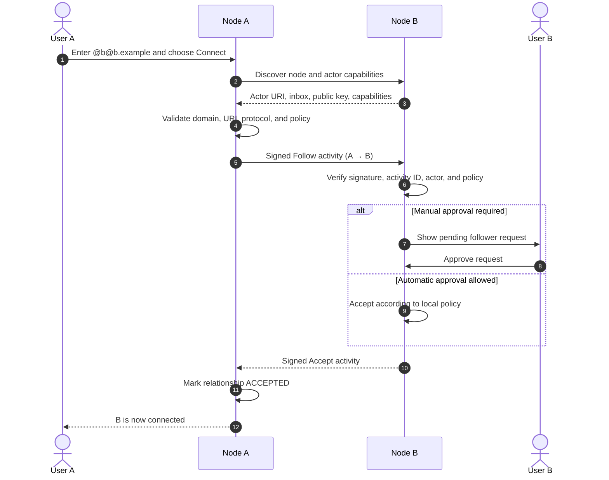
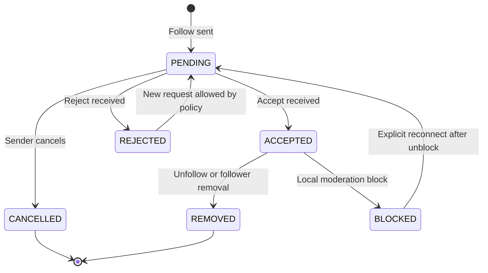
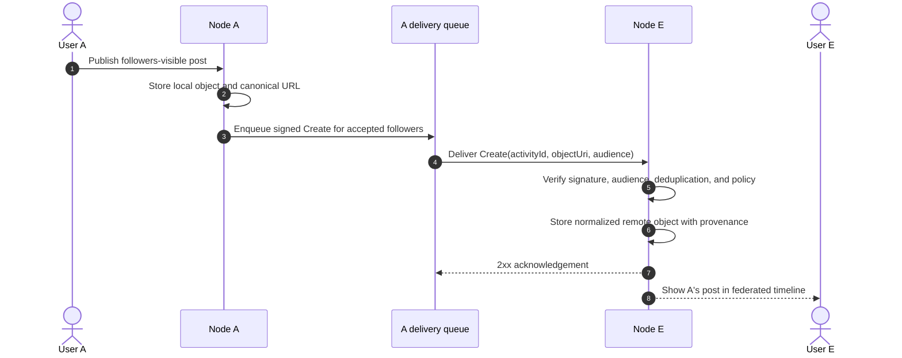
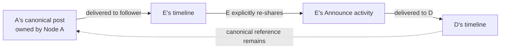
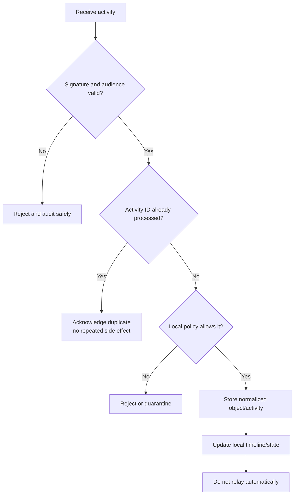
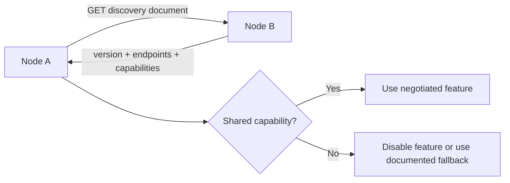

# FPDP Federation Concept (English)

## 1. Purpose and implementation status

Federation lets independently operated FPDP nodes discover and communicate with one another without requiring a central FPDP platform. Each node remains responsible for its own domain, users, content, policies, storage, moderation, and availability.

This document defines the **target FPDP federation model**. Federation is not implemented in the current repository, and a final wire protocol has not been selected. The concepts and boundaries below should guide protocol evaluation and implementation.

## 2. What “federated” means in FPDP

A traditional centralized platform stores every identity and relationship inside one service. FPDP instead treats each domain as an independently controlled network participant:

The diagram forms a valid directed cycle. It does not create a shared database or a central owner. Every arrow is an independent relationship stored and enforced by the two participating nodes.

## 3. Core federation principles

1. **Independent ownership** — a node is authoritative for its local users and local objects.
2. **Directed relationships** — A following B does not imply B follows A.
3. **Non-transitive authorization** — A trusting B does not automatically grant trust or permissions to D.
4. **Explicit provenance** — remote content retains actor, origin node, object URI, and canonical URL.
5. **Capability negotiation** — nodes only use features that both sides advertise and support.
6. **Authenticated delivery** — remote activities must be signed and verified.
7. **Idempotent processing** — repeated delivery of one activity must not repeat its effect.
8. **Eventual consistency** — remote updates may arrive late, out of order, or not at all.
9. **Local policy wins** — every receiving node applies its own visibility, filtering, and moderation rules.
10. **No implicit relay** — receiving an activity does not require forwarding it to every connection.

## 4. Federation terminology

| Term | Meaning in FPDP |
|---|---|
| Node | Independently deployed FPDP instance identified by a domain |
| Local actor | User identity owned by the current node |
| Remote actor | Cached representation of an identity owned by another node |
| Object | Post, profile update, product reference, or another addressable resource |
| Activity | Signed statement such as Follow, Accept, Create, Update, Delete, Like, or Announce |
| Inbox | Endpoint that receives activities for a node or actor |
| Outbox | Ordered activity stream emitted by a local actor |
| Capability document | Machine-readable list of protocol version, endpoints, and supported features |
| Canonical URL/URI | Authoritative remote identifier that remains attached to imported content |
| Tombstone | Minimal record showing that a previously known remote object was deleted |

The eventual protocol may use established standards such as ActivityPub or a compatible subset, but FPDP must document the chosen protocol before implementation. The conceptual terms above do not by themselves claim protocol compatibility.

## 5. Federation feature set

### 5.1 Node identity and discovery

- publish `/.well-known/fpdp` or the selected protocol's discovery document;
- expose node ID, domain, protocol version, public key, endpoints, and capabilities;
- discover an actor from a handle such as `@b@b.example`;
- cache discovery results with expiry and safe refresh behavior;
- reject domain/identifier mismatches and unsafe redirect targets.

### 5.2 Remote actors and profiles

- store a normalized cache of remote actor ID, handle, name, avatar, profile URL, key, and status;
- show that the identity is remote and name its origin node;
- refresh profiles without replacing the authoritative remote URI;
- handle suspended, moved, unavailable, and deleted actors.

### 5.3 Follow/connect lifecycle

- send and receive connection requests;
- support automatic or manually approved acceptance;
- support pending, accepted, rejected, cancelled, and removed states;
- allow unfollow, block, mute, and remove-follower actions;
- prevent duplicate relationship records.

### 5.4 Federated content

- receive Create, Update, and Delete activities for supported object types;
- display remote content in the timeline with `source_type=FEDERATED`;
- preserve canonical URL, remote actor, remote node, and publication time;
- apply visibility and audience rules before storing or displaying content;
- process edits and tombstones idempotently;
- avoid rewriting a remote object as if it were local content.

### 5.5 Interaction and redistribution

- follow and unfollow;
- like/reaction when supported by both nodes;
- reply while preserving conversation context;
- announce/re-share with a link to the original object;
- optional mention delivery;
- never assume that a received private object may be re-shared.

### 5.6 Delivery and reliability

- signed outbound activity queue;
- signature, timestamp, digest, and actor-key verification;
- unique activity ID and deduplication;
- retry with exponential backoff and jitter;
- dead-letter state for repeated failure;
- per-node rate limits and circuit breakers;
- delivery status that administrators can inspect safely.

### 5.7 Moderation and trust

- block or limit a node;
- block, mute, or report a remote actor;
- hide or report a remote object;
- reject activities that violate local policy;
- maintain allow/deny rules and reason codes;
- support audit trails without retaining unnecessary sensitive payloads.

### 5.8 Federated commerce — later phase

Potential future capabilities include discovering remote products and initiating an order request. Payment, seller-of-record, taxes, inventory ownership, refunds, and disputes remain local legal and operational responsibilities unless a separate commerce protocol explicitly defines them.

Federated commerce must not be inferred merely because content federation works.

## 6. Example topology: A → B → D → E → A

The requested scenario contains four directed connections:

| Edge | Relationship owner | Meaning |
|---|---|---|
| A → B | Node A | A follows/subscribes to B |
| B → D | Node B | B follows/subscribes to D |
| D → E | Node D | D follows/subscribes to E |
| E → A | Node E | E follows/subscribes to A |

### What this cycle does mean

- A can receive activities from B that are addressed to A/B's followers under the protocol and visibility rules.
- B can receive allowed activities from D.
- D can receive allowed activities from E.
- E can receive allowed activities from A.
- Every node may independently disconnect, block, mute, or filter its edge.

### What this cycle does not mean

- A does not automatically follow D or E.
- B cannot grant D access to A's private content.
- A's credentials or tokens are never passed to B, D, or E.
- All posts do not circulate around the loop.
- Content received from one node is not automatically republished by the receiving node.
- A connection does not imply payment trust, commercial settlement, or identity verification.

## 7. Establishing each connection

Every arrow uses the same independent follow handshake. The following sequence shows A connecting to B; B→D, D→E, and E→A repeat the same process.

Recommended relationship state machine:

## 8. Publishing inside the cycle

Assume A publishes a followers-visible post. E follows A, so Node A may deliver the Create activity to E. A does not send the activity to B merely because A follows B; following determines what A receives, not who receives A's content.

If E re-shares A's public post, E emits a new Announce/re-share activity referring to A's canonical object. That new activity can be delivered to D because D follows E. It must not create a new local copy falsely attributed to E.

## 9. How loops are prevented

The A→B→D→E→A cycle must not become an infinite relay. FPDP prevents this with several independent controls:

1. Every activity has a globally stable unique ID.
2. Every receiving node stores a processed/deduplication record.
3. Create is not automatically converted into Announce.
4. Announce refers to the original canonical object and has its own actor/activity ID.
5. Delivery targets come from the sender's direct accepted followers and declared audience—not from arbitrary graph traversal.
6. The same activity ID is acknowledged but not processed twice.
7. Hop counts or origin chains may be recorded for diagnostics, but are not substitutes for ID deduplication.
8. Nodes rate-limit abnormal repeat delivery and may block a misbehaving peer.

## 10. Timeline and provenance rules

Every federated item displayed by FPDP must include:

- `source_type = FEDERATED`;
- `source_provider` or federation protocol name;
- remote actor URI and display identity;
- origin node domain;
- canonical object URI/URL;
- original publication timestamp and local received timestamp;
- visibility/audience interpretation;
- local moderation state;
- remote update or tombstone state.

The UI should visually distinguish Local, External, and Federated items. Clicking the origin should open the canonical source when safe.

## 11. Capability discovery and compatibility

Before sending feature-specific activities, Node A should discover Node B's supported protocol version and capabilities.

Example capabilities:

- `PROFILE`
- `CONTENT_CREATE`
- `CONTENT_UPDATE`
- `CONTENT_DELETE`
- `FOLLOW`
- `LIKE`
- `REPLY`
- `ANNOUNCE`
- `PRODUCT_REFERENCE`
- `SIGNED_DELIVERY`

Unknown capabilities must be ignored safely. A version mismatch must not silently downgrade security.

## 12. Suggested API and service boundaries

Public federation endpoints depend on the selected protocol, but internal FPDP services should remain explicit:

| Component | Responsibility |
|---|---|
| `NodeDiscoveryService` | Resolve domains/handles and validate capability documents |
| `RemoteActorService` | Cache and refresh remote identity safely |
| `FollowService` | Enforce relationship state transitions |
| `ActivitySigner` | Sign outbound activities with the local node/actor key |
| `ActivityVerifier` | Verify signature, digest, timestamp, actor, and replay state |
| `InboxService` | Validate, deduplicate, authorize, and dispatch incoming activities |
| `OutboxService` | Create ordered local activities from domain events |
| `FederationDeliveryService` | Resolve recipients, queue delivery, retry, and dead-letter |
| `FederatedObjectRepository` | Store normalized remote objects and tombstones |
| `ModerationService` | Apply node, actor, object, and report policy |

Do not mix these responsibilities into the existing RSS/Atom connector. External aggregation polls third-party sources; federation exchanges authenticated activities between cooperating nodes.

## 13. Data entities

The target ERD defines:

- `remote_nodes`;
- `remote_actors`;
- `federated_objects`;
- `federation_activities`;
- `follows`;
- `moderation_rules`;
- `reports`.

Add delivery-attempt and processed-activity tables if activity volume or audit requirements justify separating them. See [ERD documentation](ERD.en.md).

## 14. Security and privacy requirements

- Use HTTPS for discovery and delivery.
- Protect private keys through encryption and rotation procedures.
- Verify signatures using the actor/node key obtained through trusted discovery.
- Prevent SSRF during remote discovery and key retrieval.
- Enforce timestamp windows, content digests, nonce/activity IDs, and replay protection.
- Limit payload size, nesting, redirects, and media fetches.
- Never forward authorization headers, cookies, or local tokens to remote media hosts.
- Apply visibility before persistence, notification, and display.
- Minimize stored raw remote payloads and define retention periods.
- Provide block, mute, report, follower removal, and disconnect controls.
- Treat remote HTML as untrusted and sanitize it before rendering.

## 15. Failure behavior

Federation must continue operating safely when a remote node is slow, offline, malicious, or permanently gone.

| Failure | Expected behavior |
|---|---|
| Remote timeout | Retry with backoff; do not block local publication |
| Invalid signature | Reject; record a sanitized security event |
| Duplicate activity | Return success where appropriate; do not repeat side effects |
| Out-of-order Update/Delete | Compare object/activity time and preserve tombstone rules |
| Remote actor moved | Verify move semantics before updating identity linkage |
| Capability removed | Stop sending unsupported activity types |
| Repeated delivery failure | Open circuit/dead-letter and show admin health state |
| Remote node blocked | Stop delivery and hide/restrict remote content per policy |

## 16. Recommended implementation order

1. Select and document the federation protocol and interoperability target.
2. Implement node identity, keys, and capability discovery.
3. Implement safe remote-node and remote-actor discovery/cache.
4. Implement signed Follow, Accept, Reject, Undo, and Block flows.
5. Implement inbox verification, activity ID deduplication, and policy checks.
6. Implement Create/Update/Delete for one simple post type.
7. Add the delivery queue, retry, dead-letter, and operational dashboard.
8. Add timeline provenance and tombstone handling.
9. Add reply, reaction, and Announce only after core delivery is stable.
10. Add moderation/reporting and run two-node interoperability and abuse tests.
11. Consider product references only after social/content federation is secure.

## 17. Acceptance scenario for A–B–D–E–A

The cycle is complete only when tests prove that:

- all four independent follow relationships reach `ACCEPTED`;
- each node stores only its own edge and required remote identity cache;
- A followers-only post is delivered to E, not automatically to B or D;
- an explicit E re-share can reach D while retaining A's canonical origin;
- replaying any delivered activity does not duplicate content or counters;
- disconnecting D→E stops new delivery from E to D without breaking other edges;
- blocking Node A at E prevents A's new activities at E;
- one offline node does not prevent another node from publishing locally;
- every timeline item visibly distinguishes local, external, and federated origin.

