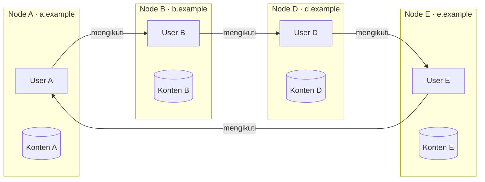
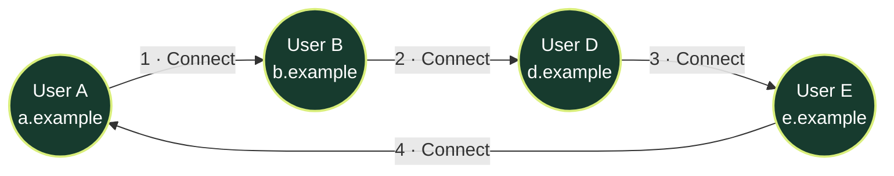
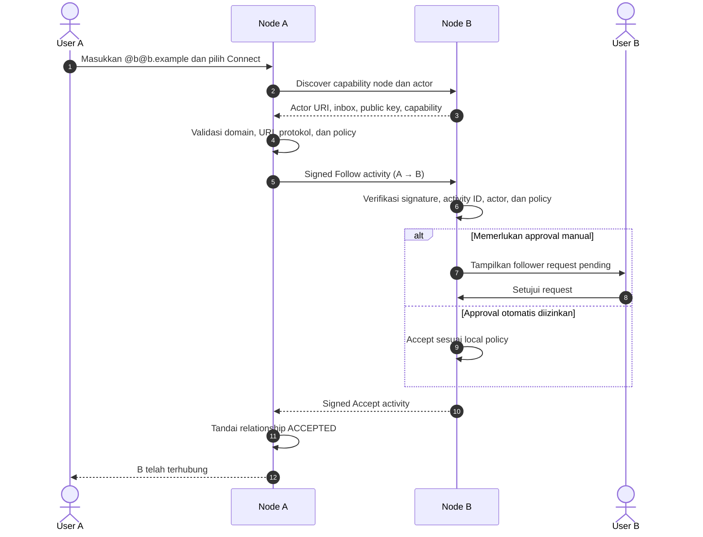
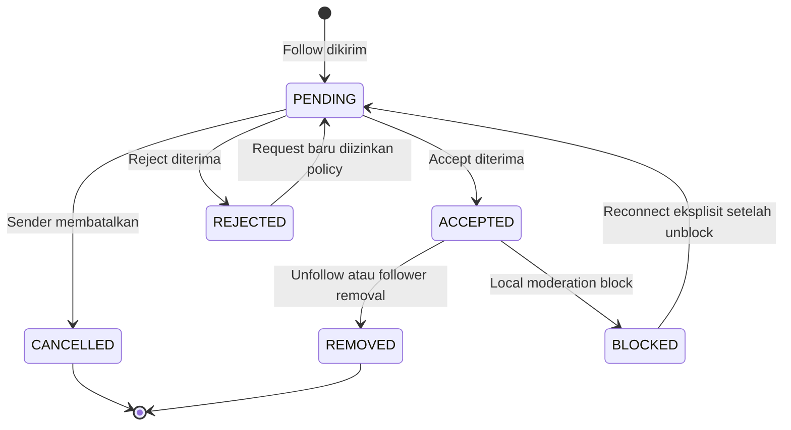
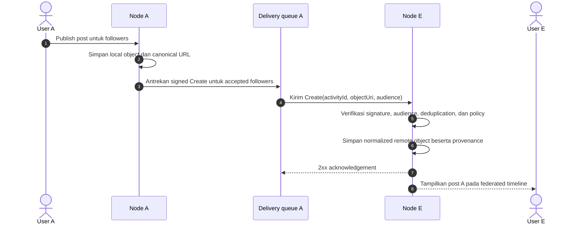
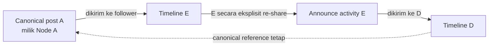
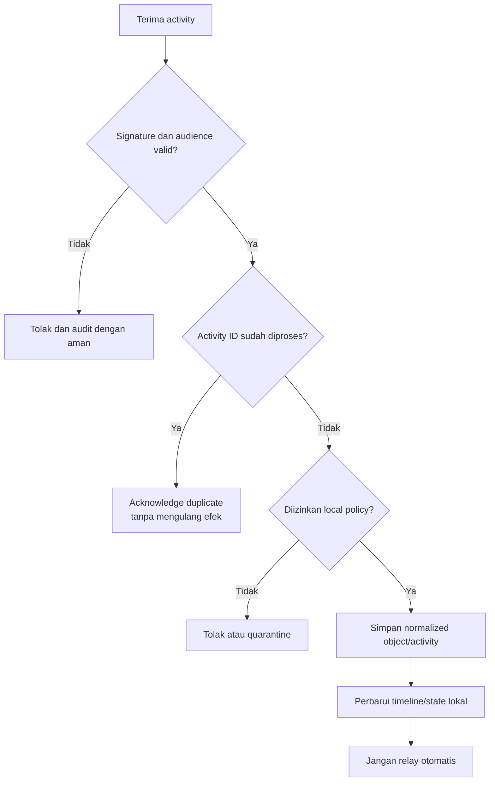
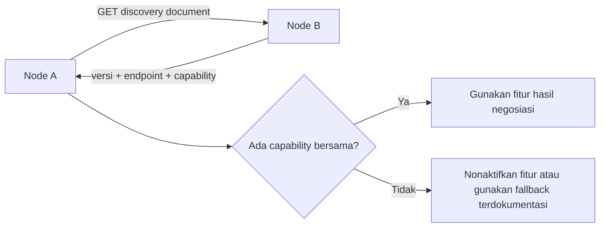

# Konsep Federasi FPDP — Bahasa Indonesia

## 1. Tujuan dan status implementasi

Federasi memungkinkan node FPDP yang dikelola secara independen untuk saling menemukan dan berkomunikasi tanpa mewajibkan platform pusat FPDP. Setiap node tetap bertanggung jawab atas domain, user, konten, policy, storage, moderasi, dan availability-nya sendiri.

Dokumen ini mendefinisikan **model federasi target FPDP**. Federasi belum diimplementasikan pada repository saat ini dan wire protocol final belum dipilih. Konsep serta boundary di bawah harus menjadi panduan evaluasi protokol dan implementasi.

## 2. Arti “federated” pada FPDP

Platform terpusat menyimpan seluruh identitas dan relasi pada satu service. FPDP memperlakukan setiap domain sebagai peserta jaringan yang dikendalikan secara independen:

Diagram tersebut membentuk siklus directed yang valid. Siklus tidak membuat shared database atau pemilik pusat. Setiap panah merupakan relasi independen yang disimpan dan diterapkan oleh dua node yang terlibat.

## 3. Prinsip inti federasi

1. **Ownership independen** — node menjadi sumber otoritatif bagi user dan object lokalnya.
2. **Relasi directed** — A mengikuti B tidak berarti B mengikuti A.
3. **Authorization non-transitive** — A mempercayai B tidak otomatis memberi kepercayaan atau permission kepada D.
4. **Provenance eksplisit** — konten remote mempertahankan actor, origin node, object URI, dan canonical URL.
5. **Capability negotiation** — node hanya menggunakan fitur yang diiklankan dan didukung kedua pihak.
6. **Delivery terautentikasi** — remote activity harus ditandatangani dan diverifikasi.
7. **Pemrosesan idempotent** — pengiriman activity yang sama tidak boleh mengulang efeknya.
8. **Eventual consistency** — remote update dapat terlambat, tidak berurutan, atau tidak pernah tiba.
9. **Local policy berlaku** — setiap receiving node menerapkan visibility, filtering, dan moderation rule sendiri.
10. **Tidak ada implicit relay** — menerima activity tidak mewajibkan penerusan ke seluruh koneksi.

## 4. Istilah federasi

| Istilah | Arti pada FPDP |
|---|---|
| Node | Instance FPDP independen yang diidentifikasi oleh domain |
| Local actor | Identitas user yang dimiliki node saat ini |
| Remote actor | Representasi cache identitas milik node lain |
| Object | Post, profile update, product reference, atau resource lain yang memiliki alamat |
| Activity | Pernyataan bertanda tangan seperti Follow, Accept, Create, Update, Delete, Like, atau Announce |
| Inbox | Endpoint penerima activity bagi node atau actor |
| Outbox | Stream activity berurutan yang diterbitkan local actor |
| Capability document | Daftar machine-readable versi protokol, endpoint, dan fitur yang didukung |
| Canonical URL/URI | Identitas remote otoritatif yang tetap melekat pada konten impor |
| Tombstone | Record minimum yang menandakan remote object yang dikenal telah dihapus |

Protokol final dapat memakai standar seperti ActivityPub atau subset yang kompatibel, tetapi FPDP harus mendokumentasikan protokol pilihan sebelum implementasi. Istilah konseptual tersebut tidak otomatis mengklaim kompatibilitas protokol.

## 5. Fitur federasi

### 5.1 Identitas dan discovery node

- mempublikasikan `/.well-known/fpdp` atau discovery document protokol pilihan;
- mengekspos node ID, domain, versi protokol, public key, endpoint, dan capability;
- menemukan actor dari handle seperti `@b@b.example`;
- menyimpan discovery cache dengan expiry dan refresh yang aman;
- menolak ketidaksesuaian domain/identifier serta redirect target yang tidak aman.

### 5.2 Remote actor dan profil

- menyimpan cache ternormalisasi actor ID, handle, nama, avatar, profile URL, key, dan status;
- menunjukkan bahwa identitas bersifat remote serta nama origin node;
- memperbarui profil tanpa mengganti authoritative remote URI;
- menangani actor suspended, moved, unavailable, dan deleted.

### 5.3 Siklus follow/connect

- mengirim dan menerima connection request;
- mendukung acceptance otomatis atau approval manual;
- mendukung status pending, accepted, rejected, cancelled, dan removed;
- menyediakan unfollow, block, mute, serta remove-follower;
- mencegah relationship record duplikat.

### 5.4 Konten federasi

- menerima activity Create, Update, dan Delete untuk object type yang didukung;
- menampilkan remote content pada timeline dengan `source_type=FEDERATED`;
- mempertahankan canonical URL, remote actor, remote node, dan waktu publikasi;
- menerapkan visibility serta audience rule sebelum menyimpan atau menampilkan konten;
- memproses edit dan tombstone secara idempotent;
- tidak menulis ulang remote object seolah-olah konten lokal.

### 5.5 Interaksi dan redistribusi

- follow dan unfollow;
- like/reaction jika didukung kedua node;
- reply dengan conversation context;
- announce/re-share dengan link ke object asli;
- mention delivery opsional;
- tidak mengasumsikan private object yang diterima boleh di-share ulang.

### 5.6 Delivery dan reliability

- queue outbound activity bertanda tangan;
- verifikasi signature, timestamp, digest, dan actor key;
- unique activity ID dan deduplication;
- retry dengan exponential backoff dan jitter;
- dead-letter state setelah kegagalan berulang;
- rate limit serta circuit breaker per node;
- delivery status yang dapat diperiksa admin dengan aman.

### 5.7 Moderasi dan trust

- block atau limit sebuah node;
- block, mute, atau report remote actor;
- hide atau report remote object;
- menolak activity yang melanggar local policy;
- menyimpan allow/deny rule dan reason code;
- menyediakan audit trail tanpa mempertahankan payload sensitif yang tidak diperlukan.

### 5.8 Federated commerce — fase lanjutan

Capability masa depan dapat mencakup discovery remote product dan inisiasi order request. Payment, seller-of-record, pajak, ownership inventory, refund, dan dispute tetap menjadi tanggung jawab legal serta operasional lokal kecuali commerce protocol terpisah mendefinisikannya secara eksplisit.

Federated commerce tidak boleh diasumsikan hanya karena content federation berhasil.

## 6. Contoh topologi: A → B → D → E → A

Skenario tersebut memiliki empat directed connection:

| Edge | Pemilik relasi | Arti |
|---|---|---|
| A → B | Node A | A mengikuti/berlangganan B |
| B → D | Node B | B mengikuti/berlangganan D |
| D → E | Node D | D mengikuti/berlangganan E |
| E → A | Node E | E mengikuti/berlangganan A |

### Arti siklus tersebut

- A dapat menerima activity B yang ditujukan kepada A/follower B sesuai protokol dan visibility rule.
- B dapat menerima activity yang diizinkan dari D.
- D dapat menerima activity yang diizinkan dari E.
- E dapat menerima activity yang diizinkan dari A.
- Setiap node dapat disconnect, block, mute, atau memfilter edge-nya secara independen.

### Hal yang tidak dihasilkan siklus tersebut

- A tidak otomatis mengikuti D atau E.
- B tidak dapat memberikan D akses ke private content milik A.
- Credential atau token A tidak pernah diberikan kepada B, D, atau E.
- Seluruh post tidak otomatis berputar di dalam loop.
- Konten yang diterima sebuah node tidak otomatis diterbitkan ulang oleh node tersebut.
- Connection tidak berarti payment trust, commercial settlement, atau identity verification.

## 7. Proses membuat setiap koneksi

Setiap panah memakai follow handshake independen yang sama. Sequence berikut menunjukkan A terhubung ke B; B→D, D→E, dan E→A mengulangi proses yang sama.

State machine relationship yang disarankan:

## 8. Publikasi di dalam siklus

Anggap A menerbitkan post dengan visibility followers. E mengikuti A, sehingga Node A dapat mengirim activity Create kepada E. A tidak mengirim activity ke B hanya karena A mengikuti B; follow menentukan konten yang diterima A, bukan siapa yang menerima konten A.

Jika E me-re-share post publik A, E mengeluarkan activity Announce/re-share baru yang mereferensikan canonical object A. Activity baru tersebut dapat dikirim kepada D karena D mengikuti E. Sistem tidak boleh membuat local copy baru yang secara keliru diatribusikan kepada E.

## 9. Pencegahan loop

Siklus A→B→D→E→A tidak boleh berubah menjadi infinite relay. FPDP mencegahnya dengan beberapa kontrol independen:

1. Setiap activity memiliki globally stable unique ID.
2. Setiap receiving node menyimpan record processed/deduplication.
3. Create tidak otomatis diubah menjadi Announce.
4. Announce mereferensikan canonical object asli dan memiliki actor/activity ID sendiri.
5. Delivery target berasal dari direct accepted follower milik sender dan declared audience, bukan arbitrary graph traversal.
6. Activity ID yang sama di-acknowledge tetapi tidak diproses dua kali.
7. Hop count atau origin chain dapat dicatat untuk diagnosis, tetapi bukan pengganti ID deduplication.
8. Node membatasi repeated delivery abnormal dan dapat memblokir peer yang bermasalah.

## 10. Aturan timeline dan provenance

Setiap item federasi yang ditampilkan FPDP wajib memuat:

- `source_type = FEDERATED`;
- `source_provider` atau nama protokol federasi;
- remote actor URI dan display identity;
- domain origin node;
- canonical object URI/URL;
- timestamp publikasi asli dan waktu penerimaan lokal;
- interpretasi visibility/audience;
- local moderation state;
- remote update atau tombstone state.

UI harus membedakan item Local, External, dan Federated secara visual. Klik pada origin harus membuka canonical source jika aman.

## 11. Capability discovery dan compatibility

Sebelum mengirim activity spesifik fitur, Node A harus menemukan versi protokol dan capability Node B.

Contoh capability:

- `PROFILE`
- `CONTENT_CREATE`
- `CONTENT_UPDATE`
- `CONTENT_DELETE`
- `FOLLOW`
- `LIKE`
- `REPLY`
- `ANNOUNCE`
- `PRODUCT_REFERENCE`
- `SIGNED_DELIVERY`

Capability yang tidak dikenal harus diabaikan dengan aman. Version mismatch tidak boleh menurunkan keamanan secara diam-diam.

## 12. API dan service boundary yang disarankan

Endpoint federasi publik bergantung pada protokol pilihan, tetapi service internal FPDP harus tetap eksplisit:

| Komponen | Tanggung jawab |
|---|---|
| `NodeDiscoveryService` | Resolve domain/handle dan validasi capability document |
| `RemoteActorService` | Cache dan refresh remote identity secara aman |
| `FollowService` | Menerapkan transisi relationship state |
| `ActivitySigner` | Menandatangani outbound activity dengan key node/actor lokal |
| `ActivityVerifier` | Memverifikasi signature, digest, timestamp, actor, dan replay state |
| `InboxService` | Validasi, deduplikasi, authorization, dan dispatch incoming activity |
| `OutboxService` | Membuat local activity berurutan dari domain event |
| `FederationDeliveryService` | Resolve recipient, antrekan delivery, retry, dan dead-letter |
| `FederatedObjectRepository` | Menyimpan normalized remote object dan tombstone |
| `ModerationService` | Menerapkan policy node, actor, object, dan report |

Jangan mencampur tanggung jawab tersebut dengan connector RSS/Atom. External aggregation melakukan polling third-party source; federasi mempertukarkan authenticated activity antar-node yang bekerja sama.

## 13. Entity data

ERD target mendefinisikan:

- `remote_nodes`;
- `remote_actors`;
- `federated_objects`;
- `federation_activities`;
- `follows`;
- `moderation_rules`;
- `reports`.

Tambahkan tabel delivery attempt dan processed activity jika volume atau kebutuhan audit memerlukan pemisahan. Lihat [dokumentasi ERD](ERD.id.md).

## 14. Persyaratan keamanan dan privasi

- Gunakan HTTPS untuk discovery dan delivery.
- Lindungi private key dengan enkripsi dan prosedur rotasi.
- Verifikasi signature memakai actor/node key dari trusted discovery.
- Cegah SSRF pada remote discovery dan key retrieval.
- Terapkan timestamp window, content digest, nonce/activity ID, dan replay protection.
- Batasi ukuran payload, nesting, redirect, dan media fetch.
- Jangan meneruskan authorization header, cookie, atau local token ke remote media host.
- Terapkan visibility sebelum persistence, notification, dan display.
- Minimalkan raw remote payload yang disimpan dan tentukan retention period.
- Sediakan block, mute, report, follower removal, dan disconnect.
- Perlakukan remote HTML sebagai untrusted content dan sanitasi sebelum render.

## 15. Perilaku saat gagal

Federasi harus tetap beroperasi secara aman ketika remote node lambat, offline, malicious, atau hilang permanen.

| Kegagalan | Perilaku yang diharapkan |
|---|---|
| Remote timeout | Retry dengan backoff; jangan menghambat publikasi lokal |
| Signature tidak valid | Tolak dan catat security event tersanitasi |
| Activity duplikat | Berikan success jika tepat; jangan ulangi efek |
| Update/Delete tidak berurutan | Bandingkan waktu object/activity dan pertahankan tombstone rule |
| Remote actor pindah | Verifikasi move semantic sebelum mengubah identity linkage |
| Capability dihapus | Hentikan pengiriman jenis activity yang tidak didukung |
| Delivery gagal berulang | Open circuit/dead-letter dan tampilkan admin health state |
| Remote node diblokir | Hentikan delivery dan sembunyikan/batasi remote content sesuai policy |

## 16. Urutan implementasi

1. Pilih dan dokumentasikan protokol federasi serta interoperability target.
2. Implementasikan node identity, key, dan capability discovery.
3. Implementasikan discovery/cache remote node dan remote actor yang aman.
4. Implementasikan signed Follow, Accept, Reject, Undo, dan Block.
5. Implementasikan inbox verification, activity ID deduplication, dan policy check.
6. Implementasikan Create/Update/Delete untuk satu simple post type.
7. Tambahkan delivery queue, retry, dead-letter, dan operational dashboard.
8. Tambahkan timeline provenance dan tombstone handling.
9. Tambahkan reply, reaction, dan Announce setelah core delivery stabil.
10. Tambahkan moderation/reporting lalu jalankan interoperability dan abuse test dua node.
11. Pertimbangkan product reference hanya setelah social/content federation aman.

## 17. Acceptance scenario A–B–D–E–A

Siklus dinyatakan lengkap hanya jika test membuktikan:

- keempat relationship independen mencapai status `ACCEPTED`;
- setiap node hanya menyimpan edge miliknya dan remote identity cache yang diperlukan;
- post followers-only A dikirim ke E, bukan otomatis ke B atau D;
- explicit re-share oleh E dapat mencapai D sambil mempertahankan canonical origin A;
- replay activity apa pun tidak menduplikasi konten atau counter;
- disconnect D→E menghentikan delivery baru dari E ke D tanpa merusak edge lain;
- block Node A pada E mencegah activity baru A masuk ke E;
- satu node offline tidak mencegah node lain melakukan publikasi lokal;
- setiap timeline item membedakan origin local, external, dan federated secara jelas.

