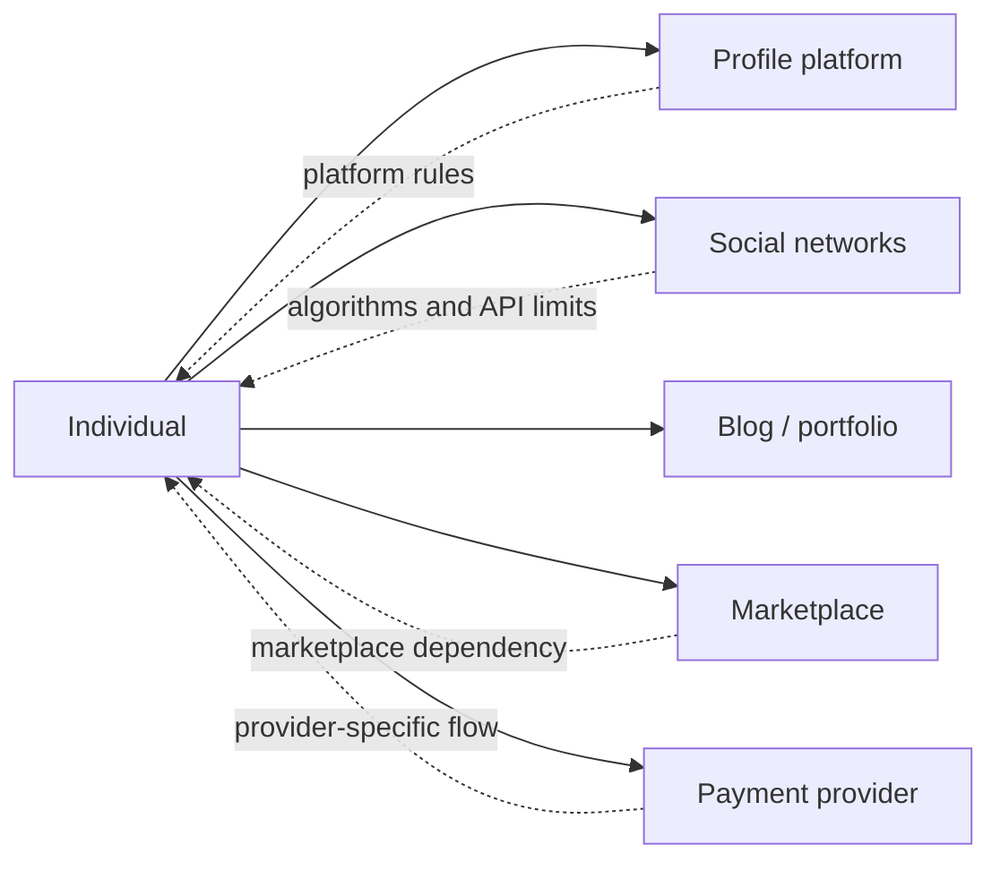
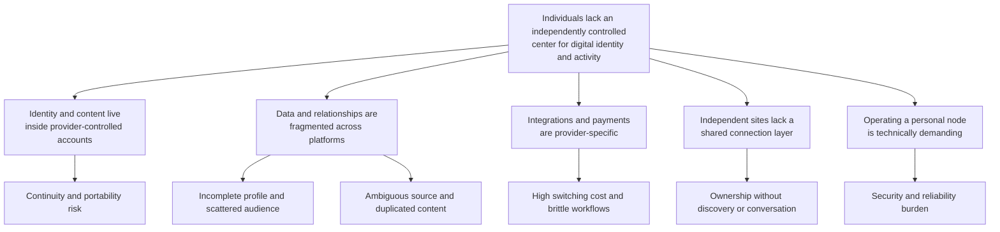
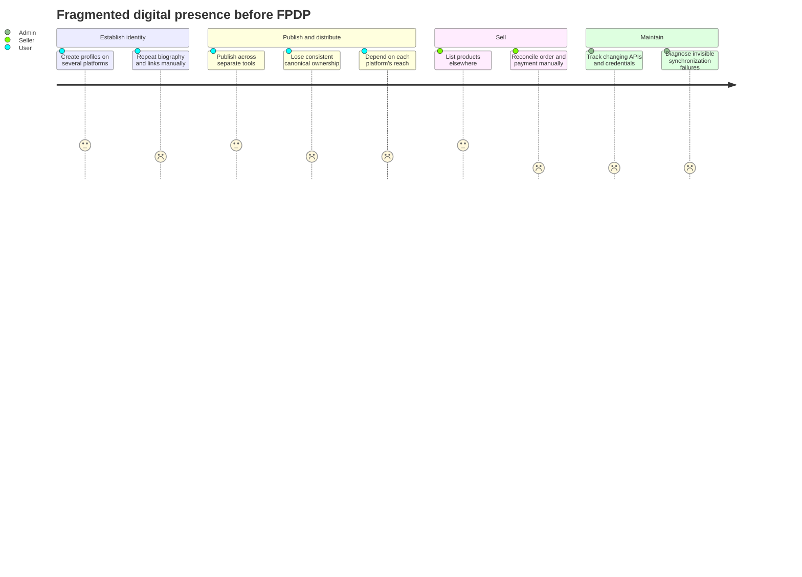

# FPDP Problem Definition (English)

## 1. Executive summary

People increasingly build their identity, audience, body of work, relationships, products, and payment flows across several third-party platforms. Each platform is useful, but the person usually does not control the primary domain, data model, distribution rules, API availability, or continuity of that presence.

FPDP addresses this central problem:

> **An individual lacks one independently controlled digital home that can represent their identity, publish original content, preserve connections to external platforms, and support direct relationships and transactions without becoming dependent on one provider.**

FPDP is not intended to replace every social network or marketplace. It provides a user-controlled home node that remains useful on its own and connects to other systems through explicit, attributed, revocable integrations and federation.

## 2. Problem context

A creator, professional, freelancer, or seller may currently use:

- one platform for a public profile;
- another for professional identity;
- several social networks for distribution and conversation;
- a hosted portfolio or blog for long-form work;
- one or more marketplaces for products;
- a separate payment provider for transactions;
- messaging platforms for community and customer relationships.

The result is not merely “too many applications.” The deeper issue is that the individual's digital presence is assembled inside systems with different ownership, access, identity, policy, and portability boundaries.



## 3. Primary user problems

### 3.1 The user's identity has no independent center

An account URL on a third-party platform is controlled by that platform. A username can change, an account can be restricted, a product can be discontinued, or profile visibility can depend on platform rules.

The user needs a stable domain that acts as the authoritative location for:

- identity and profile;
- biography and contact paths;
- work, posts, projects, and products;
- canonical links;
- connection and payment endpoints.

Desired outcome: the user can point people to one durable address they control, while still participating in external networks.

### 3.2 Content and audience are fragmented

Content may be distributed across blogs, social feeds, video platforms, professional networks, and marketplaces. Visitors must move between profiles and cannot easily understand the complete body of work.

The owner also lacks one place to see:

- locally published content;
- external content imported with permission;
- federated content from connected nodes;
- the source and canonical location of every item.

Desired outcome: one coherent timeline and profile that preserve the distinctions between local, external, and federated content.

### 3.3 Platform dependence creates continuity risk

When a person's primary presence exists only inside a third party, changes to algorithms, pricing, API access, account policy, or product direction can reduce reach or remove a workflow.

FPDP cannot remove all third-party risk, but it can reduce the blast radius:

- local identity and content continue to work;
- an external connector can be disabled without deleting the node;
- provider-specific data remains labeled rather than becoming the node's hidden foundation;
- an adapter can be replaced without rewriting core business logic.

Desired outcome: losing one integration degrades one capability rather than erasing the entire digital home.

### 3.4 Ownership and provenance are unclear

Aggregating content can create confusion: Was the item written locally? Imported from an external account? Received from another independent node? Who is the original author? Which URL is authoritative?

Without provenance, a unified feed risks misattribution, duplication, stale copies, and loss of trust.

Desired outcome: every item exposes its source type, provider or origin node, author, publication time, and canonical URL.

### 3.5 External connections are difficult to control

Integrations often hide what permission was granted, which account is connected, when synchronization last succeeded, or what happens after disconnecting.

Users need to be able to:

- understand the data and permission requested;
- test a connection before saving it;
- see granted scopes and token status;
- enable, pause, retry, or disconnect synchronization;
- choose whether imported data is retained or removed;
- identify synchronization failure without reading server logs.

Desired outcome: integration is transparent, revocable, and operationally visible.

### 3.6 Independent publishing lacks network effects

Owning a website improves control, but an isolated site does not automatically provide discovery, following, distributed conversations, or updates between independent sites.

Federation is intended to solve this gap without recreating one central FPDP network. Independent nodes can discover identities, establish directed relationships, and exchange permitted activities while enforcing local policy.

Desired outcome: personal domains can participate in a network while remaining independently owned and operated.

### 3.7 Selling from a personal domain is provider-bound and fragmented

A seller may display work on one site, list products on a marketplace, accept payment elsewhere, and manually reconcile order states. Moving to another payment provider or marketplace can require changes across the application.

Desired outcome:

- products and orders have a local authoritative model;
- external marketplace records retain their origin;
- payment logic depends on a common interface;
- the node operator can choose an approved gateway;
- payment states and webhook processing are normalized and idempotent.

### 3.8 Node operation is technically opaque

An independent node introduces responsibilities that centralized platforms normally hide: domain configuration, credentials, queues, retries, backups, security, webhook verification, moderation, and provider health.

Without understandable operational controls, “ownership” can become an unreasonable maintenance burden.

Desired outcome: operators can configure, monitor, recover, back up, and secure a node without inspecting internal database records for ordinary tasks.

## 4. Problem tree



## 5. Stakeholders and jobs to be done

### Node owner, creator, or professional

> When I build a public identity and publish work online, I want one domain I control to be the canonical home, so that my presence remains coherent even when external platforms change.

> When I already publish elsewhere, I want to connect those sources with visible attribution, so that I can present a complete body of work without pretending I created every item locally.

### Visitor or audience member

> When I visit someone's domain, I want to understand who they are, what they publish, and where each item came from, so that I can judge authenticity and follow the original source.

### Seller or merchant

> When I sell from my personal domain, I want products, orders, and payment status to remain understandable and portable, so that one provider does not own my entire customer journey.

### Buyer

> When I buy from an independent node, I want clear seller identity, totals, provider, payment state, and confirmation, so that I can trust the transaction and recover from failure.

### Node administrator

> When I operate a node, I want safe defaults, visible system health, recoverable jobs, and replaceable adapters, so that independence does not require constant low-level maintenance.

## 6. Current-state journey and friction



The scores are illustrative design framing, not research results. They must be validated through interviews and product analytics.

## 7. How FPDP responds

| Problem | FPDP response | Intended outcome |
|---|---|---|
| No independent identity center | Personal domain, node, and public profile | Stable canonical digital identity |
| Content fragmentation | Local publishing and normalized unified timeline | One coherent view without erasing source differences |
| Provider lock-in | Interfaces, adapters, factories, and explicit provider metadata | Replaceable integrations and limited failure impact |
| Ambiguous attribution | `source_type`, provider/node identity, author, canonical URL | Trustworthy provenance |
| Opaque integration lifecycle | Test, consent, sync state, retry, disconnect, retention choice | User-controlled external connections |
| Isolated personal websites | Directed federation, discovery, signed activities | Network participation without central ownership |
| Fragmented commerce | Local products/orders and payment abstraction | Portable business state and provider choice |
| Operational burden | Admin health, queue visibility, audit, backups, secure configuration | Supportable independent operation |

FPDP should not claim the problem is solved merely because an adapter or table exists. The outcome must be observable in an end-to-end user journey.

## 8. Product boundaries and non-goals

FPDP does not attempt to:

- guarantee access to data that a third-party platform does not expose;
- bypass platform permission, review, rate-limit, or account restrictions;
- scrape platforms as a substitute for authorized APIs;
- make all external content locally owned;
- copy every social-network feature;
- guarantee that a self-hosted node has the same reach as a large platform;
- make remote nodes inherently trustworthy;
- automatically settle legal, tax, refund, or dispute obligations across federated sellers;
- eliminate the need for security updates, backups, moderation, or operations;
- become a mandatory central registry for all FPDP nodes.

## 9. Key assumptions that require validation

These are product hypotheses, not established facts:

| Assumption | Validation method | Failure signal |
|---|---|---|
| Users value domain ownership enough to complete setup | Interviews and onboarding test | High abandonment before profile publication |
| A unified attributed timeline is easier to understand | Usability test with Local/External/Federated items | Users cannot identify item origin |
| Users will grant connector access for aggregation | Consent funnel and interviews | Low connection rate or permission concern |
| Operators can manage a node with guided controls | Installation and recovery study | Frequent manual database/server intervention |
| Federation creates useful relationships | Two-node pilot and retention analysis | Connections exist but produce no recurring value |
| Sellers want local order ownership and gateway choice | Merchant discovery interviews | Marketplace-only workflows remain preferred |
| Bilingual and extensible localization improves adoption | Language usage and completion metrics | Locale support has no measurable activation impact |

## 10. Problem validation plan

Before expanding implementation, validate the problem in this order:

1. Interview creators, professionals, and sellers who actively maintain at least two public platforms.
2. Map which identity, content, audience, and transaction data they consider critical.
3. Observe how they currently update profiles, cross-post, attribute sources, and recover from provider failure.
4. Test the mockup journey: create profile, publish locally, connect a feed, review provenance, and open the public page.
5. Test whether users understand Local, External, and Federated labels without explanation.
6. Test disconnect and data-retention decisions.
7. Run a small independent-node pilot before prioritizing advanced federation or commerce.

## 11. Outcome metrics

### User ownership and activation

- percentage of owners who publish a profile on their domain;
- median time from registration to a useful public page;
- percentage that publishes at least one local post;
- export completion and disconnect success rate.

### Aggregation and provenance

- percentage connecting at least one authorized source;
- first-sync and recurring-sync success rate;
- percentage of displayed items with complete source, author, and canonical URL;
- percentage of users who correctly identify item origin in usability tests;
- duplicate and stale-content rate.

### Independence and reliability

- percentage of core profile/content views that work without external providers;
- recovery time after a connector outage;
- provider-switch effort measured in implementation and operator time;
- oldest queued job, retry recovery, and failed-job visibility.

### Federation

- accepted connection rate;
- active connections that produce meaningful repeat visits or interactions;
- delivery success and deduplication rate;
- block/report handling time;
- percentage of federated items with preserved canonical provenance.

### Commerce

- product-to-order and order-to-paid conversion;
- payment-state reconciliation accuracy;
- duplicate payment or webhook side-effect rate;
- time required to configure or replace a gateway.

Metrics must be interpreted with privacy safeguards. FPDP should avoid solving platform dependence by introducing invasive cross-site tracking.

## 12. Prioritized problem statement for the MVP

The MVP should solve a narrow version of the broader problem:

> **A creator who already has a domain and content in more than one place needs a simple way to publish a canonical profile and local posts, connect one external feed, and show a single timeline with unmistakable attribution—without depending on that external source for the node to remain useful.**

The first validated journey is therefore:

```text
Create owner account → Publish public profile → Publish local post
→ Connect RSS/Atom source → Preview and synchronize
→ View one attributed timeline → Disconnect safely
```

Payment and federation remain strategic problems, but they should follow after identity, local publishing, provenance, and connector control have been proven.

