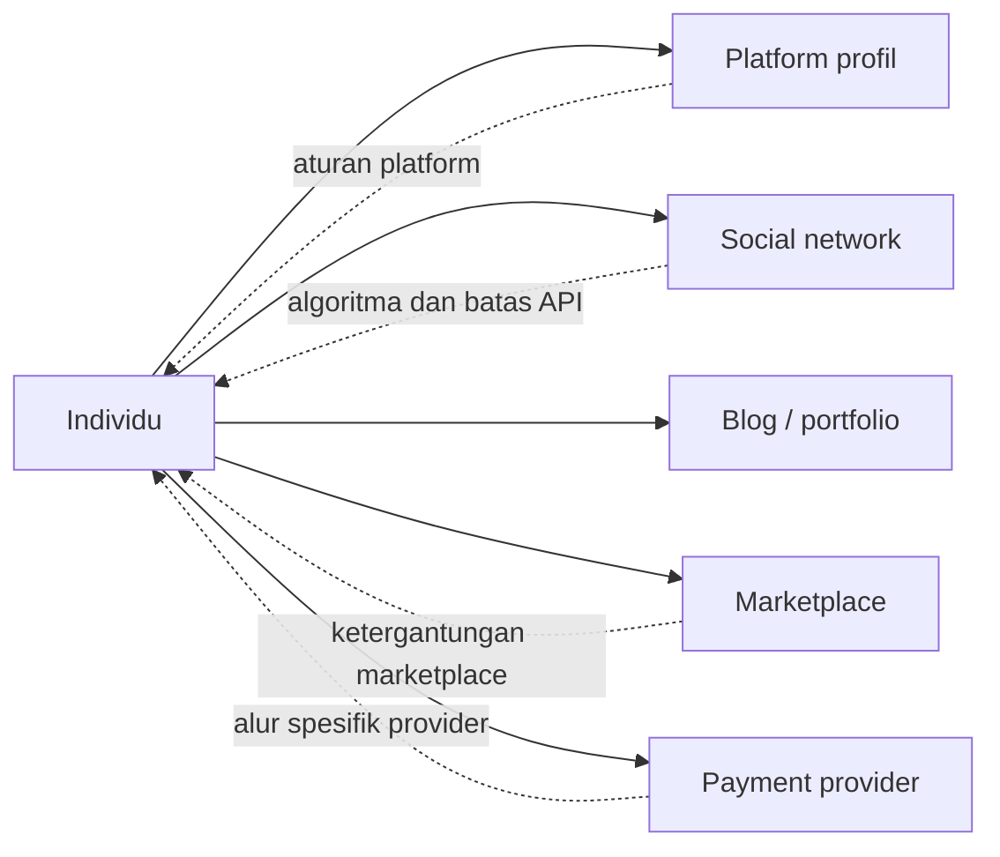
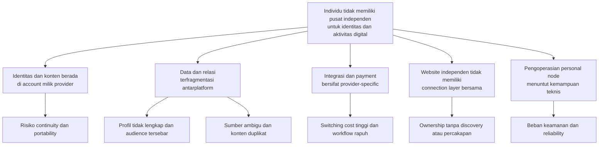
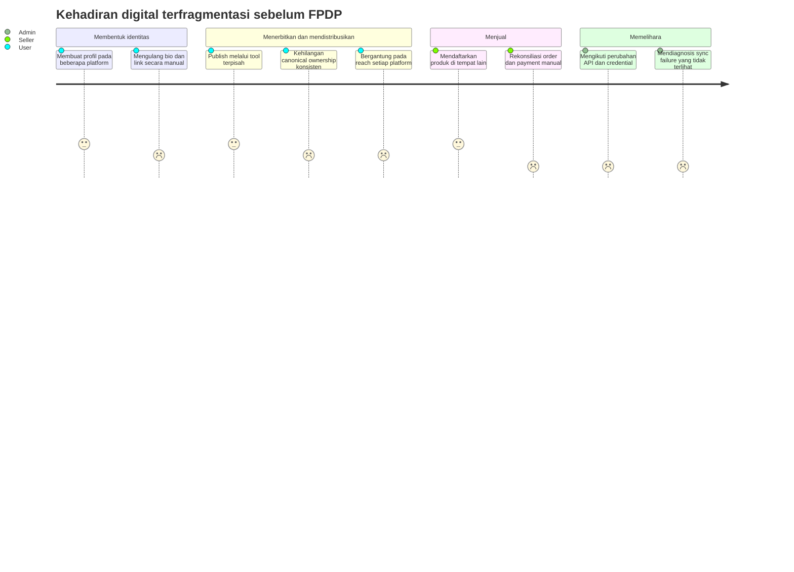

# Definisi Masalah FPDP — Bahasa Indonesia

## 1. Ringkasan eksekutif

Individu semakin sering membangun identitas, audience, kumpulan karya, relasi, produk, dan alur pembayaran pada berbagai platform pihak ketiga. Setiap platform berguna, tetapi individu biasanya tidak mengendalikan domain utama, model data, aturan distribusi, ketersediaan API, atau keberlanjutan kehadirannya.

FPDP berusaha menyelesaikan masalah inti berikut:

> **Individu tidak memiliki satu digital home independen yang dapat merepresentasikan identitas, menerbitkan konten asli, mempertahankan koneksi dengan platform eksternal, serta mendukung relasi dan transaksi langsung tanpa bergantung pada satu provider.**

FPDP tidak dimaksudkan untuk menggantikan setiap social network atau marketplace. FPDP menyediakan home node yang dikendalikan pengguna, tetap berguna secara mandiri, serta terhubung ke sistem lain melalui integrasi dan federasi yang eksplisit, beratribusi, dan dapat dicabut.

## 2. Konteks masalah

Creator, professional, freelancer, atau seller saat ini dapat memakai:

- satu platform untuk profil publik;
- platform lain untuk identitas profesional;
- beberapa social network untuk distribusi dan percakapan;
- hosted portfolio atau blog untuk karya panjang;
- satu atau beberapa marketplace untuk produk;
- payment provider terpisah untuk transaksi;
- messaging platform untuk komunitas dan relasi pelanggan.

Masalah yang muncul bukan sekadar “terlalu banyak aplikasi.” Masalah yang lebih mendasar adalah kehadiran digital individu tersusun di dalam sistem dengan boundary ownership, access, identity, policy, dan portability yang berbeda.



## 3. Masalah utama pengguna

### 3.1 Identitas pengguna tidak memiliki pusat independen

URL account pada platform pihak ketiga dikendalikan oleh platform tersebut. Username dapat berubah, account dapat dibatasi, produk dapat dihentikan, atau visibility profil dapat bergantung pada aturan platform.

Pengguna membutuhkan domain stabil yang menjadi lokasi otoritatif bagi:

- identitas dan profil;
- biografi dan jalur kontak;
- karya, post, proyek, dan produk;
- canonical link;
- endpoint koneksi dan pembayaran.

Outcome yang diinginkan: pengguna dapat mengarahkan orang ke satu alamat tahan lama yang mereka kendalikan, sambil tetap berpartisipasi pada jaringan eksternal.

### 3.2 Konten dan audience terfragmentasi

Konten dapat tersebar pada blog, social feed, platform video, professional network, dan marketplace. Pengunjung harus berpindah antarprofil dan sulit memahami keseluruhan karya.

Owner juga tidak memiliki satu tempat untuk melihat:

- konten yang diterbitkan lokal;
- konten eksternal yang diimpor dengan izin;
- konten federasi dari node terhubung;
- sumber dan canonical location setiap item.

Outcome yang diinginkan: satu timeline dan profil koheren yang tetap membedakan konten local, external, dan federated.

### 3.3 Ketergantungan platform menimbulkan risiko continuity

Ketika kehadiran utama seseorang hanya berada pada pihak ketiga, perubahan algoritma, harga, akses API, account policy, atau arah produk dapat mengurangi reach atau menghilangkan workflow.

FPDP tidak dapat menghapus seluruh risiko pihak ketiga, tetapi dapat membatasi dampaknya:

- identitas dan konten lokal tetap berjalan;
- connector eksternal dapat dinonaktifkan tanpa menghapus node;
- data spesifik provider tetap diberi label dan tidak menjadi fondasi tersembunyi node;
- adapter dapat diganti tanpa menulis ulang core business logic.

Outcome yang diinginkan: hilangnya satu integrasi hanya menurunkan satu capability dan bukan menghapus seluruh digital home.

### 3.4 Ownership dan provenance tidak jelas

Agregasi konten dapat menimbulkan kebingungan: Apakah item dibuat lokal? Diimpor dari external account? Diterima dari node independen lain? Siapa author asli? URL mana yang otoritatif?

Tanpa provenance, unified feed berisiko menimbulkan atribusi salah, duplikasi, stale copy, dan hilangnya kepercayaan.

Outcome yang diinginkan: setiap item memperlihatkan source type, provider atau origin node, author, publication time, dan canonical URL.

### 3.5 Koneksi eksternal sulit dikendalikan

Integrasi sering menyembunyikan permission yang diberikan, account yang terhubung, keberhasilan sinkronisasi terakhir, atau dampak disconnect.

Pengguna harus dapat:

- memahami data dan permission yang diminta;
- menguji koneksi sebelum menyimpan;
- melihat granted scope dan token status;
- enable, pause, retry, atau disconnect sinkronisasi;
- memilih apakah data impor disimpan atau dihapus;
- mengetahui kegagalan sinkronisasi tanpa membaca server log.

Outcome yang diinginkan: integrasi transparan, dapat dicabut, dan terlihat secara operasional.

### 3.6 Publikasi independen kekurangan network effect

Memiliki website meningkatkan kontrol, tetapi website terisolasi tidak otomatis menyediakan discovery, following, distributed conversation, atau update antarwebsite independen.

Federasi dirancang untuk mengisi gap tersebut tanpa membuat ulang satu jaringan FPDP terpusat. Node independen dapat menemukan identitas, membangun directed relationship, dan bertukar activity yang diizinkan sambil menerapkan local policy.

Outcome yang diinginkan: domain personal dapat berpartisipasi dalam jaringan sambil tetap dimiliki serta dioperasikan secara independen.

### 3.7 Penjualan dari domain personal terikat provider dan terfragmentasi

Seller dapat menampilkan karya pada satu situs, menjual produk pada marketplace, menerima payment di tempat lain, dan merekonsiliasi status order secara manual. Berpindah payment provider atau marketplace dapat membutuhkan perubahan pada seluruh aplikasi.

Outcome yang diinginkan:

- produk dan order memiliki model lokal yang otoritatif;
- record marketplace eksternal mempertahankan origin;
- payment logic bergantung pada interface bersama;
- operator node dapat memilih gateway yang disetujui;
- payment state dan pemrosesan webhook dinormalisasi serta idempotent.

### 3.8 Operasi node sulit dipahami

Node independen membawa tanggung jawab yang biasanya disembunyikan platform terpusat: konfigurasi domain, credential, queue, retry, backup, security, webhook verification, moderation, dan provider health.

Tanpa operational control yang mudah dipahami, “ownership” dapat menjadi beban maintenance yang tidak masuk akal.

Outcome yang diinginkan: operator dapat mengatur, memonitor, memulihkan, melakukan backup, dan mengamankan node tanpa memeriksa database internal untuk pekerjaan biasa.

## 4. Problem tree



## 5. Stakeholder dan jobs to be done

### Node owner, creator, atau professional

> Ketika saya membangun identitas publik dan menerbitkan karya, saya ingin satu domain yang saya kendalikan menjadi canonical home agar kehadiran saya tetap koheren ketika platform eksternal berubah.

> Ketika saya sudah menerbitkan konten di tempat lain, saya ingin menghubungkan sumber tersebut dengan atribusi yang terlihat agar dapat menampilkan keseluruhan karya tanpa berpura-pura bahwa setiap item dibuat secara lokal.

### Pengunjung atau audience

> Ketika saya mengunjungi domain seseorang, saya ingin memahami siapa mereka, apa yang mereka terbitkan, dan asal setiap item agar dapat menilai keaslian serta mengikuti sumber aslinya.

### Seller atau merchant

> Ketika saya menjual dari domain personal, saya ingin produk, order, dan status payment tetap mudah dipahami serta portabel agar satu provider tidak menguasai seluruh customer journey.

### Buyer

> Ketika membeli dari node independen, saya ingin identitas seller, total, provider, payment state, dan konfirmasi yang jelas agar dapat mempercayai transaksi dan pulih dari kegagalan.

### Node administrator

> Ketika mengoperasikan node, saya ingin safe default, system health yang terlihat, job yang dapat dipulihkan, dan adapter yang dapat diganti agar independensi tidak membutuhkan maintenance level rendah secara terus-menerus.

## 6. Journey saat ini dan friction



Skor bersifat ilustrasi framing desain dan bukan hasil riset. Skor harus divalidasi melalui interview dan product analytics.

## 7. Respons FPDP terhadap masalah

| Masalah | Respons FPDP | Outcome yang dituju |
|---|---|---|
| Tidak ada pusat identitas independen | Domain personal, node, dan profil publik | Identitas digital canonical yang stabil |
| Fragmentasi konten | Local publishing dan normalized unified timeline | Satu tampilan koheren tanpa menghapus perbedaan sumber |
| Provider lock-in | Interface, adapter, factory, dan provider metadata eksplisit | Integrasi dapat diganti dan dampak kegagalan terbatas |
| Atribusi ambigu | `source_type`, identitas provider/node, author, canonical URL | Provenance yang dapat dipercaya |
| Lifecycle integrasi tidak transparan | Test, consent, sync state, retry, disconnect, retention choice | Koneksi eksternal yang dikendalikan user |
| Website personal terisolasi | Directed federation, discovery, signed activity | Partisipasi jaringan tanpa central ownership |
| Commerce terfragmentasi | Produk/order lokal dan payment abstraction | Business state portabel dan pilihan provider |
| Beban operasional | Admin health, queue visibility, audit, backup, secure config | Operasi independen yang dapat didukung |

FPDP tidak boleh mengklaim masalah selesai hanya karena adapter atau tabel tersedia. Outcome harus dapat diamati melalui user journey end-to-end.

## 8. Boundary produk dan non-goals

FPDP tidak berusaha untuk:

- menjamin akses ke data yang tidak diekspos platform pihak ketiga;
- melewati permission, review, rate limit, atau account restriction platform;
- melakukan scraping sebagai pengganti authorized API;
- menjadikan seluruh external content sebagai milik lokal;
- menyalin semua fitur social network;
- menjamin self-hosted node memiliki reach yang sama dengan platform besar;
- menganggap remote node selalu dapat dipercaya;
- menyelesaikan otomatis kewajiban legal, pajak, refund, atau dispute antar-seller federasi;
- menghapus kebutuhan security update, backup, moderation, atau operations;
- menjadi central registry wajib bagi seluruh node FPDP.

## 9. Asumsi penting yang harus divalidasi

Hal berikut merupakan product hypothesis dan bukan fakta yang sudah terbukti:

| Asumsi | Metode validasi | Sinyal kegagalan |
|---|---|---|
| User cukup menghargai domain ownership untuk menyelesaikan setup | Interview dan onboarding test | Abandonment tinggi sebelum profil diterbitkan |
| Unified attributed timeline lebih mudah dipahami | Usability test dengan item Local/External/Federated | User tidak dapat mengenali origin item |
| User bersedia memberi akses connector untuk agregasi | Consent funnel dan interview | Connection rate rendah atau kekhawatiran permission |
| Operator dapat mengelola node melalui guided control | Installation dan recovery study | Sering membutuhkan intervensi database/server manual |
| Federasi menciptakan relasi yang berguna | Pilot dua node dan retention analysis | Connection ada tetapi tidak menghasilkan recurring value |
| Seller membutuhkan ownership order lokal dan pilihan gateway | Merchant discovery interview | Workflow marketplace-only tetap lebih dipilih |
| Localization bilingual dan extensible membantu adopsi | Language usage dan completion metric | Locale support tidak meningkatkan activation |

## 10. Rencana validasi masalah

Sebelum memperluas implementasi, validasi masalah dalam urutan berikut:

1. Interview creator, professional, dan seller yang aktif mengelola minimal dua platform publik.
2. Petakan data identity, content, audience, dan transaction yang mereka anggap kritis.
3. Amati cara mereka memperbarui profil, melakukan cross-post, memberi atribusi, dan pulih dari provider failure.
4. Uji journey mockup: membuat profil, publish lokal, menghubungkan feed, meninjau provenance, dan membuka halaman publik.
5. Uji apakah user memahami label Local, External, dan Federated tanpa penjelasan.
6. Uji keputusan disconnect dan data retention.
7. Jalankan pilot independent-node kecil sebelum memprioritaskan advanced federation atau commerce.

## 11. Metrik outcome

### Ownership dan activation pengguna

- persentase owner yang menerbitkan profil pada domain mereka;
- median waktu dari registrasi sampai halaman publik yang berguna;
- persentase yang menerbitkan minimal satu local post;
- export completion dan disconnect success rate.

### Agregasi dan provenance

- persentase yang menghubungkan minimal satu authorized source;
- first-sync dan recurring-sync success rate;
- persentase item dengan source, author, dan canonical URL lengkap;
- persentase user yang dapat mengenali origin item pada usability test;
- duplicate dan stale-content rate.

### Independensi dan reliability

- persentase core profile/content view yang tetap bekerja tanpa external provider;
- recovery time setelah connector outage;
- provider-switch effort dalam waktu implementasi dan operator;
- job tertua dalam queue, retry recovery, dan failed-job visibility.

### Federasi

- accepted connection rate;
- koneksi aktif yang menghasilkan repeat visit atau interaction bermakna;
- delivery success dan deduplication rate;
- waktu penanganan block/report;
- persentase federated item dengan canonical provenance yang dipertahankan.

### Commerce

- konversi product-to-order dan order-to-paid;
- akurasi reconciliation payment state;
- tingkat duplicate payment atau webhook side effect;
- waktu yang dibutuhkan untuk mengatur atau mengganti gateway.

Metrik harus ditafsirkan dengan privacy safeguard. FPDP tidak boleh menyelesaikan ketergantungan platform dengan menciptakan invasive cross-site tracking.

## 12. Problem statement prioritas untuk MVP

MVP harus menyelesaikan versi sempit dari masalah yang lebih luas:

> **Creator yang sudah memiliki domain dan konten di lebih dari satu tempat membutuhkan cara sederhana untuk menerbitkan profil canonical dan post lokal, menghubungkan satu external feed, serta menampilkan satu timeline dengan atribusi yang jelas—tanpa bergantung pada sumber eksternal tersebut agar node tetap berguna.**

Journey pertama yang harus divalidasi:

```text
Buat account owner → Terbitkan profil publik → Terbitkan local post
→ Hubungkan sumber RSS/Atom → Preview dan sinkronisasi
→ Lihat satu timeline beratribusi → Disconnect dengan aman
```

Payment dan federasi tetap merupakan masalah strategis, tetapi dikerjakan setelah identity, local publishing, provenance, dan connector control terbukti.

