# FPDP Development Progress Report — English

## 1. Snapshot

**As of:** 2026-09-19, verified directly against the code, migrations, tests, and routes in this repository (not only against planning documents).

FPDP has a working **engineering foundation** and a working **identity/authentication slice** (Phase 0 and most of Phase 1 in the [roadmap](ROADMAP.en.md)). Payment and external-content **connector interfaces** exist with one functional dummy/adapter set each. **Local content (posts), federation, marketplace, and the administration dashboard have no backend implementation yet** — they exist only as design documents and, for the dashboard/public profile, as a static interactive HTML mockup.

This report cross-references the [Work Breakdown Structure](WBS-TASK.en.md) (workstreams 1.0–10.0) and the [Roadmap](ROADMAP.en.md) (phases 0–7) so progress can be read against either plan.

## 2. Status at a glance

```mermaid
flowchart LR
    P0["Phase 0<br/>Engineering foundation"] --> P1["Phase 1<br/>Identity & personal node"]
    P1 --> P2["Phase 2<br/>Local content & timeline"]
    P2 --> P3["Phase 3<br/>External feed aggregation"]
    P3 --> P4["Phase 4<br/>Operations & MVP hardening"]
    P4 --> P5["Phase 5<br/>Marketplace & payments"]
    P5 --> P6["Phase 6<br/>Federation"]
    P6 --> P7["Phase 7<br/>Ecosystem & scale"]

    classDef done fill:#e3efe9,stroke:#185f48,color:#17211b;
    classDef partial fill:#f2e8d6,stroke:#93631e,color:#17211b;
    classDef todo fill:#f1e3e1,stroke:#a13d37,color:#17211b;
    class P0,P1 done;
    class P3 partial;
    class P2,P4,P5,P6,P7 todo;
```

| Workstream (WBS) | Status | Evidence |
|---|---|---|
| 1.0 Project setup | **Done** | `composer.json` PSR-4 autoload, `.env.example`, `Config` loader |
| 2.0 Core platform architecture | **Done** | `Router`, `Database`, `MigrationRunner`, JSON envelope, exception mapping, factory pattern for payments/connectors |
| 3.0 Authentication & user management | **Mostly done** | Register/login/logout/`/me`, bcrypt, hashed bearer tokens, rate limiting; profile read/update; admin roles and a minimal profile-editor UI are missing |
| 4.0 Content and timeline | **Not started** | No `posts` table, no post controller/service, no timeline query |
| 5.0 Federation layer | **Not started** | Concept documented ([FEDERATION-CONCEPT.en.md](FEDERATION-CONCEPT.en.md)); zero implementation code |
| 6.0 Payment layer | **Partially done** | Interface, factory, dummy gateway, and tables done; real gateway, idempotency, and admin settings missing |
| 7.0 External content integration | **Partially done** | RSS/Atom/Custom API adapters (incl. YouTube video-embed normalization) done; scheduler, persistence, attribution UI, and SSRF hardening missing |
| 8.0 Marketplace | **Not started** | No product/order tables or code |
| 9.0 Administration dashboard | **Not started (mockup only)** | Prototyped as static HTML in [documentation/mockup](mockup/README.md); no real endpoints or views |
| 10.0 Testing, security, deployment | **Partially done** | 12 passing test scripts; no CI workflow, no security audit executed, no deployment checklist run |

## 3. What is done

- **HTTP foundation:** public front controller (`public/index.php`), `Router` with static/`{param}` routes, JSON success/error envelopes, sanitized exception-to-500 mapping.
- **Configuration:** `Config` loader with defaults, `.env` override, fail-fast validation.
- **Database layer:** PDO connection manager and `MigrationRunner`; 15 ordered, repeatable migrations under `database/migrations/` (payment gateways/configs/payments/transactions, external accounts/feed sources/posts, connector definitions, integration queue, nodes, users, profiles, auth tokens, audit events, rate limits).
- **Identity & authentication:** owner registration, login, logout, `/api/v1/me`; bcrypt password hashing; bearer tokens hashed at rest; per-IP rate limiting on register/login (`429 RATE_LIMITED`).
- **Profiles:** public profile read by handle (`GET /api/v1/profiles/{handle}`) and authenticated update (`PATCH /api/v1/me/profile`), with visibility rules.
- **Payments (scaffolding):** `PaymentGatewayInterface`, `PaymentGatewayFactory`, `PaymentService`, and a functional `DummyPaymentGateway` (create/status/cancel/refund/webhook normalization). The factory only recognizes `DUMMY` and explicitly rejects any other code.
- **External content connectors:** `ExternalContentProviderInterface`, `ExternalConnectorFactory`, and working `RSSConnector`/`AtomConnector`/`CustomApiConnector` adapters. RSS/Atom adapters now also detect YouTube video links (including the `yt:videoId`/`media:group` elements in a channel's official Atom feed) and normalize them into an embeddable descriptor (`YouTubeEmbedResolver`).
- **Interactive UI mockup:** dependency-free HTML/CSS/JS prototype of the owner dashboard and public profile under [documentation/mockup](mockup/README.md), including a working, embeddable YouTube "Video" section on the public profile — useful for design review, not wired to the backend.
- **Tests (12, all passing):** `MvpSmokeTest`, `MvcHomeTest`, `RouterTest`, `FrontControllerTest`, `ConfigTest`, `MigrationRunnerTest`, `DatabaseTest`, `FactoryFallbackTest`, `AuthEndpointsTest` (full HTTP flow), `RateLimitTest`, `RateLimitEndpointTest`, `YouTubeEmbedResolverTest`.
- **Documentation:** BRD, PRD, WBS, Roadmap, ERD, API contract, OpenAPI 3.1, Federation concept, Content-aggregation guide, Social/commerce integrations guide, Problem statement, User journey, and the mockup navigation map — all bilingual (English/Indonesian).

## 4. What is partially done

| Area | What exists | What is missing |
|---|---|---|
| Authentication & authorization | Bearer-token auth, ownership of the caller's own account | Role/permission model (admin vs owner), general-purpose authorization middleware |
| Audit trail | `audit_events` migration (table exists) | Nothing in the codebase writes to it yet |
| Payment lifecycle | Dummy create/status/cancel/refund/webhook normalization | Any real gateway adapter, signed-webhook verification, replay/duplicate-event protection, gateway admin settings UI |
| External content sync | Connectors can fetch and normalize records in memory (incl. video embeds) | No scheduler/worker consumes them; nothing persists a fetched item into `external_posts`; no SSRF protection, timeout, or retry/backoff on outbound fetches |
| Attribution & timeline display | Normalization contract documented (`source_type`, canonical URL, provenance) | No unified timeline query or rendering in the real app (only illustrated in the static mockup) |
| Testing & CI | 12 passing script-style tests run manually via `php tests/*.php` | No CI workflow (no `.github/workflows`), no dedicated webhook-idempotency or connector-security tests |

## 5. What is not started

- **Local content (posts):** no `posts`/`post_media` tables, no create/read/update/delete, no drafts, no visibility enforcement, no canonical URLs, no timeline.
- **Federation:** no node discovery, remote actors, signed activity delivery, or moderation — design-only ([FEDERATION-CONCEPT.en.md](FEDERATION-CONCEPT.en.md)).
- **Marketplace:** no product, inventory, order, order-line, or checkout model — only the payment-gateway plumbing that a future checkout would use.
- **Administration dashboard (real):** the dashboard exists only as a static mockup; there are no backend endpoints, views, or auth-gated screens for settings, integrations, products, orders, payments, federation, or analytics.
- **Production payment adapters** and the security work that must ship with them (idempotency keys, signed-webhook verification, reconciliation).
- **Deployment/operations:** no CI pipeline, no backup/restore/rollback runbook execution, no license file, no staging recovery exercises.

## 6. Recommended next steps

Per the roadmap's ["tasks to start first"](ROADMAP.en.md#6-tasks-to-start-first) table, the highest-leverage remaining work is, in order:

1. Finish Phase 1: add a minimal profile-editor/public-profile UI and an admin role/ownership middleware.
2. Start Phase 2: add `posts`/`post_media` migrations and a local post CRUD + timeline slice — this is the single biggest gap, since it blocks a real (non-mockup) public profile.
3. Harden Phase 3: add an SSRF-safe outbound HTTP client, then wire a scheduler/worker that actually persists connector output into `external_posts` and merges it into the timeline.
4. Only after 1–3 are stable: begin Phase 5 (marketplace/payments) and Phase 6 (federation), per the roadmap's dependency map.

## 7. References

- [Work Breakdown Structure](WBS-TASK.en.md)
- [Development roadmap and strategy](ROADMAP.en.md)
- [Entity Relationship Diagram](ERD.en.md)
- [API contract](API-CONTRACT.en.md) · [OpenAPI 3.1](openapi.yaml)
- [Interactive mockup](mockup/README.md) · [Mockup navigation map](mockup/NAVIGATION-MAP.en.md)
- [Repository README](../README.md) — "Current implementation" table, kept in sync with this report
