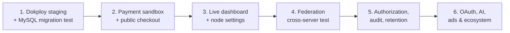

# FPDP Development Progress Report

## 1. Snapshot

**Verification date:** September 20, 2026
**Evidence:** repository routes, controllers, services, repositories, migrations, UI, tests, and deployment configuration—not planning documents alone.

FPDP has moved beyond a basic prototype. Identity, local publishing, external aggregation, a basic marketplace, payment abstraction, analytics, and most federation foundations exist as testable code. Dokploy staging is live and validated, the home page (`/`) now renders the node owner's personal digital home live, and the owner dashboard Overview is wired to real APIs. The next stage is no longer scaffolding but connecting commercial flows end to end (including a way to pick which payment gateway is active), filling in the remaining dashboard panels, validating external integrations against real sandboxes/servers, and hardening production operations.

Repository snapshot:

- **40 MySQL migrations** (`0001`–`0040`);
- **31 test scripts**;
- REST APIs for identity, profiles, posts, timeline, external feeds, CV, payments, marketplace, analytics, federation, and post-media upload;
- real UI for the home page (a live personal digital home per node), local timeline, public profile, post page, post editor (with direct media upload), and the owner dashboard Overview;
- 4 payment gateway adapters: Dummy, Paywuz, Midtrans, and PayPal (Orders API v2);
- a Dockerfile and Dokploy-specific Compose deployment — deployed and validated on staging;
- bilingual product and technical documentation.

## 2. Phase status

```mermaid
flowchart LR
    P0["Phase 0<br/>Engineering foundation"] --> P1["Phase 1<br/>Identity & personal node"]
    P1 --> P2["Phase 2<br/>Local content & timeline"]
    P2 --> P3["Phase 3<br/>External aggregation"]
    P3 --> P4["Phase 4<br/>MVP hardening"]
    P4 --> P5["Phase 5<br/>Marketplace & payments"]
    P5 --> P6["Phase 6<br/>Federation"]
    P6 --> P7["Phase 7+<br/>Ecosystem, AI, scale"]

    classDef done fill:#e3efe9,stroke:#185f48,color:#17211b;
    classDef partial fill:#f2e8d6,stroke:#93631e,color:#17211b;
    classDef planned fill:#f1e3e1,stroke:#a13d37,color:#17211b;
    class P0,P1,P2,P3 done;
    class P4,P5,P6 partial;
    class P7 planned;
```

| Workstream | Status | Summary |
|---|---|---|
| Engineering foundation | **Done** | PSR-4, router, PDO, migration runner, config, envelopes, exception mapping, CI |
| Identity & profile | **MVP complete** | Register/login/logout/`me`, hashed tokens, rate limiting, profile visibility, Google visitor OAuth |
| Local content | **MVP complete** | CRUD, draft/publish, visibility, soft delete, media, canonical URLs, cursor timeline, UI |
| External aggregation | **MVP complete** | RSS/Atom/Custom API, SSRF-safe HTTP, sync worker, deduplication, persistence, timeline merge |
| Operations & hardening | **Partial** | CI, base audit exist; Dokploy staging is live and validated (migrations, health check, owner bootstrap); backup/restore recovery exercise remains |
| Marketplace | **Mostly done** | Products and orders exist; public checkout and payment are not connected end to end |
| Payments | **Mostly done** | Dummy, Paywuz, Midtrans, PayPal (Orders API v2), encrypted config, webhook/idempotency; real sandbox (every provider) and reconciliation remain; no way to pick the active gateway for checkout yet |
| Federation | **Backend mostly done** | Keys, discovery, signed inbox/outbox, follow lifecycle, moderation, delivery retry; cross-server/UI remain |
| Dashboard | **Partial** | Owner Overview is live at `/dashboard` (KPIs, traffic chart, top content, recent activity) using existing APIs; Payments/Analytics/Federation are not separate panels yet, node settings remain |
| AI & advertising | **Planned** | Strategy is documented; LLM chat and advertising marketplace are not implemented |

## 3. Delivered capabilities

### 3.1 Platform and baseline security

- Front controller and router with static, segment-parameter, and canonical `/@handle` routes.
- The home page (`/`) renders the node owner's public profile live (the BRD's personal-digital-home vision) once the node has an owner with a `PUBLIC` profile; falls back to a static placeholder for a fresh install or a non-public profile.
- Configuration from defaults, `.env`, and native container environment variables.
- Password hashing, hashed/revocable bearer tokens, and authentication rate limits.
- SSRF-aware outbound HTTP with private-target blocking, redirect, timeout, and response-size limits.
- Consistent JSON success/error envelopes and automated CI checks.

### 3.2 Identity, profiles, and visitors

- Registration provisions a node, owner user, and profile in one flow.
- Login, logout, `/api/v1/me`, public profile reads, and owner profile updates.
- `PUBLIC`, `UNLISTED`, and `PRIVATE` profile visibility.
- Google visitor OAuth with signed state and hashed visitor tokens.

### 3.3 Local content and media

- Post create/read/update/soft delete and ownership enforcement.
- Draft, publish, and unpublish through `published_at`.
- Stable profile/post canonical URLs and cursor pagination.
- Up to ten ordered `IMAGE`, `VIDEO`, `AUDIO`, or `FILE` metadata items with HTTPS/credential/alt-text validation.
- **Direct media file upload** (`POST /api/v1/me/media`, owner-only): an alternative to pasting an external URL. The client-claimed `content_type` is never trusted — the actual bytes are sniffed server-side (`finfo`) and checked against an allowlist per media type; SVG is deliberately excluded from `IMAGE` and `FILE` is restricted to PDF, since content served back with the wrong type is a stored-XSS vector. Files are served from `GET /api/v1/media/{key}` (an unguessable UUID storage key is the access control, the same model as any external CDN link), inline, with `X-Content-Type-Options: nosniff` and a one-year immutable cache.
- Live local timeline, profile, post, and post-editor (including a media upload button) pages.

### 3.4 External content

- RSS, Atom, and Custom API connectors.
- YouTube normalization from official feeds and privacy-enhanced embed support.
- Feed-source management, synchronization, deduplication, persistence, statistics, and attributed timeline merge.

### 3.5 CV and visitor-monetization foundation

- CV storage outside the webroot, public metadata, payment-aware access grants, and gated downloads.
- Replacing a CV invalidates previous grants.
- Visitor identity is distinct from owner identity.

### 3.6 Marketplace and payments

- Product CRUD and orders with immutable product snapshots.
- Order lifecycle and ownership validation.
- `PaymentGatewayInterface`, Dummy, Paywuz, Midtrans, and PayPal (Orders API v2) adapters.
- The PayPal adapter handles the two-step capture flow (approve, then capture) via lazy-capture inside `getPaymentStatus()`, refunds by looking up the capture id (not the order id), verifies webhooks through PayPal's own `verify-webhook-signature` API (not a local HMAC), and explicitly rejects unsupported currencies including IDR.
- Payment/transaction persistence, webhook verification, and duplicate-event handling.
- AES-256-GCM encrypted gateway configuration through API without returning secrets.
- Payment dashboard summary API.
- **Known gap:** there is no mechanism for the owner or a visitor to choose which gateway is active — checkout still resolves a gateway through an explicit parameter/env var per feature (e.g. `CV_PAYMENT_GATEWAY` for CV access), not a UI choice.

### 3.7 Federation

- Ed25519 node identity and signing keys.
- Public capability discovery and cached remote keys.
- Signed public inbox, authenticated outbox, Follow/Accept/Reject/Undo/Block processing.
- Incoming/outgoing follow direction, federated connections, and public latest-post previews.
- Remote-node trust states, delivery retries, exponential backoff, deduplication, and timestamp replay reduction.
- Federation summary and capability-settings APIs.

### 3.8 Analytics and dashboard

- Privacy-conscious daily visitor HMACs; raw IP addresses are not stored.
- Profile view, post view, outbound click, and shop-conversion events.
- Seven-day summary, unique visitors, traffic chart, and top content.
- Dashboard overview aggregating content, marketplace, payment, federation, analytics, and audit activity.
- **Live owner Overview UI** at `/dashboard` (vanilla JS + PHP, no framework, backed by the existing `/api/v1/me/dashboard/overview`): node status, 6 KPI tiles (published posts, products, pending orders, revenue this month, followers, unique visitors), a 7-day bar chart (views vs. unique visitors, a colorblind-safe validated palette), a top-content list, and recent activity. Verified against a real browser (Playwright): sign-in flow, live data rendering, chart hover tooltips, zero console errors.

### 3.9 Deployment

- Web installer for VPS/shared hosting.
- PHP 8.3 + Apache image.
- Dokploy Compose with MySQL 8.4, health checks, persistent volumes, automatic migrations, and owner bootstrap.
- Production secret validation and web-installer lock.
- English and Indonesian deployment guides.

## 4. Partially complete

### 4.1 Production validation

- The Docker image was not built in this development workspace because Docker CLI is unavailable here, but the image build and Dokploy staging deployment were run on the server and confirmed successful by the project owner (2026-09-19): every migration ran cleanly, the health check passed, owner bootstrap created the first account, and the domain/TLS are live.
- The full migration set is not exercised against disposable MySQL 8 by the repository test suite (CI); migration validation so far comes from the staging run above, not an automated CI job.
- No recovery exercise (backup/restore/rollback) has been run.
- `sodium` availability must be verified explicitly in the built production image.

### 4.2 Checkout and marketplace

- Orders are not connected to gateway payments in a public visitor checkout.
- Checkout UI, receipt, status polling, cancellation, and refund experiences remain.
- `SHOP_CONVERSION` still reflects owner-created orders rather than true visitor checkout.
- External-product labels and federated order requests remain.

### 4.3 Production payments

- Paywuz, Midtrans, and PayPal use fake HTTP requesters in tests; real sandbox validation remains for all three.
- Midtrans refund events after `PAID` do not always reconcile the payment to `REFUNDED`.
- No settlement/payout ledger, fee accounting, or reconciliation job exists.
- `APP_KEY` rotation cannot automatically re-encrypt gateway credentials.
- No UI/API exists yet to choose which gateway is active for a given checkout; each feature hardcodes one gateway through an env var.

### 4.4 Dashboard and settings

- Owner Overview is live at `/dashboard` (see 3.8); Payments, Analytics, and Federation are not separate dashboard panels beyond what Overview already summarizes.
- Content, Timeline, Integrations, Products, and Orders have domain APIs but no integrated dashboard panels.
- Theme, layout, custom CSS, default/enabled languages, node configuration, 2FA, and session management remain.

### 4.5 Production federation

- No two-instance, cross-domain FPDP interoperability test has run.
- No live federation dashboard for follow/trust/block/moderation/capability actions exists.
- Replay protection lacks a nonce cache.
- Stored capabilities do not enforce feature access.
- Historical follow records may require incoming/outgoing direction backfill.

### 4.6 Authorization, audit, and analytics hardening

- No centralized role/permission middleware distinguishes owner/admin actions.
- Payment-credential and remote-trust changes are not fully audited.
- The public outbound-click endpoint lacks dedicated rate limiting.
- `analytics_events` has no retention/cleanup job.

## 5. Not started

- Production OAuth connectors for LinkedIn, X, Threads, TikTok, and Shopee. Instagram uses a non-OAuth "litescrap" connector (public profile HTML scraping) instead — see `InstagramConnector`; not yet validated against production accounts.
- LLM provider configuration, profile/CV-grounded chat, paid sessions, and AI cost controls.
- Advertising marketplace: slots, pricing, booking, approval, and delivery windows.
- Production plugin/adapter marketplace and federated commerce.
- Multi-node administration, shared/object storage, and horizontal scaling.
- License file and formal contribution policy.

## 6. Recommended priority

1. ~~Deploy a staging node through Dokploy and validate image build, health checks, volumes, bootstrap, and every migration on MySQL 8.~~ **Done** — Dokploy staging is live and validated (2026-09-19).
2. Validate Paywuz, Midtrans, and PayPal against real sandboxes.
3. Connect public checkout → order → payment → webhook → fulfillment/refund, including a way to choose the active gateway.
4. ~~Turn the dashboard mockup into a live UI, starting with APIs already available.~~ **Partially done** — Overview is live at `/dashboard` (2026-09-20); Payments/Analytics/Federation panels and node settings remain.
5. Implement node appearance/language and security settings.
6. Run cross-server federation interoperability tests.
7. Add RBAC middleware, sensitive-action audit coverage, analytics rate limiting, and retention.
8. Continue with social OAuth, AI chat, advertising, and ecosystem work afterward.

## 7. Operational decisions and risks

- The current deployment assumes **one owner and one app replica per node**.
- Do not scale horizontally before migration locking and shared/object storage exist.
- MySQL and `storage/` must be restored from a consistent recovery point.
- Code rollback does not reverse forward migrations.
- `APP_KEY` protects OAuth state, analytics HMACs, and encrypted gateway credentials; rotation requires a dedicated procedure.
- Production policy must decide whether public registration remains open.
- Payment and federation require real remote-system testing before being called production-ready.

## 8. Latest validation

- **31/31 test scripts passed** in the latest development run.
- PHP syntax checks passed for configuration and owner bootstrap.
- Owner bootstrap passed its SQLite integration test.
- `git diff --check` passed.
- Docker build/Compose rendering did not run in this development workspace because Docker CLI is unavailable here; this acceptance step was run directly on the Dokploy server and confirmed successful by the project owner.
- `ExternalContentTest` passed but Windows emitted a temporary SQLite cleanup warning; functionality passed, while cleanup can be improved.
- The Overview dashboard, the live home page, and the full media-upload flow (choose file → upload → URL auto-filled → save post → image renders on the public post page) were verified against a real browser (Playwright, headless Chromium): screenshots were inspected, zero console errors on every flow.

## 9. References

- [Roadmap](ROADMAP.en.md)
- [WBS](WBS-TASK.en.md)
- [PRD](PRD.en.md)
- [ERD](ERD.en.md)
- [API Contract](API-CONTRACT.en.md) and [OpenAPI](openapi.yaml)
- [Federation Concept](FEDERATION-CONCEPT.en.md)
- [Dokploy Guide](DOKPLOY-DEPLOYMENT.en.md)
- [Mockup](mockup/README.md)
