# FPDP Development Progress Report — English

## 1. Snapshot

**As of:** 2026-09-19, verified directly against the code, migrations, tests, and routes in this repository (not only against planning documents). The federation section of this report was updated after two consecutive follow-up sessions: (1) end-to-end signature verification, remote node discovery, and inbox→processor wiring, then (2) a `trust_state` moderation endpoint and timestamp-based replay protection (see §3 and §4).

FPDP has a working **engineering foundation** and most product phases implemented or in progress. The repository now includes:

- Full **identity/authentication** flow (Phase 1)
- **Local post CRUD** with media, timeline, and visibility (Phase 2)
- **External content connectors** with SSRF-safe HTTP client and sync worker (Phase 3)
- **Audit trail** wired across all services and **GitHub Actions CI** (Phase 4)
- **Marketplace** with products, orders, and order items (Phase 5)
- **Signed-activity federation** (Phase 6): Ed25519 node identity, capability-document discovery, inbound signature verification, stale-activity rejection (timestamp window), automatic Follow/Accept/Reject/Undo/Block handling through a public inbox, an owner-facing `trust_state` moderation endpoint, and a delivery worker with retry+backoff

What remains is: advanced marketplace features (checkout — not wired to any real gateway yet) and the administration dashboard backend. Federation still needs a real cross-server test (only exercised within a single process/DB so far) and has no admin UI yet (API only); the same is true for both payment gateways (Paywuz, Midtrans) — neither has ever been run end-to-end against a real sandbox (tests inject a fake HTTP requester for `createPayment`/`getPaymentStatus`/etc., see §7).

This report cross-references the [Work Breakdown Structure](WBS-TASK.en.md) (workstreams 1.0–10.0) and the [Roadmap](ROADMAP.en.md) (phases 0–7) so progress can be read against either plan.

## 2. Status at a glance

```mermaid
flowchart LR
    P0["Phase 0<br/>Engineering foundation"] --> P1["Phase 1<br/>Identity & personal node"]
    P1 --> P2["Phase 2<br/>Local content & timeline"]
    P2 --> P3["Phase 3<br/>External feed aggregation"]
    P3 --> P4["Phase 4<br/>Operations & MVP hardening"]
    P4 --> P5["Phase 5<br/>Marketplace & payments"]
    P5 --> P6["Phase 6<br/>Federation"]
    P6 --> P7["Phase 7<br/>Ecosystem & scale"]

    classDef done fill:#e3efe9,stroke:#185f48,color:#17211b;
    classDef partial fill:#f2e8d6,stroke:#93631e,color:#17211b;
    classDef todo fill:#f1e3e1,stroke:#a13d37,color:#17211b;
    class P0,P1,P2,P3,P5 done;
    class P4,P6 partial;
    class P7 todo;
```

| Workstream (WBS) | Status | Evidence |
|---|---|---|
| 1.0 Project setup | **Done** | `composer.json` PSR-4 autoload, `.env.example`, `Config` loader, `.dockerignore`, `Dockerfile`, `dokploy-compose.yml` |
| 2.0 Core platform architecture | **Done** | `Router`, `Database`, `MigrationRunner`, `HttpClient` (SSRF-safe), JSON envelope, exception mapping, factory pattern for payments/connectors |
| 3.0 Authentication & user management | **Done** | Register/login/logout/`/me`, bcrypt, hashed bearer tokens, rate limiting; profile read/update by handle; visitor Google OAuth |
| 4.0 Content and timeline | **Done** | Posts CRUD, draft/publish/soft-delete, media metadata (image/video/audio/file), canonical URLs, cursor-paginated public timeline, post editor UI |
| 5.0 Federation layer | **Mostly done** | Ed25519 node identity, capability-document discovery, inbound signature verification, stale-activity rejection (timestamp window), automatic Follow/Accept/Reject/Undo/Block via a public inbox, `trust_state` moderation endpoints (`GET`/`PATCH /api/v1/me/federation/remote-nodes`), delivery worker with retry+backoff (9 tests); not yet tested across real servers, no admin UI |
| 6.0 Payment layer | **Mostly done** | Interface, factory, dummy gateway; real **Paywuz** (create + HMAC-SHA256 webhook) and **Midtrans** (Snap create + Core API status/cancel/refund + SHA512 webhook) gateways, both with `payments`/`payment_transactions` persistence and idempotency; gateway admin settings not started |
| 7.0 External content integration | **Done** | RSS/Atom/Custom API connectors with HttpClient (SSRF-safe), SyncWorker, `sync-external.php` CLI for cron, dedup by (provider, external_post_id), timeline merge via `source_type=EXTERNAL` |
| 8.0 Marketplace | **Done** | Products CRUD + Orders with immutable item snapshots + order status flow (14 test cases) |
| 9.0 Administration dashboard | **Not started (mockup only)** | Prototyped as static HTML in [documentation/mockup](mockup/README.md); no real endpoints or views |
| 10.0 Testing, security, deployment | **Partially done** | 25 passing test scripts; GitHub Actions CI workflow; Dokploy deployment guide (EN & ID); audit trail across auth/post/profile services; note: the real migrations under `database/migrations/` have never been validated to run against SQLite (every test hand-writes its own minimal schema — see §7) |

## 3. What is done

- **HTTP foundation:** public front controller (`public/index.php`), `Router` with static/`{param}`/`@{handle}` routes, JSON success/error envelopes, sanitized exception-to-500 mapping.
- **Configuration:** `Config` loader with defaults, `.env` override, fail-fast validation.
- **Database layer:** PDO connection manager and `MigrationRunner`; **28** ordered, repeatable migrations under `database/migrations/` covering payments, external content, nodes, users, profiles, auth, audit, rate limits, visitors, CV, posts, remote nodes/actors, federated connections/posts, products, orders, and order_items.
- **SSRF-safe HTTP Client:** URL validation blocking private IP ranges (10.x, 172.16-31.x, 192.168.x, 169.254.x, localhost), configurable timeouts, response size limits, max 5 redirects.
- **Identity & authentication:** Owner registration (creates node+user+profile in one step), login/logout, bcrypt password hashing, bearer tokens hashed at rest, rate limiting on register/login.
- **Profiles:** Public profile read by handle (`GET /api/v1/profiles/{handle}`), authenticated update (`PATCH /api/v1/me/profile`), visibility rules (PUBLIC/UNLISTED/PRIVATE).
- **Visitor identity:** Google OAuth 2.0 sign-in scoped per node/profile, with state signer and callback.
- **Local content:** Draft/publish/update/soft-delete post flow, media metadata validation (type, HTTPS-only URL, max 10 items), post-type (NOTE/ARTICLE/MEDIA), visibility enforcement, canonical URLs, cursor-paginated public timeline, post editor UI.
- **CV management:** Upload, show with gated access, grant access, and download endpoints with file size limits.
- **External content sync:** RSS, Atom, Custom API connectors refactored to use SSRF-safe HttpClient. `SyncWorker` fetches feed sources due for sync, deduplicates by (provider, external_post_id), persists to `external_posts`, updates sync status. CLI entry (`sync-external.php`) for cron jobs. Timeline supports `source_type=EXTERNAL`.
- **Audit trail:** `AuditService` wired into AuthService (`user.registered/login/logout`), PostService (`post.created/deleted`), ProfileService (`profile.updated`). Null-safe integration.
- **Federated connections:** 3 endpoints — public list (filtered), owner list (all), PATCH to update show_on_profile/mute/block. Cursor pagination. 13 test cases.
- **Signed-activity federation (node identity, discovery, automatic inbox):** `NodeKeyService` generates an Ed25519 keypair per node and signs outgoing activities; `GET /api/v1/federation/capability` is now reachable without a bearer token (falls back to the single locally-hosted node) so remote servers can discover us. The new `NodeDiscoveryService` fetches the sender's capability document over the SSRF-safe HTTP client, caches its public key in `remote_node_keys`, and auto-registers unknown remote actors. `POST /api/v1/federation/inbox` is now a public endpoint (no longer requires the caller's own bearer token) and verifies each activity's signature against the discovered public key before processing — an invalid signature returns 403, and a sender domain marked `BLOCKED` in `remote_nodes` is rejected before any discovery attempt. Inbound `Follow`/`Undo`/`Block` activities are resolved to a local profile from the actor URI embedded in the payload; inbound `Accept`/`Reject` are matched back to the `Follow` we originally sent and update its status plus the resulting `federated_connections` row. `deliver-federation.php` (the delivery cron worker) now honors real exponential backoff (`federation_activities.next_attempt_at`, migration `0033`). Inbound activities whose `published` field falls outside a ±5-minute window of server time are rejected (403) as a basic replay defense on top of the existing activity-id dedup. Owners can now also review and moderate remote nodes via `GET /api/v1/me/federation/remote-nodes` (every remote node seen so far, with `trust_state`/`last_seen_at`) and `PATCH /api/v1/me/federation/remote-nodes/{domain}/trust` (set `UNKNOWN`/`TRUSTED`/`BLOCKED`) — a `BLOCKED` state takes effect on the very next inbox request, before discovery or signature verification is attempted. 9 tests (`FederationInboxTest`): valid signature, tampered signature, blocked domain, unsigned activity, a full send-follow → inbound-Accept round trip, duplicate activity id, a stale-timestamp activity, the moderation list requiring auth, and blocking via the endpoint immediately rejecting the next inbox call.
- **Marketplace:** Full product CRUD. Orders with immutable `product_snapshot` (preserves price & title at order time), auto-calculated totals, 6 statuses (PENDING→...→COMPLETED/CANCELLED/REFUNDED). Ownership validation. 14 test cases.
- **Real payment gateway (Paywuz):** `PaywuzGateway` implements `PaymentGatewayInterface` against Paywuz Merchant API v1's documented contract — `createPayment()` (`POST {base}/transactions`, Bearer API key), `verifyWebhook()` (HMAC-SHA256 over the raw body, `X-Paywuz-Signature: sha256=<hex>` header), `handleWebhook()` (normalizes `transaction.paid`/`transaction.failed`/`transaction.cancelled`). `getPaymentStatus()`/`cancelPayment()`/`refundPayment()` deliberately throw, since Paywuz doesn't document those endpoints anywhere — not guessed. The new `PaymentRepository` persists to `payments`/`payment_transactions` (a `metadata` JSON column was added in migration `0034`; a `(provider, external_id)` unique constraint for webhook idempotency in `0035`). The public `POST /api/v1/payments/webhook/{gateway}` endpoint (no bearer auth — authenticated by signature instead) verifies then idempotently transitions `payments.status` PENDING→PAID/FAILED/CANCELLED, and dispatches fulfillment based on `metadata.purpose`. `CvAccessService::grantAccess()` is now gateway-aware: `DUMMY` still grants synchronously (preserving the old tests' behavior), while an asynchronous gateway like `PAYWUZ` creates a PENDING payment and only grants via `confirmPayment()` once the webhook confirms PAID — the old "createPayment succeeded = paid" shortcut now only applies to `DUMMY`. The gateway is selected via `CV_PAYMENT_GATEWAY` (default `DUMMY`). 8 new tests (`PaywuzGatewayTest`: request/response shape, order_id validation, signature verification, event normalization, undocumented operations throwing; `PaymentWebhookTest`: invalid signature → 401, a valid webhook → PAID + CV grant, a retried delivery → duplicate no-op, an unknown order → accepted with no effect).
- **Real payment gateway (Midtrans):** `MidtransGateway` adds a second real gateway to the factory, built against Midtrans's publicly documented Snap + Core API (docs.midtrans.com) — `createPayment()` (`POST {snap_url}/transactions`, HTTP Basic auth with the Server Key, response `{token, redirect_url}`). Unlike Paywuz, `getPaymentStatus()`/`cancelPayment()`/`refundPayment()` are **fully implemented** via the Core API (`GET/POST {api_url}/{order_id}/status|cancel|refund`), since Midtrans documents them. `verifyWebhook()` verifies the `signature_key` Midtrans sends **inside the notification body itself** (not a header, unlike Paywuz) by recomputing `SHA512(order_id+status_code+gross_amount+ServerKey)`. `handleWebhook()` normalizes every `transaction_status` Midtrans documents (`capture`+`fraud_status=accept`/`settlement` → PAID, `pending` → PENDING, `deny`/`expire` → FAILED, `cancel` → CANCELLED, `refund`/`partial_refund` → REFUNDED — recorded in `payment_transactions` but does not yet change `payments.status`, since that transition only fires from PENDING; see §7). Sandbox vs. production URLs are chosen via `MIDTRANS_ENVIRONMENT`. 7 new tests (`MidtransGatewayTest`): Snap request/auth shape, order_id validation, a failing HTTP response, status/cancel/refund via the Core API, signature verification (valid/tampered/missing), and normalization of every `transaction_status` value. The pre-existing `FactoryFallbackTest` used `MIDTRANS` as its "registered but not yet implemented" example — it now uses `STRIPE` instead, since Midtrans is real now.
- **Web UI (MVC):** Landing page, timeline (`/timeline`), public profile (`/@{handle}`), public post page, authenticated post editor (`/dashboard/posts`).
- **Install wizard:** `public/install.php` with environment check, `.env` writer, migration runner, and owner registration step.
- **Docker deployment:** `Dockerfile` (PHP 8.3 Apache), `dokploy-compose.yml` (app + MySQL 8.4), `docker/entrypoint.sh`, `.dockerignore`, Dokploy deployment guide (EN & ID).
- **CI workflow:** GitHub Actions (`.github/workflows/test.yml`) — PHP 8.2 & 8.3 syntax check on push to main/develop, full test suite on push/PR.
- **Tests (22, all passing):** AuthEndpoints, Config, ContentPages, CvEndpoints, Database, ExternalContent, FactoryFallback, FederatedConnections, FrontController, Installer, Marketplace, MigrationRunner, MvcHome, MvpSmoke, OAuthStateSigner, PostEndpoints, RateLimit, RateLimitEndpoint, Router, VisitorAuthEndpoints, YouTubeEmbedResolver.
- **Documentation:** BRD, PRD, WBS, Roadmap, ERD, API contract, OpenAPI 3.1, Federation concept, Content-aggregation guide, Social/commerce integrations, Problem statement, Value proposition, User journey, Deployment (VPS, shared hosting, Dokploy), AI monetization strategy, Progress report, mockup navigation map — all bilingual (English/Indonesian).
- **Identity & authentication:** owner registration, login, logout, `/api/v1/me`; bcrypt password hashing; bearer tokens hashed at rest; per-IP rate limiting on register/login (`429 RATE_LIMITED`).
- **Profiles:** public profile read by handle (`GET /api/v1/profiles/{handle}`) and authenticated update (`PATCH /api/v1/me/profile`), with visibility rules.
- **Payments (scaffolding):** `PaymentGatewayInterface`, `PaymentGatewayFactory`, `PaymentService`, and a functional `DummyPaymentGateway` (create/status/cancel/refund/webhook normalization). The factory only recognizes `DUMMY` and explicitly rejects any other code.
- **External content connectors:** `ExternalContentProviderInterface`, `ExternalConnectorFactory`, and working `RSSConnector`/`AtomConnector`/`CustomApiConnector` adapters. RSS/Atom adapters now also detect YouTube video links (including the `yt:videoId`/`media:group` elements in a channel's official Atom feed) and normalize them into an embeddable descriptor (`YouTubeEmbedResolver`).
- **Interactive UI mockup:** dependency-free HTML/CSS/JS prototype of the owner dashboard and public profile under [documentation/mockup](mockup/README.md), including a working, embeddable YouTube "Video" section on the public profile — useful for design review, not wired to the backend.
- **Tests (12, all passing):** `MvpSmokeTest`, `MvcHomeTest`, `RouterTest`, `FrontControllerTest`, `ConfigTest`, `MigrationRunnerTest`, `DatabaseTest`, `FactoryFallbackTest`, `AuthEndpointsTest` (full HTTP flow), `RateLimitTest`, `RateLimitEndpointTest`, `YouTubeEmbedResolverTest`.
- **Documentation:** BRD, PRD, WBS, Roadmap, ERD, API contract, OpenAPI 3.1, Federation concept, Content-aggregation guide, Social/commerce integrations guide, Problem statement, User journey, and the mockup navigation map — all bilingual (English/Indonesian).

## 4. What is partially done

| Area | What exists | What is missing |
|---|---|---|
| Authentication & authorization | Bearer-token auth, ownership of the caller's own account | Role/permission model (admin vs owner), general-purpose authorization middleware, session-based auth for dashboard |
| Audit trail | `AuditService` wired into 3 services (auth, post, profile) | Not yet wired into federation, marketplace, CV, and visitor services |
| Payment lifecycle | Dummy create/status/cancel/refund/webhook normalization; real **Paywuz** (create + HMAC-SHA256 webhook) and **Midtrans** (Snap create + status/cancel/refund + SHA512 webhook), both with idempotency and `payments`/`payment_transactions` persistence | `getPaymentStatus`/`cancelPayment`/`refundPayment` for Paywuz (undocumented in their API), gateway admin settings UI, post-PAID refund handling (recorded but not applied), reconciliation |
| Federation | Node identity + signing, capability discovery, signature-verified inbox, stale-activity rejection, Follow/Accept/Reject/Undo/Block, `trust_state` moderation endpoints, delivery worker with backoff | Admin UI (API only today), a full anti-replay nonce cache (currently a ±5-minute timestamp window plus activity-id dedup), real cross-server testing (only exercised within a single process/DB so far) |
| Marketplace | Products CRUD, orders with immutable snapshots, status flow | Real checkout flow with payment integration, external-product labels, federated order-request workflow |
| Testing & CI | 24 passing script-style tests, GitHub Actions workflow | No connector-security tests, no performance benchmarks, no live test against a real Paywuz sandbox |

## 5. What is not started

- **Post-PAID refund reconciliation:** a `refund`/`partial_refund` webhook event (Midtrans) is recorded in `payment_transactions` for audit, but `PaymentService::handleWebhook()` only allows a transition away from `PENDING` — a payment that is already `PAID` does not currently move to `REFUNDED` automatically.
- **Advanced marketplace:** checkout flow with real payment, external-product labels, federated order-request workflow.
- **Administration dashboard (real):** the dashboard exists only as a static mockup; no backend endpoints, views, or auth-gated screens for settings, integrations, products, orders, payments, federation, or analytics.
- **LLM/AI monetization:** chatbot, paid CV gating, analytics, ad marketplace — design-only ([AI-MONETIZATION-STRATEGY.en.md](AI-MONETIZATION-STRATEGY.en.md)).
- **OAuth social connectors:** Instagram, LinkedIn, X (Twitter) — only the RSS/Atom/Custom API connectors are implemented.
- **Deployment/operations:** no backup/restore/rollback runbook execution, no license file, no staging recovery exercises.

## 6. Recommended next steps

Per the roadmap, the highest-leverage remaining work is, in order:

1. **Test Paywuz and Midtrans against real sandboxes** — run `createPayment()`/`getPaymentStatus()`/etc. for real with sandbox credentials to validate the response shape beyond what the documentation says (tests today only exercise them through a fake HTTP requester).
2. **Checkout flow** — wire `MarketplaceService`/orders into the `PaymentService`/`PaymentRepository` layer just built for the CV paywall (currently the only caller).
3. **Administration dashboard backend** — API endpoints for settings, products, orders, payments, and analytics to replace the static mockup, including a UI for the federation moderation and gateway-settings endpoints that already exist in the API.
4. **Authorization middleware** — role/permission model (admin vs owner) and middleware for route protection (the federation moderation endpoints are currently only gated by ordinary bearer auth, with no admin-role distinction).
5. **Real cross-server federation test** — run two actual FPDP instances (e.g. two Dokploy containers) following each other over the internet, to validate discovery/signing beyond the in-process/in-DB test.

## 7. Operational notes (from the follow-up sessions)

- **`ext-sodium` dependency:** `NodeKeyService` (Ed25519 generate/sign/verify) requires PHP's `sodium` extension. On the local development environment (XAMPP on Windows) it was **disabled by default** in `php.ini` (`;extension=sodium`) — it has been enabled for this session so the tests can run. The production `Dockerfile` (`docker-php-ext-install pdo_mysql mbstring simplexml`) does not explicitly install/enable `sodium`; verify it is actually present on the target PHP image before relying on signed federation in production (it usually ships built-in since PHP 7.2, but don't assume without checking).
- **Real migrations still unvalidated against SQLite:** all 33 files under `database/migrations/` (including pre-existing ones) fail when run directly through `MigrationRunner` against an in-memory SQLite database (`ALTER TABLE`, `KEY idx(...)`, `... ON UPDATE CURRENT_TIMESTAMP`, and `COMMENT '...'` are not valid SQLite syntax). This is not a regression from this session — every existing test (and the new one) hand-writes its own minimal SQLite schema instead of running the real migration files. Migrations are currently only validated against MySQL/MariaDB in CI; no test in this repo runs `database/migrations/*.sql` end-to-end against a real MySQL instance.
- **Single-local-node assumption:** the public `GET /api/v1/federation/capability` endpoint (used by other nodes for discovery) falls back to `NodeRepository::findFirst()` when called without a bearer token, because the schema supports multiple `nodes` per install but there is no `Host`-header-based resolution. This matches the "one owner per deployment" model described in §3, but would need redesigning if FPDP is ever run as a genuine multi-tenant install.
- **Replay protection is still coarse:** rejecting activities with a `published` timestamp outside a ±5-minute window (`FederationService::MAX_ACTIVITY_SKEW_SECONDS`) narrows the replay window, but it is not a nonce cache — a captured activity with a valid signature and unique `id`, replayed within that window, would still be processed as new (dedup only blocks reusing the exact same `id` twice). Good enough for an MVP, not full anti-replay protection.
- **Moderation actions are not audited yet:** `PATCH /api/v1/me/federation/remote-nodes/{domain}/trust` does not write to `audit_events` (unlike AuthService/PostService/ProfileService, which are already wired to `AuditService`) — worth connecting when the admin dashboard backend is built.
- **Neither Paywuz nor Midtrans has been tested against the real API:** `PaywuzGateway`'s contract (`createPayment`/`verifyWebhook`/`handleWebhook`) was taken from documentation and a working reference implementation in a sibling project (`kpp.botantrian`); `MidtransGateway`'s contract was taken from Midtrans's public documentation (docs.midtrans.com) — neither was verified against a live call to the real API, only through a fake HTTP requester in tests. Paywuz's `getPaymentStatus()`/`cancelPayment()`/`refundPayment()` intentionally throw because that reference material doesn't document those endpoints — if Paywuz does actually have them, check their official docs/support directly rather than guessing from this code.
- **`payment_transactions` now has a UNIQUE KEY (provider, external_id)** (migration `0035`) that didn't exist before — if any existing production data already has a duplicate `(provider, external_id)` pair, this migration will fail to apply; no test verifies this migration against pre-existing data.
- **`CvAccessService` now reads `Config::get('CV_PAYMENT_GATEWAY')` at runtime** — deployments running on the old assumption (always DUMMY, always synchronous grant) are unaffected as long as this env var is left unset (it defaults to `DUMMY`), but operators should be told the grant flow becomes asynchronous once Paywuz is enabled (see `.env.example`).

## 8. References

- [Work Breakdown Structure](WBS-TASK.en.md)
- [Development roadmap and strategy](ROADMAP.en.md)
- [Entity Relationship Diagram](ERD.en.md)
- [API contract](API-CONTRACT.en.md) · [OpenAPI 3.1](openapi.yaml)
- [Interactive mockup](mockup/README.md) · [Mockup navigation map](mockup/NAVIGATION-MAP.en.md)
- [Deployment guide (Dokploy)](DOKPLOY-DEPLOYMENT.en.md)
- [Deployment guide (VPS & shared hosting)](DEPLOYMENT-GUIDE.en.md)
- [Repository README](../README.md) — "Current implementation" table, kept in sync with this report
