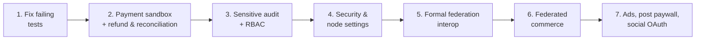

# FPDP Development Progress Report

## 1. Snapshot

**Verification date:** September 26, 2026
**Evidence:** repository routes, controllers, services, repositories, migrations, views, gateway plugins, tests, and deployment configuration—not planning documents alone. The test suite was re-run on the same date (see Section 8).

FPDP is past its core MVP. Since the September 21 report, visitor commerce flows are connected (public product checkout, paid CV access, wallet top-up, manual payment confirmation), a paid LLM + RAG visitor chatbot is live, the owner dashboard has panels for nearly every domain, and federation speaks ActivityPub (WebFinger, actor, inbox/outbox, inbound and outbound federated posts). Payment refunds, cancellation, and reconciliation are now available too. The next focus is validation against real sandboxes/servers, auditing sensitive actions, security settings, and operational hardening.

Repository snapshot:

- **59 MySQL migrations** (`0001`–`0059`);
- **49 test scripts**, all passing (see Section 8);
- REST APIs for identity, profiles, posts, timeline, external feeds, CV, payments, personal online shop (including visitor checkout and digital assets), analytics, federation, LLM config, RAG, chatbot, wallet, wall comments, themes, and media upload;
- real UI: home, unified timeline (local + federated + promoted products), profile, post, shop, product page, public CV, "coretan" wall, YouTube page, payment thank-you page, and 12 owner dashboard pages;
- 3 public themes: `default`, `editorial`, `minimal`;
- 6 payment gateways: Dummy, Paywuz, Midtrans, PayPal (built in) + iPaymu and Manual Transfer (plugins under `gateways/`);
- a Dockerfile and Dokploy Compose deployment — staging live and validated;
- bilingual product and technical documentation.

## 2. Phase status

```mermaid
flowchart LR
    P0["Phase 0<br/>Engineering foundation"] --> P1["Phase 1<br/>Identity & personal node"]
    P1 --> P2["Phase 2<br/>Local content & timeline"]
    P2 --> P3["Phase 3<br/>External aggregation"]
    P3 --> P4["Phase 4<br/>MVP hardening"]
    P4 --> P5["Phase 5<br/>Online shop & payment"]
    P5 --> P6["Phase 6<br/>Federation"]
    P6 --> P7["Phase 7<br/>Federated commerce"]
    P7 --> P8["Phase 8+<br/>Ecosystem, AI, scale"]

    classDef done fill:#e3efe9,stroke:#185f48,color:#17211b;
    classDef partial fill:#f2e8d6,stroke:#93631e,color:#17211b;
    classDef planned fill:#f1e3e1,stroke:#a13d37,color:#17211b;
    class P0,P1,P2,P3 done;
    class P4,P5,P6,P7,P8 partial;
```

| Workstream | Status | Summary |
|---|---|---|
| Engineering foundation | **Done** | PSR-4, router, PDO, migration runner, config, JSON envelope, exception mapping (now with exception logging), CI |
| Identity & profile | **Done for MVP** | Register/login/logout/`me`, hashed tokens, rate limiting, profile visibility, Google OAuth visitors |
| Local content | **Done for MVP** | CRUD, draft/publish, visibility, soft delete, media upload, lightbox, canonical URLs, cursor timeline, dashboard post list and delete |
| External aggregation | **Done for MVP** | RSS/Atom/Custom API, YouTube feeds, LinkedIn Organizations, anti-SSRF HTTP client, sync worker, dedup |
| Operations & hardening | **Partial** | CI, audit trail live for sensitive actions, centralized owner-only access, validated Dokploy staging; backup/restore exercise and retention not done |
| Personal online shop | **Done for MVP** | The node owner's own shop: products, orders, public visitor checkout, shipping address, digital assets + download, promoted products |
| Payment | **Mostly done** | 6 gateways, gateway plugin system, active-gateway selection, per-environment sandbox/live, manual confirmation, owner cancel and refund, reconciliation; real sandbox testing and settlement ledger not done |
| Federation | **Mostly done** | ActivityPub (WebFinger, actor, inbox/outbox, followers/following), federated posts and products, federation worker, federation dashboard; cross-server interop testing not formally documented |
| Dashboard | **Mostly done** | 12 live owner pages; standalone Analytics panel and security settings missing |
| AI | **Mostly done** | LLM providers (OpenAI, Anthropic, OpenRouter), describe-image, RAG + FAQ, paid visitor chatbot via wallet, conversation history |
| Advertising | **Not started** | Strategy document only |

## 3. What is available

### 3.1 Platform and baseline security

- Front controller and router support static routes, segment parameters, and canonical `/@handle`.
- The home page (`/`) renders the owner's personal digital home live, falling back to a placeholder for fresh installs or non-public profiles.
- Config reads defaults, `.env`, and native container environment variables.
- Passwords are hashed; bearer tokens are hashed and revocable.
- Rate limiting for register/login, wall comments, LLM calls, and RAG.
- The external HTTP client blocks private/internal targets and limits redirects, timeouts, and response size.
- Uncaught exceptions are now logged instead of only returning a generic 500.
- `scripts/rotate-app-key.php` re-encrypts gateway credentials and OAuth tokens transactionally.
- GitHub Actions runs syntax checks and the test suite.

### 3.2 Identity, profile, and visitors

- Registration creates the node, owner user, and profile in one flow.
- Login, logout, `/api/v1/me`, public profile, profile update, and a dashboard-editable About Me page.
- Profile visibility: `PUBLIC`, `UNLISTED`, `PRIVATE`.
- Google OAuth visitors with signed state and hashed visitor tokens; owners can list visitors (`/api/v1/me/visitors`).

### 3.3 Local content, media, and interaction

- Create/read/update/soft-delete posts; draft/publish; visibility and ownership enforcement.
- Up to 10 media items per post; direct upload (`POST /api/v1/me/media`) with server-side MIME detection, no SVG, and `FILE` limited to PDF.
- The post editor embeds YouTube, TikTok, and Instagram videos; bare URLs in timeline excerpts are auto-linked.
- Click-to-zoom lightbox for post images and product photos.
- "Coretan" wall (guestbook): visitors post comments; the owner replies and deletes.

### 3.4 External content

- RSS, Atom, Custom API, and official YouTube feed connectors with privacy-enhanced embeds.
- LinkedIn Organizations: OAuth, Organization discovery, encrypted tokens, post fetch, disconnect.
- Feed-source management, sync trigger, sync worker, deduplication, stats.
- The unified timeline merges local posts, external content, sanitized federated posts, and promoted products.

> Correction: the **Facebook Pages** integration and the **Instagram litescrap** connector listed in the previous report have been **removed** from the repository (commit `629c807`) and are no longer available.

### 3.5 CV and visitor monetization

- Owners upload a CV to `storage/` outside the webroot; replacing it revokes old grants.
- Public CV page with the real profile photo, access request, paywall, post-payment grant, and protected download.
- Access grants now store buyer identity (name, email, etc.) and offer extended CV access options.

### 3.6 Personal online shop and payment

Scope: an online shop owned by the website owner (one seller per node, not a multi-seller marketplace). Visitors can buy directly on the node, and product posts spread to the fediverse. Federated commerce — buyers on other nodes/the fediverse ordering products — is a key differentiator of the platform and remains a goal.

- Product CRUD, orders with immutable snapshots, status lifecycle.
- **Public visitor checkout** (`POST /api/v1/profiles/{handle}/orders`) with buyer identity and shipping address.
- **Product digital assets**: owner upload, buyer download after payment.
- Promoted products (`is_promoted`) appear in the timeline and are federated.
- `PaymentGatewayInterface`, factory, Dummy/Paywuz/Midtrans/PayPal adapters, and a **gateway plugin system** (`gateways/*/gateway.json`) with iPaymu and Manual Transfer plugins.
- Per-environment (Sandbox/Live) credentials encrypted with AES-256-GCM in `payment_gateway_configs`; saved non-secret values are shown in Settings, secrets are not.
- Saving a gateway verifies credentials with the provider (PayPal OAuth, authenticated Midtrans request); activation rejects incomplete configuration.
- The PayPal environment is read from database config with a `PAYPAL_ENVIRONMENT` fallback; iPaymu follows the same environment dropdown.
- The gateway code is resolved before payment validation (products, CV, and wallet top-up).
- Webhook verification and duplicate-event handling.
- **Payment confirmation page** for product/CV/wallet, confirmation links across all themes, and a thank-you page (`/payment/thank-you`).
- **Manual confirmation of pending payments** by the owner (`/api/v1/me/payments/pending`, `.../{uuid}/confirm`).
- Payments dashboard: balance/approximate settlement, success rate, total refunded, recent transactions, and buyer details.
- **Owner cancellation** (`POST /api/v1/me/payments/{uuid}/cancel`): cancels at the gateway when it has an API (Midtrans, Paywuz, Dummy, Manual Transfer) and still cancels locally when the gateway refuses or has none (PayPal, iPaymu), showing the provider message to the owner. The related order is closed too.
- **Owner refund** (`POST /api/v1/me/payments/{uuid}/refund`): full or partial (`refunded_amount`, `PARTIALLY_REFUNDED`/`REFUNDED` status, migration `0059`). Gateways with no refund API (Paywuz, iPaymu) use the manual-refund option. A full refund undoes fulfillment through `PaymentFulfillmentService`: CV grant revoked, order set to `REFUNDED`, top-up taken back out of the wallet. Refunding a top-up already partly spent on chat is refused.
- **Refunds made in the provider's dashboard are now applied**: Midtrans `refund`/`partial_refund` webhooks move a `PAID` payment to `REFUNDED`/`PARTIALLY_REFUNDED`. Previously the refund notification was dropped as a duplicate, because Midtrans reuses the same `transaction_id` for every notification about one transaction.
- **Reconciliation** (`scripts/reconcile-payments.php` for cron, plus the "Cek status ke gateway" button / `POST /api/v1/me/payments/reconcile`): asks the provider for the status of `PENDING` payments older than 15 minutes, applies terminal statuses, and runs fulfillment. Payments cancelled/failed locally in the last 7 days but `PAID` at the provider are moved to `PAID`, fulfilled, and reported as mismatches. Exit code 1 on any error or mismatch.
- **Paywuz adapter aligned with the official Merchant API v1 docs**: `getPaymentStatus()` uses `GET /transactions/{orderId}` and `cancelPayment()` uses `POST /transactions/{orderId}/cancel` (previously both threw, as if the endpoints did not exist). `transaction.settlement` stays `PENDING`. Credential verification now uses `GET /payment-methods` and rejects a `pk_live_` key saved under Sandbox, or the reverse.

### 3.7 AI, RAG, and chatbot

- `LLMProviderInterface` + factory for OpenAI, Anthropic, and OpenRouter; per-node configuration (`llm_configs`).
- `describe-image`: drafts a product description from a photo, manually triggered and rate limited.
- RAG: owners upload documents and generate/edit/delete FAQs from them.
- **Visitor chatbot** with a widget in every theme; owners toggle it and set pricing.
- **Visitor wallet**: top-up through the active gateway, owners can grant balance manually; balance pays for chat.
- Owner-facing chatbot session and message history; a pending-orders (buying interest) filter from conversations.

### 3.8 Federation

- Ed25519 node identity, signing keys, and RSA keys for ActivityPub HTTP Signatures.
- WebFinger (`/.well-known/webfinger`), actor document, `/@handle/inbox`, `/@handle/outbox`, `/followers`, `/following`.
- Follow, Accept, Reject, Undo, Block; `INCOMING`/`OUTGOING` direction with a unique pair per direction; mutual-follow status fixes.
- Follow-request approve/reject, remote-node trust state (`UNKNOWN`, `TRUSTED`, `BLOCKED`), capability settings.
- Inbound and outbound Create/Update/Delete for federated posts, including image attachments; federated product delivery.
- A federation worker service that actually delivers queued activities; retry, exponential backoff, dedup, timestamp window.
- Every inbox activity and unresolved Accept/Reject is logged; actor resolution is retried before an inbound Follow is dropped.
- Federation dashboard (`/dashboard/federation`) with a follow form accepting an account or profile URL.

### 3.9 Analytics and dashboard

- Daily visitor hashing with HMAC + `APP_KEY`; raw IPs are not stored.
- Profile view, post view, outbound click, and shop conversion events; dashboard analytics API.
- Live dashboard pages: Overview, Posts (editor + list), About Me, CV, Products, Orders (buyer info and filters), Payments, Integrations, Federation, RAG, Themes, Settings (gateway, LLM, chatbot), and Coretan.
- Theme selection from the dashboard; site navigation unified into one source across all themes.

### 3.10 Deployment

- Web installer for VPS/shared hosting.
- PHP 8.3 + Apache Docker image; `.well-known` publicly allowed in the vhost.
- Dokploy Compose: app + MySQL 8.4 + federation worker, health check, persistent volumes, automatic migrations, owner bootstrap.
- Production secret validation and web-installer lock.

## 4. Partially complete

### 4.1 Production validation

- Dokploy staging was validated (September 19, 2026), but no CI job runs all migrations against a disposable MySQL 8.
- Backup/restore/rollback is documented but not tested through a recovery exercise.
- The `sodium` extension is not declared explicitly in the `Dockerfile`; its availability in the image needs verification.

### 4.2 Payment production

- Paywuz, Midtrans, PayPal, and iPaymu are tested with a fake HTTP requester, not against real provider sandboxes. Sandbox testing needs the owner's sandbox credentials and has to be run by the owner.
- `scripts/reconcile-payments.php` is not scheduled in the Dokploy Compose yet; it needs a cron (e.g. every 15 minutes) or a worker service like the federation worker.
- The Payments dashboard balance is still an approximation from the `payments` table (net of refunds); there is no settlement/payout ledger or gateway-fee accounting (the `fee` column is never filled).
- A partial refund made in the Midtrans dashboard only moves the status to `PARTIALLY_REFUNDED`; the amount is not recorded, since the notification does not reliably carry it.
- PayPal and iPaymu have no cancel API; cancellation is local only and the provider's payment page stays open until it expires (reconciliation catches it if it is paid anyway).

### 4.3 Dashboard and settings

- The analytics API exists, but there is no standalone `/dashboard/analytics` page beyond the Overview summary.
- Node settings are incomplete: default/enabled languages, custom CSS/layout, and general node config (themes are available).
- Security settings are missing: 2FA and session management.

### 4.4 Federation production

- No formal record yet of interop testing between two FPDP instances or another ActivityPub server on separate domains, although many recent fixes came from real-world testing.
- Replay protection does not use a nonce cache.
- Stored capabilities do not yet enforce feature access.
- Older follow data may need an `INCOMING`/`OUTGOING` direction backfill.
- `app/Services/Federation/Federaltest.php` looks like a scratch file inside the service namespace and should be reviewed.

### 4.5 External integrations

- LinkedIn is not validated against the production Community Management API.
- The YouTube embed renderer on timeline/profile is still limited; playlist normalization is unsupported.

### 4.6 Authorization, audit, and analytics hardening

- **Correction:** the previous report said the audit trail already covered auth, posts, profile, and wall comments. In fact `AuditService` was never wired into `routes.php`, so no audit event was ever recorded in production. Fixed on September 26, 2026.
- **Done (September 26, 2026):** an **owner-only** access model is enforced centrally in `AuthService`: only an `ACTIVE` user with role `OWNER` can log in or use a token; a suspended account or any other role is refused immediately even with a still-valid token, and the refusal is recorded as `access.denied`. There is no admin role, per the product decision (one website = one owner).
- **Done (September 26, 2026):** the audit trail now records `user.registered`, `user.login`, `user.login_failed`, `access.denied`, `payment.confirmed_manually`, `payment.cancelled`, `payment.refunded`, `payment.reconciled` (including from cron), `payment_gateway.configured` (key names only, no values), `payment_gateway.activated`, `llm.configured` (no API key), `wallet.granted`, `federation.trust_changed`, `federation.blocked`, and `federation.capabilities_updated`, alongside the existing post/profile/wall-comment events. Payment entries do not copy buyer personal data. A failed audit write does not undo the action; the error goes to the server log.
- There is no dashboard page to browse the full audit trail yet (Overview only shows recent activity), and no retention for `audit_events`.
- Owner access to buyer personal data (Payments/Orders pages) is not logged per view yet.
- The public outbound-click endpoint has no dedicated rate limit.
- `analytics_events` has no retention/cleanup job.

## 5. Not started

- Advertising marketplace: ad slots, pricing, booking, approval, delivery windows.
- Per-post paywall (per-post pricing and entitlement).
- OAuth connectors for Facebook, Instagram, X, Threads, TikTok, and Shopee.
- AI cost controls/usage reporting beyond rate limits (per-node spend ceiling).
- Production plugin/adapter marketplace (a local gateway plugin system exists).
- **End-to-end federated commerce (cross-node orders)** — a key differentiator: visitors on other nodes/the fediverse can order products distributed through federation. Product distribution to the fediverse already works; the cross-node order, payment, and confirmation flow does not yet.
- Multi-node administration, shared/object storage, horizontal scaling.
- Formal contribution policy (`CONTRIBUTING.md`). The license is set: Apache-2.0 (`LICENSE`, `NOTICE`).

## 6. Next priorities

1. ~~Fix the `PostEndpointsTest` fixture (`slug` column) and make RSA-based tests independent of local OpenSSL configuration.~~ **Done** (September 26, 2026) — 47/47 tests pass.
2. **Partly done** (September 26, 2026): owner refund/cancel, applying refunds from webhooks, a reconciliation job, and aligning the Paywuz adapter with its official docs are in place. Remaining: testing Paywuz, Midtrans, PayPal, and iPaymu against real sandboxes (needs the owner's credentials) and scheduling the reconciliation cron in Dokploy.
3. ~~Add credential changes, gateway activation, manual confirmation, wallet grants, and remote-node trust to the audit trail; add RBAC middleware.~~ **Done** (September 26, 2026) — the audit trail is wired in and covers every sensitive action; owner-only dashboard access is enforced centrally (no admin role).
4. Implement 2FA/session management, language settings, and an Analytics page.
5. Document a two-domain federation interop test and add a nonce cache.
6. Start Phase 7 Federated Commerce: ActivityPub product representation, cross-node order requests, payment on the seller node, and order status sent back to the buyer node.
7. Add an analytics retention job and an outbound-click rate limit.
8. Only then continue with advertising, per-post paywall, additional social OAuth, and ecosystem work.

## 7. Risks and operational decisions

- Deployment assumes **one owner and one app replica per node**; do not scale before migration locking and shared storage exist.
- MySQL and `storage/` (CVs, media, digital assets, RAG documents) must be restored from a consistent recovery point.
- Code rollback does not reverse forward migrations.
- `APP_KEY` protects OAuth state, analytics HMAC, gateway credentials, and OAuth tokens; rotation must use `scripts/rotate-app-key.php`.
- Manual payment confirmation grants access/fulfillment without provider proof; it is now in the audit trail (who, when, which payment), but the transfer evidence itself stays outside the system.
- The chatbot uses the owner's LLM API key; without a spend ceiling, abuse can run up provider bills.
- **Buyer personal data** (name, email, phone, shipping address) is now stored in orders, payment metadata, and CV grants. In line with ISO/IEC 27001:2022 controls (A.5.34 Privacy and protection of PII, A.8.10 Information deletion, A.8.15 Logging), the following must be defined: a processing basis and privacy notice for buyers, retention and deletion periods, restricted dashboard access, and auditing of access to buyer data.
- Payment and federation must be tested against real remote systems before being called production-ready.

## 8. Latest validation

Run on September 26, 2026 in the development workspace (PHP 8.5.8 CLI, Windows), using the same loop as CI (`php tests/*Test.php`):

- **49 of 49 tests pass**, with no `OPENSSL_CONF` needed. The new `OwnerAccessAuditTest` checks owner-only access (suspended accounts and other roles are refused even with a valid token), auditing of failed logins, gateway and LLM configuration, confirmation, refund, and cancellation, that secrets and buyer personal data never reach the audit trail, and that login still works when the audit table is broken. The new `PaymentRefundCancelReconcileTest` covers cancellation, full/partial/manual refunds, refunding an already-spent top-up, a Midtrans refund webhook after settlement, reconciliation (provider status, minimum age, gateways without a status API, errors, mismatches), and the dashboard summary. `PaywuzGatewayTest` used to silently send real requests to `api.paywuz.id`; it now uses a fake requester.
- Fixed in this round:
  - `PostEndpointsTest`: the SQLite fixture now has the `posts.slug` column, and the canonical URL assertion follows the `/posts/{id}-{slug}` format introduced in commit `24ab57b`.
  - `FederationInboxTest`, `FederatedPostIngestionTest`, `MutualFollowTest`: previously failed because Windows/XAMPP PHP could not find `openssl.cnf`, so `openssl_pkey_new()` failed (`error:80000003`). The same issue would also break node federation key generation on Windows deployments. `NodeKeyService::createRsaKeyPair()` now tries OpenSSL's default config first, then falls back to `app/Services/Federation/openssl-fallback.cnf`; all three tests use the same helper.
- Docker build was not run in this workspace; the staging deployment was confirmed by the project owner.

## 9. References

- [Roadmap](ROADMAP.en.md)
- [WBS](WBS-TASK.en.md)
- [PRD](PRD.en.md)
- [ERD](ERD.en.md)
- [API Contract](API-CONTRACT.en.md) and [OpenAPI](openapi.yaml)
- [Federation Concept](FEDERATION-CONCEPT.en.md)
- [AI Monetization Strategy](AI-MONETIZATION-STRATEGY.en.md)
- [Dokploy Guide](DOKPLOY-DEPLOYMENT.en.md)
- [Theme Guide](THEME-GUIDE.en.md)
- [Mockup](mockup/README.md)
