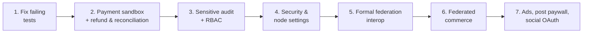

# FPDP Development Progress Report

## 1. Snapshot

**Verification date:** September 26, 2026
**Evidence:** repository routes, controllers, services, repositories, migrations, views, gateway plugins, tests, and deployment configuration—not planning documents alone. The test suite was re-run on the same date (see Section 8).

FPDP is past its core MVP. Since the September 21 report, visitor commerce flows are connected (public product checkout, paid CV access, wallet top-up, manual payment confirmation), a paid LLM + RAG visitor chatbot is live, the owner dashboard has panels for nearly every domain, and federation speaks ActivityPub (WebFinger, actor, inbox/outbox, inbound and outbound federated posts). The next focus is validation against real sandboxes/servers, refunds and reconciliation, security settings, and operational hardening.

Repository snapshot:

- **58 MySQL migrations** (`0001`–`0058`);
- **47 test scripts** (43 passing, 4 failing — see Section 8);
- REST APIs for identity, profiles, posts, timeline, external feeds, CV, payments, personal online shop (including visitor checkout and digital assets), analytics, federation, LLM config, RAG, chatbot, wallet, wall comments, themes, and media upload;
- real UI: home, unified timeline (local + federated + promoted products), profile, post, shop, product page, public CV, "coretan" wall, YouTube page, payment thank-you page, and 12 owner dashboard pages;
- 3 public themes: `default`, `editorial`, `minimal`;
- 6 payment gateways: Dummy, Paywuz, Midtrans, PayPal (built in) + iPaymu and Manual Transfer (plugins under `gateways/`);
- a Dockerfile and Dokploy Compose deployment — staging live and validated;
- bilingual product and technical documentation.

## 2. Phase status

```mermaid
flowchart LR
    P0["Phase 0<br/>Engineering foundation"] --> P1["Phase 1<br/>Identity & personal node"]
    P1 --> P2["Phase 2<br/>Local content & timeline"]
    P2 --> P3["Phase 3<br/>External aggregation"]
    P3 --> P4["Phase 4<br/>MVP hardening"]
    P4 --> P5["Phase 5<br/>Online shop & payment"]
    P5 --> P6["Phase 6<br/>Federation"]
    P6 --> P7["Phase 7<br/>Federated commerce"]
    P7 --> P8["Phase 8+<br/>Ecosystem, AI, scale"]

    classDef done fill:#e3efe9,stroke:#185f48,color:#17211b;
    classDef partial fill:#f2e8d6,stroke:#93631e,color:#17211b;
    classDef planned fill:#f1e3e1,stroke:#a13d37,color:#17211b;
    class P0,P1,P2,P3 done;
    class P4,P5,P6,P7,P8 partial;
```

| Workstream | Status | Summary |
|---|---|---|
| Engineering foundation | **Done** | PSR-4, router, PDO, migration runner, config, JSON envelope, exception mapping (now with exception logging), CI |
| Identity & profile | **Done for MVP** | Register/login/logout/`me`, hashed tokens, rate limiting, profile visibility, Google OAuth visitors |
| Local content | **Done for MVP** | CRUD, draft/publish, visibility, soft delete, media upload, lightbox, canonical URLs, cursor timeline, dashboard post list and delete |
| External aggregation | **Done for MVP** | RSS/Atom/Custom API, YouTube feeds, LinkedIn Organizations, anti-SSRF HTTP client, sync worker, dedup |
| Operations & hardening | **Partial** | CI, basic audit, validated Dokploy staging; backup/restore exercise, RBAC, and retention not done |
| Personal online shop | **Done for MVP** | The node owner's own shop: products, orders, public visitor checkout, shipping address, digital assets + download, promoted products |
| Payment | **Mostly done** | 6 gateways, gateway plugin system, active-gateway selection, per-environment sandbox/live, manual confirmation; real sandboxes, refund UI, and reconciliation not done |
| Federation | **Mostly done** | ActivityPub (WebFinger, actor, inbox/outbox, followers/following), federated posts and products, federation worker, federation dashboard; cross-server interop testing not formally documented |
| Dashboard | **Mostly done** | 12 live owner pages; standalone Analytics panel and security settings missing |
| AI | **Mostly done** | LLM providers (OpenAI, Anthropic, OpenRouter), describe-image, RAG + FAQ, paid visitor chatbot via wallet, conversation history |
| Advertising | **Not started** | Strategy document only |

## 3. What is available

### 3.1 Platform and baseline security

- Front controller and router support static routes, segment parameters, and canonical `/@handle`.
- The home page (`/`) renders the owner's personal digital home live, falling back to a placeholder for fresh installs or non-public profiles.
- Config reads defaults, `.env`, and native container environment variables.
- Passwords are hashed; bearer tokens are hashed and revocable.
- Rate limiting for register/login, wall comments, LLM calls, and RAG.
- The external HTTP client blocks private/internal targets and limits redirects, timeouts, and response size.
- Uncaught exceptions are now logged instead of only returning a generic 500.
- `scripts/rotate-app-key.php` re-encrypts gateway credentials and OAuth tokens transactionally.
- GitHub Actions runs syntax checks and the test suite.

### 3.2 Identity, profile, and visitors

- Registration creates the node, owner user, and profile in one flow.
- Login, logout, `/api/v1/me`, public profile, profile update, and a dashboard-editable About Me page.
- Profile visibility: `PUBLIC`, `UNLISTED`, `PRIVATE`.
- Google OAuth visitors with signed state and hashed visitor tokens; owners can list visitors (`/api/v1/me/visitors`).

### 3.3 Local content, media, and interaction

- Create/read/update/soft-delete posts; draft/publish; visibility and ownership enforcement.
- Up to 10 media items per post; direct upload (`POST /api/v1/me/media`) with server-side MIME detection, no SVG, and `FILE` limited to PDF.
- The post editor embeds YouTube, TikTok, and Instagram videos; bare URLs in timeline excerpts are auto-linked.
- Click-to-zoom lightbox for post images and product photos.
- "Coretan" wall (guestbook): visitors post comments; the owner replies and deletes.

### 3.4 External content

- RSS, Atom, Custom API, and official YouTube feed connectors with privacy-enhanced embeds.
- LinkedIn Organizations: OAuth, Organization discovery, encrypted tokens, post fetch, disconnect.
- Feed-source management, sync trigger, sync worker, deduplication, stats.
- The unified timeline merges local posts, external content, sanitized federated posts, and promoted products.

> Correction: the **Facebook Pages** integration and the **Instagram litescrap** connector listed in the previous report have been **removed** from the repository (commit `629c807`) and are no longer available.

### 3.5 CV and visitor monetization

- Owners upload a CV to `storage/` outside the webroot; replacing it revokes old grants.
- Public CV page with the real profile photo, access request, paywall, post-payment grant, and protected download.
- Access grants now store buyer identity (name, email, etc.) and offer extended CV access options.

### 3.6 Personal online shop and payment

Scope: an online shop owned by the website owner (one seller per node, not a multi-seller marketplace). Visitors can buy directly on the node, and product posts spread to the fediverse. Federated commerce — buyers on other nodes/the fediverse ordering products — is a key differentiator of the platform and remains a goal.

- Product CRUD, orders with immutable snapshots, status lifecycle.
- **Public visitor checkout** (`POST /api/v1/profiles/{handle}/orders`) with buyer identity and shipping address.
- **Product digital assets**: owner upload, buyer download after payment.
- Promoted products (`is_promoted`) appear in the timeline and are federated.
- `PaymentGatewayInterface`, factory, Dummy/Paywuz/Midtrans/PayPal adapters, and a **gateway plugin system** (`gateways/*/gateway.json`) with iPaymu and Manual Transfer plugins.
- Per-environment (Sandbox/Live) credentials encrypted with AES-256-GCM in `payment_gateway_configs`; saved non-secret values are shown in Settings, secrets are not.
- Saving a gateway verifies credentials with the provider (PayPal OAuth, authenticated Midtrans request); activation rejects incomplete configuration.
- The PayPal environment is read from database config with a `PAYPAL_ENVIRONMENT` fallback; iPaymu follows the same environment dropdown.
- The gateway code is resolved before payment validation (products, CV, and wallet top-up).
- Webhook verification and duplicate-event handling.
- **Payment confirmation page** for product/CV/wallet, confirmation links across all themes, and a thank-you page (`/payment/thank-you`).
- **Manual confirmation of pending payments** by the owner (`/api/v1/me/payments/pending`, `.../{uuid}/confirm`).
- Payments dashboard: balance/approximate settlement, success rate, recent transactions, and buyer details.

### 3.7 AI, RAG, and chatbot

- `LLMProviderInterface` + factory for OpenAI, Anthropic, and OpenRouter; per-node configuration (`llm_configs`).
- `describe-image`: drafts a product description from a photo, manually triggered and rate limited.
- RAG: owners upload documents and generate/edit/delete FAQs from them.
- **Visitor chatbot** with a widget in every theme; owners toggle it and set pricing.
- **Visitor wallet**: top-up through the active gateway, owners can grant balance manually; balance pays for chat.
- Owner-facing chatbot session and message history; a pending-orders (buying interest) filter from conversations.

### 3.8 Federation

- Ed25519 node identity, signing keys, and RSA keys for ActivityPub HTTP Signatures.
- WebFinger (`/.well-known/webfinger`), actor document, `/@handle/inbox`, `/@handle/outbox`, `/followers`, `/following`.
- Follow, Accept, Reject, Undo, Block; `INCOMING`/`OUTGOING` direction with a unique pair per direction; mutual-follow status fixes.
- Follow-request approve/reject, remote-node trust state (`UNKNOWN`, `TRUSTED`, `BLOCKED`), capability settings.
- Inbound and outbound Create/Update/Delete for federated posts, including image attachments; federated product delivery.
- A federation worker service that actually delivers queued activities; retry, exponential backoff, dedup, timestamp window.
- Every inbox activity and unresolved Accept/Reject is logged; actor resolution is retried before an inbound Follow is dropped.
- Federation dashboard (`/dashboard/federation`) with a follow form accepting an account or profile URL.

### 3.9 Analytics and dashboard

- Daily visitor hashing with HMAC + `APP_KEY`; raw IPs are not stored.
- Profile view, post view, outbound click, and shop conversion events; dashboard analytics API.
- Live dashboard pages: Overview, Posts (editor + list), About Me, CV, Products, Orders (buyer info and filters), Payments, Integrations, Federation, RAG, Themes, Settings (gateway, LLM, chatbot), and Coretan.
- Theme selection from the dashboard; site navigation unified into one source across all themes.

### 3.10 Deployment

- Web installer for VPS/shared hosting.
- PHP 8.3 + Apache Docker image; `.well-known` publicly allowed in the vhost.
- Dokploy Compose: app + MySQL 8.4 + federation worker, health check, persistent volumes, automatic migrations, owner bootstrap.
- Production secret validation and web-installer lock.

## 4. Partially complete

### 4.1 Production validation

- Dokploy staging was validated (September 19, 2026), but no CI job runs all migrations against a disposable MySQL 8.
- Backup/restore/rollback is documented but not tested through a recovery exercise.
- The `sodium` extension is not declared explicitly in the `Dockerfile`; its availability in the image needs verification.

### 4.2 Payment production

- Paywuz, Midtrans, PayPal, and iPaymu are tested with a fake HTTP requester, not against real provider sandboxes. Paywuz has no non-transactional verification endpoint.
- A Midtrans refund after `PAID` is recorded as a transaction event but does not always reconcile the payment to `REFUNDED`.
- No owner UI/API for refunds or payment cancellation; `POST /payments/{id}/cancel` from the API contract is not implemented.
- The Payments dashboard balance is an approximation from the `payments` table; there is no settlement/payout ledger, gateway-fee accounting, or reconciliation job.
- Manual Transfer does not support refunds (per its plugin capabilities).

### 4.3 Dashboard and settings

- The analytics API exists, but there is no standalone `/dashboard/analytics` page beyond the Overview summary.
- Node settings are incomplete: default/enabled languages, custom CSS/layout, and general node config (themes are available).
- Security settings are missing: 2FA and session management.

### 4.4 Federation production

- No formal record yet of interop testing between two FPDP instances or another ActivityPub server on separate domains, although many recent fixes came from real-world testing.
- Replay protection does not use a nonce cache.
- Stored capabilities do not yet enforce feature access.
- Older follow data may need an `INCOMING`/`OUTGOING` direction backfill.
- `app/Services/Federation/Federaltest.php` looks like a scratch file inside the service namespace and should be reviewed.

### 4.5 External integrations

- LinkedIn is not validated against the production Community Management API.
- The YouTube embed renderer on timeline/profile is still limited; playlist normalization is unsupported.

### 4.6 Authorization, audit, and analytics hardening

- No centralized role/permission middleware (owner vs admin).
- The audit trail covers auth, posts, profile, and wall comments; payment-credential changes, gateway activation, manual payment confirmation, wallet grants, and remote-node trust are not audited.
- The public outbound-click endpoint has no dedicated rate limit.
- `analytics_events` has no retention/cleanup job.

## 5. Not started

- Advertising marketplace: ad slots, pricing, booking, approval, delivery windows.
- Per-post paywall (per-post pricing and entitlement).
- OAuth connectors for Facebook, Instagram, X, Threads, TikTok, and Shopee.
- AI cost controls/usage reporting beyond rate limits (per-node spend ceiling).
- Production plugin/adapter marketplace (a local gateway plugin system exists).
- **End-to-end federated commerce (cross-node orders)** — a key differentiator: visitors on other nodes/the fediverse can order products distributed through federation. Product distribution to the fediverse already works; the cross-node order, payment, and confirmation flow does not yet.
- Multi-node administration, shared/object storage, horizontal scaling.
- License file and formal contribution policy.

## 6. Next priorities

1. Fix the `PostEndpointsTest` fixture (`slug` column) and make RSA-based tests independent of local OpenSSL configuration.
2. Test Paywuz, Midtrans, PayPal, and iPaymu against real sandboxes; add owner refund/cancel and a reconciliation job.
3. Add credential changes, gateway activation, manual confirmation, wallet grants, and remote-node trust to the audit trail; add RBAC middleware.
4. Implement 2FA/session management, language settings, and an Analytics page.
5. Document a two-domain federation interop test and add a nonce cache.
6. Start Phase 7 Federated Commerce: ActivityPub product representation, cross-node order requests, payment on the seller node, and order status sent back to the buyer node.
7. Add an analytics retention job and an outbound-click rate limit.
8. Only then continue with advertising, per-post paywall, additional social OAuth, and ecosystem work.

## 7. Risks and operational decisions

- Deployment assumes **one owner and one app replica per node**; do not scale before migration locking and shared storage exist.
- MySQL and `storage/` (CVs, media, digital assets, RAG documents) must be restored from a consistent recovery point.
- Code rollback does not reverse forward migrations.
- `APP_KEY` protects OAuth state, analytics HMAC, gateway credentials, and OAuth tokens; rotation must use `scripts/rotate-app-key.php`.
- Manual payment confirmation grants access/fulfillment without provider proof; without an audit trail it is hard to trace in a dispute.
- The chatbot uses the owner's LLM API key; without a spend ceiling, abuse can run up provider bills.
- **Buyer personal data** (name, email, phone, shipping address) is now stored in orders, payment metadata, and CV grants. In line with ISO/IEC 27001:2022 controls (A.5.34 Privacy and protection of PII, A.8.10 Information deletion, A.8.15 Logging), the following must be defined: a processing basis and privacy notice for buyers, retention and deletion periods, restricted dashboard access, and auditing of access to buyer data.
- Payment and federation must be tested against real remote systems before being called production-ready.

## 8. Latest validation

Run on September 26, 2026 in the development workspace (PHP 8.5.8 CLI, Windows), using the same loop as CI (`php tests/*Test.php`):

- **43 of 47 tests pass.**
- `PostEndpointsTest` **fails due to a fixture bug**: the test's SQLite schema lacks the `posts.slug` column now used by `PostRepository`.
- `FederationInboxTest`, `FederatedPostIngestionTest`, and `MutualFollowTest` **fail due to the local environment**: `openssl_pkey_new()` cannot generate an RSA keypair (`error:80000003`, no OpenSSL config found by this Windows PHP). CI results on Linux need confirmation.
- Docker build was not run in this workspace; the staging deployment was confirmed by the project owner.

## 9. References

- [Roadmap](ROADMAP.en.md)
- [WBS](WBS-TASK.en.md)
- [PRD](PRD.en.md)
- [ERD](ERD.en.md)
- [API Contract](API-CONTRACT.en.md) and [OpenAPI](openapi.yaml)
- [Federation Concept](FEDERATION-CONCEPT.en.md)
- [AI Monetization Strategy](AI-MONETIZATION-STRATEGY.en.md)
- [Dokploy Guide](DOKPLOY-DEPLOYMENT.en.md)
- [Theme Guide](THEME-GUIDE.en.md)
- [Mockup](mockup/README.md)
