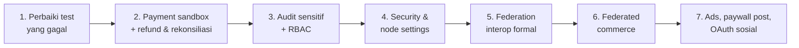

# Laporan Progres Pengembangan FPDP

## 1. Snapshot

**Tanggal verifikasi:** 26 September 2026
**Dasar verifikasi:** route, controller, service, repository, migration, view, gateway plugin, test, dan konfigurasi deployment pada repository—bukan hanya dokumen rencana. Test suite dijalankan ulang pada tanggal yang sama (lihat Bagian 8).

FPDP sudah melewati tahap MVP inti. Sejak laporan 21 September, flow komersial visitor sudah tersambung (checkout produk publik, pembayaran akses CV, top-up wallet, konfirmasi pembayaran manual), chatbot visitor berbayar berbasis LLM + RAG sudah live, dashboard owner sudah punya panel untuk hampir semua domain, dan federasi sudah berbicara ActivityPub (WebFinger, actor, inbox/outbox, post federasi masuk/keluar). Refund, pembatalan, dan rekonsiliasi pembayaran kini juga tersedia. Fokus berikutnya adalah validasi terhadap sandbox/server nyata, audit aksi sensitif, security settings, serta hardening operasional.

Ringkasan repository saat laporan ini dibuat:

- **59 migration MySQL** (`0001`–`0059`);
- **49 test script**, semuanya lulus (lihat Bagian 8);
- REST API untuk identity, profile, posts, timeline, external feeds, CV, payments, toko online pribadi (termasuk checkout visitor dan aset digital), analytics, federation, LLM config, RAG, chatbot, wallet, wall comments, theme, dan upload media;
- UI nyata: home, timeline terpadu (lokal + federasi + produk promosi), profil, post, shop, halaman produk, CV publik, wall "coretan", halaman YouTube, halaman terima kasih pembayaran, serta 12 halaman dashboard owner;
- 3 theme publik: `default`, `editorial`, `minimal`;
- 6 payment gateway: Dummy, Paywuz, Midtrans, PayPal (built-in) + iPaymu dan Manual Transfer (plugin di `gateways/`);
- Dockerfile serta Docker Compose Dokploy — staging live dan tervalidasi;
- dokumentasi produk dan teknis bilingual.

## 2. Status fase

```mermaid
flowchart LR
    P0["Phase 0<br/>Fondasi engineering"] --> P1["Phase 1<br/>Identity & personal node"]
    P1 --> P2["Phase 2<br/>Konten lokal & timeline"]
    P2 --> P3["Phase 3<br/>Agregasi eksternal"]
    P3 --> P4["Phase 4<br/>Hardening MVP"]
    P4 --> P5["Phase 5<br/>Toko online & payment"]
    P5 --> P6["Phase 6<br/>Federasi"]
    P6 --> P7["Phase 7<br/>Federated commerce"]
    P7 --> P8["Phase 8+<br/>Ekosistem, AI, scale"]

    classDef done fill:#e3efe9,stroke:#185f48,color:#17211b;
    classDef partial fill:#f2e8d6,stroke:#93631e,color:#17211b;
    classDef planned fill:#f1e3e1,stroke:#a13d37,color:#17211b;
    class P0,P1,P2,P3 done;
    class P4,P5,P6,P7,P8 partial;
```

| Workstream | Status | Ringkasan |
|---|---|---|
| Fondasi engineering | **Selesai** | PSR-4, router, PDO, migration runner, config, JSON envelope, exception mapping (kini dengan logging exception), CI |
| Identity & profile | **Selesai untuk MVP** | Register/login/logout/`me`, token hash, rate limit, profile visibility, Google OAuth visitor |
| Konten lokal | **Selesai untuk MVP** | CRUD, draft/publish, visibility, soft-delete, media upload, lightbox, canonical URL, cursor timeline, daftar & hapus post di dashboard |
| External aggregation | **Selesai untuk MVP** | RSS/Atom/Custom API, YouTube feed, LinkedIn Organizations, anti-SSRF HTTP client, sync worker, dedup |
| Operasional & hardening | **Sebagian** | CI, audit trail aktif untuk aksi sensitif, akses owner-only terpusat, staging Dokploy tervalidasi; backup/restore exercise dan retention belum |
| Toko online pribadi | **Selesai untuk MVP** | Toko milik owner node: product, order, checkout visitor publik, alamat pengiriman, aset digital + download, produk promosi |
| Payment | **Sebagian besar** | 6 gateway, sistem plugin gateway, pemilihan gateway aktif, sandbox/live per environment, konfirmasi manual, pembatalan dan refund owner, rekonsiliasi; uji sandbox nyata dan ledger settlement belum |
| Federasi | **Sebagian besar** | ActivityPub (WebFinger, actor, inbox/outbox, followers/following), post & produk federasi, federation worker, dashboard federation; uji interop lintas server belum terdokumentasi formal |
| Dashboard | **Sebagian besar** | 12 halaman owner live; panel Analytics tersendiri dan security settings belum |
| AI | **Sebagian besar** | LLM provider (OpenAI, Anthropic, OpenRouter), describe-image, RAG + FAQ, chatbot visitor berbayar via wallet, riwayat percakapan |
| Advertising | **Belum dimulai** | Hanya dokumen strategi |

## 3. Yang sudah tersedia

### 3.1 Platform dan keamanan dasar

- Front controller dan router mendukung route statis, parameter segment, dan canonical `/@handle`.
- Halaman utama (`/`) menampilkan personal digital home owner secara live; fallback ke placeholder untuk instalasi baru atau profile non-public.
- Config membaca default, `.env`, dan environment variable container.
- Password di-hash; bearer token di-hash dan dapat dicabut.
- Rate limiting untuk register/login, wall comment, panggilan LLM, dan RAG.
- HTTP client eksternal memblokir target private/internal, membatasi redirect, timeout, dan ukuran response.
- Exception yang tidak tertangani kini di-log, bukan hanya dikembalikan sebagai 500 generik.
- `scripts/rotate-app-key.php` melakukan re-encryption credential gateway dan token OAuth secara transaksional.
- GitHub Actions menjalankan syntax check dan test suite.

### 3.2 Identity, profile, dan visitor

- Registrasi membuat node, owner user, dan profile dalam satu flow.
- Login, logout, `/api/v1/me`, profile publik, update profile, dan halaman About Me yang dapat diedit dari dashboard.
- Profile visibility: `PUBLIC`, `UNLISTED`, `PRIVATE`.
- Google OAuth visitor dengan signed state dan visitor token yang di-hash; owner dapat melihat daftar visitor (`/api/v1/me/visitors`).

### 3.3 Konten lokal, media, dan interaksi

- Create/read/update/soft-delete post; draft/publish; visibility dan ownership enforcement.
- Maksimal 10 media per post; upload langsung (`POST /api/v1/me/media`) dengan deteksi MIME server-side, tanpa SVG, `FILE` hanya PDF.
- Post editor mendukung embed video YouTube, TikTok, dan Instagram; bare URL pada excerpt timeline otomatis menjadi link.
- Lightbox click-to-zoom untuk gambar post dan foto produk.
- Wall "coretan" (buku tamu): visitor menulis komentar, owner membalas dan menghapus.

### 3.4 Konten eksternal

- Connector RSS, Atom, Custom API, dan YouTube official feed dengan privacy-enhanced embed.
- LinkedIn Organizations: OAuth, discovery Organization, token terenkripsi, fetch post, disconnect.
- Feed-source management, sync trigger, sync worker, deduplication, statistik.
- Timeline terpadu menggabungkan post lokal, konten eksternal, post federasi (tersanitasi), dan produk promosi.

> Catatan koreksi: integrasi **Facebook Pages** dan connector **Instagram litescrap** yang tercatat di laporan sebelumnya sudah **dihapus** dari repository (commit `629c807`). Keduanya tidak lagi tersedia.

### 3.5 CV dan monetisasi visitor

- Owner upload CV ke `storage/` di luar webroot; mengganti dokumen membatalkan grant lama.
- Halaman CV publik dengan foto profil asli, access request, paywall, grant setelah pembayaran, dan download terlindungi.
- Grant akses kini menyimpan identitas pembeli (nama, email, dsb.) dan pilihan akses CV yang diperluas.

### 3.6 Toko online pribadi dan payment

Cakupan: toko online milik pemilik website (satu penjual per node, bukan marketplace multi-penjual). Pengunjung dapat membeli langsung di node, dan posting produk tersebar ke fediverse. Federated commerce — pembeli dari node/fediverse lain dapat memesan produk — adalah keunggulan utama platform dan tetap menjadi target.

- Product CRUD, order dengan immutable snapshot, status lifecycle.
- **Checkout visitor publik** (`POST /api/v1/profiles/{handle}/orders`) dengan identitas pembeli dan alamat pengiriman.
- **Aset digital produk**: owner upload, pembeli download setelah pembayaran.
- Produk promosi (`is_promoted`) tampil di timeline dan ikut difederasikan.
- `PaymentGatewayInterface`, factory, adapter Dummy/Paywuz/Midtrans/PayPal, serta **sistem plugin gateway** (`gateways/*/gateway.json`) dengan plugin iPaymu dan Manual Transfer.
- Credential per environment (Sandbox/Live) terenkripsi AES-256-GCM di `payment_gateway_configs`; nilai non-secret yang tersimpan ditampilkan kembali di Settings, secret tidak.
- Penyimpanan gateway memverifikasi credential ke provider (PayPal OAuth, Midtrans request berautentikasi); aktivasi menolak konfigurasi tidak lengkap.
- Environment PayPal dibaca dari konfigurasi database dengan fallback `PAYPAL_ENVIRONMENT`; iPaymu mengikuti dropdown environment yang sama.
- Gateway code di-resolve sebelum validasi pembayaran (produk, CV, dan top-up wallet).
- Webhook verification dan duplicate-event handling.
- **Halaman konfirmasi pembayaran** untuk produk/CV/wallet, link konfirmasi di semua theme, dan halaman terima kasih (`/payment/thank-you`).
- **Konfirmasi manual pembayaran pending** oleh owner (`/api/v1/me/payments/pending`, `.../{uuid}/confirm`).
- Dashboard Payments: saldo/perkiraan settlement, success rate, total refund, transaksi terbaru, dan detail pembeli.
- **Pembatalan oleh owner** (`POST /api/v1/me/payments/{uuid}/cancel`): membatalkan di gateway bila ada API-nya (Midtrans, Paywuz, Dummy, Manual Transfer), dan tetap membatalkan lokal bila gateway menolak atau tidak punya API (PayPal, iPaymu), dengan pesan provider ditampilkan ke owner. Order terkait ikut ditutup.
- **Refund oleh owner** (`POST /api/v1/me/payments/{uuid}/refund`): penuh atau sebagian (`refunded_amount`, status `PARTIALLY_REFUNDED`/`REFUNDED`, migration `0059`). Gateway tanpa API refund (Paywuz, iPaymu) memakai opsi refund manual. Refund penuh membatalkan fulfillment lewat `PaymentFulfillmentService`: grant CV dicabut, order menjadi `REFUNDED`, saldo top-up ditarik kembali. Refund top-up yang sebagian sudah dipakai untuk chat ditolak.
- **Refund dari dashboard provider** kini diterapkan: webhook `refund`/`partial_refund` Midtrans memindahkan payment `PAID` ke `REFUNDED`/`PARTIALLY_REFUNDED`. Sebelumnya notifikasi refund terbuang sebagai duplikat karena Midtrans memakai `transaction_id` yang sama untuk semua notifikasi satu transaksi.
- **Rekonsiliasi** (`scripts/reconcile-payments.php` untuk cron, dan tombol "Cek status ke gateway" / `POST /api/v1/me/payments/reconcile`): menanyakan status payment `PENDING` yang lebih tua dari 15 menit ke provider, menerapkan status final, dan menjalankan fulfillment. Payment yang dibatalkan/gagal lokal dalam 7 hari terakhir tetapi `PAID` di provider dipindah ke `PAID`, difulfill, dan dilaporkan sebagai mismatch. Exit code 1 bila ada error atau mismatch.
- **Adapter Paywuz diselaraskan dengan dokumentasi resmi Merchant API v1**: `getPaymentStatus()` memakai `GET /transactions/{orderId}` dan `cancelPayment()` memakai `POST /transactions/{orderId}/cancel` (sebelumnya melempar error karena dianggap tidak ada). Event `transaction.settlement` tetap `PENDING`. Verifikasi credential kini memakai `GET /payment-methods` dan menolak key `pk_live_` yang disimpan di Sandbox atau sebaliknya.

### 3.7 AI, RAG, dan chatbot

- `LLMProviderInterface` + factory untuk OpenAI, Anthropic, dan OpenRouter; konfigurasi per node (`llm_configs`).
- `describe-image`: draf deskripsi produk dari foto, dipicu manual dan dibatasi rate limit.
- RAG: owner upload dokumen, generate/edit/hapus FAQ dari dokumen.
- **Chatbot visitor** dengan widget di semua theme; owner mengatur aktif/nonaktif dan harga.
- **Wallet visitor**: top-up lewat gateway aktif, owner dapat memberi saldo manual; saldo dipakai untuk chat berbayar.
- Riwayat sesi dan pesan chatbot untuk owner; filter pending orders (minat beli) dari percakapan.

### 3.8 Federasi

- Ed25519 node identity, signing key, dan RSA key untuk HTTP Signature ActivityPub.
- WebFinger (`/.well-known/webfinger`), actor document, `/@handle/inbox`, `/@handle/outbox`, `/followers`, `/following`.
- Follow, Accept, Reject, Undo, Block; arah follow `INCOMING`/`OUTGOING` dengan unique pair per arah; perbaikan status mutual-follow.
- Follow request approval/reject, remote-node trust state (`UNKNOWN`, `TRUSTED`, `BLOCKED`), capability settings.
- Post federasi Create/Update/Delete masuk dan keluar, termasuk lampiran gambar; delivery produk federasi.
- Federation worker service yang benar-benar mengirim antrean aktivitas; retry, exponential backoff, dedup, timestamp window.
- Logging setiap aktivitas inbox dan Accept/Reject yang tidak ter-resolve; retry resolusi actor sebelum Follow dibuang.
- Dashboard federation (`/dashboard/federation`) dengan form follow yang menerima akun atau URL profil.

### 3.9 Analytics dan dashboard

- Visitor hashing harian berbasis HMAC + `APP_KEY`; IP mentah tidak disimpan.
- Event profile view, post view, outbound click, dan shop conversion; API analytics dashboard.
- Halaman dashboard live: Overview, Posts (editor + daftar), About Me, CV, Products, Orders (dengan info pembeli dan filter), Payments, Integrations, Federation, RAG, Themes, Settings (gateway, LLM, chatbot), dan Coretan.
- Pemilihan theme dari dashboard; navigasi situs disatukan dalam satu sumber untuk semua theme.

### 3.10 Deployment

- Web installer untuk VPS/shared hosting.
- Docker image PHP 8.3 + Apache; `.well-known` diizinkan publik di vhost.
- Dokploy Compose: app + MySQL 8.4 + federation worker, health check, persistent volume, migration otomatis, bootstrap owner.
- Validasi secret production dan lock web installer.

## 4. Yang masih sebagian selesai

### 4.1 Production validation

- Staging Dokploy sudah tervalidasi (19 September 2026), tetapi belum ada job CI yang menjalankan seluruh migration di MySQL 8 disposable.
- Backup/restore/rollback baru terdokumentasi, belum diuji lewat recovery exercise.
- Extension `sodium` tidak dideklarasikan eksplisit di `Dockerfile`; ketersediaannya di image perlu diverifikasi.

### 4.2 Payment production

- Paywuz, Midtrans, PayPal, dan iPaymu diuji dengan fake HTTP requester, belum terhadap sandbox provider nyata. Uji sandbox membutuhkan credential sandbox milik owner dan harus dijalankan owner.
- `scripts/reconcile-payments.php` belum dijadwalkan di Dokploy Compose; perlu cron (misalnya tiap 15 menit) atau service worker seperti federation worker.
- Saldo di dashboard Payments masih perkiraan dari tabel `payments` (dikurangi refund); belum ada ledger settlement/payout dan akuntansi fee gateway (kolom `fee` belum diisi).
- Refund sebagian dari dashboard Midtrans hanya memindahkan status ke `PARTIALLY_REFUNDED`; jumlahnya tidak tercatat karena notifikasi tidak selalu membawa nominal refund.
- PayPal dan iPaymu tidak punya API pembatalan; pembatalan hanya lokal dan halaman bayar provider tetap terbuka sampai kedaluwarsa (rekonsiliasi menangkap bila tetap dibayar).

### 4.3 Dashboard dan settings

- API analytics sudah ada, tetapi belum ada halaman `/dashboard/analytics` tersendiri di luar ringkasan Overview.
- Node settings belum lengkap: default/enabled languages, custom CSS/layout, dan node config umum (theme sudah tersedia).
- Security settings belum ada: 2FA dan session management.

### 4.4 Federasi production

- Belum ada catatan formal uji interoperabilitas dua instance FPDP atau server ActivityPub lain pada domain berbeda, walaupun banyak perbaikan terbaru berasal dari uji nyata.
- Replay protection belum memakai nonce cache.
- Capability yang disimpan belum menegakkan akses fitur.
- Data follow lama mungkin perlu backfill arah `INCOMING`/`OUTGOING`.
- File `app/Services/Federation/Federaltest.php` terlihat seperti file uji coba di dalam namespace service dan perlu ditinjau.

### 4.5 Integrasi eksternal

- LinkedIn belum divalidasi terhadap Community Management API production.
- Renderer embed YouTube pada timeline/profile masih terbatas; normalisasi playlist belum didukung.

### 4.6 Authorization, audit, dan analytics hardening

- **Koreksi:** laporan sebelumnya menyebut audit trail sudah mencakup auth, post, profile, dan wall comment. Kenyataannya `AuditService` tidak pernah dipasang di `routes.php`, sehingga tidak ada satu pun event audit yang tercatat di production. Sudah diperbaiki (26 September 2026).
- **Selesai (26 September 2026):** model akses **owner-only** ditegakkan terpusat di `AuthService`: hanya user `ACTIVE` dengan role `OWNER` yang bisa login dan memakai token; akun yang di-suspend atau memiliki role lain langsung ditolak walau tokennya masih berlaku, dan penolakan dicatat sebagai `access.denied`. Tidak ada role admin, sesuai keputusan produk (satu website = satu pemilik).
- **Selesai (26 September 2026):** audit trail kini mencatat `user.registered`, `user.login`, `user.login_failed`, `access.denied`, `payment.confirmed_manually`, `payment.cancelled`, `payment.refunded`, `payment.reconciled` (termasuk dari cron), `payment_gateway.configured` (nama key saja, tanpa nilai), `payment_gateway.activated`, `llm.configured` (tanpa API key), `wallet.granted`, `federation.trust_changed`, `federation.blocked`, dan `federation.capabilities_updated`, selain event post/profile/wall comment yang sudah ada. Entri pembayaran tidak menyalin data pribadi pembeli. Gagal menulis audit tidak membatalkan aksinya; error ditulis ke log server.
- Belum ada halaman dashboard untuk menelusuri audit trail secara lengkap (Overview hanya menampilkan aktivitas terbaru), dan belum ada retensi untuk `audit_events`.
- Akses owner ke data pribadi pembeli (halaman Payments/Orders) belum dicatat per tampilan.
- Endpoint publik outbound-click belum punya rate limiting khusus.
- `analytics_events` belum punya retention/cleanup job.

## 5. Belum dimulai

- Advertising marketplace: ad slot, pricing, booking, approval, delivery window.
- Paywall per post (harga dan entitlement per post).
- OAuth connector untuk Facebook, Instagram, X, Threads, TikTok, dan Shopee.
- Cost control/usage report AI di luar rate limit (plafon biaya per node).
- Production plugin/adapter marketplace (sistem plugin gateway lokal sudah ada).
- **Federated commerce end-to-end (order lintas node)** — keunggulan utama: pengunjung dari node/fediverse lain dapat memesan produk yang tersebar lewat federasi. Distribusi produk ke fediverse sudah berjalan; alur order, pembayaran, dan konfirmasi lintas node belum.
- Multi-node administration, shared/object storage, horizontal scaling.
- Formal contribution policy (`CONTRIBUTING.md`). Lisensi sudah ditetapkan: Apache-2.0 (`LICENSE`, `NOTICE`).

## 6. Prioritas berikutnya

1. ~~Perbaiki fixture `PostEndpointsTest` (kolom `slug`) dan buat test berbasis RSA tidak bergantung pada konfigurasi OpenSSL lokal.~~ **Selesai** (26 September 2026) — 47/47 test lulus.
2. **Sebagian selesai** (26 September 2026): refund/cancel owner, penerapan refund dari webhook, reconciliation job, dan penyelarasan adapter Paywuz dengan dokumentasi resmi sudah tersedia. Sisa: uji Paywuz, Midtrans, PayPal, dan iPaymu terhadap sandbox nyata (butuh credential owner) dan penjadwalan cron rekonsiliasi di Dokploy.
3. ~~Masukkan perubahan credential, aktivasi gateway, konfirmasi manual, grant wallet, dan trust remote node ke audit trail; tambahkan RBAC middleware.~~ **Selesai** (26 September 2026) — audit trail dipasang dan mencakup semua aksi sensitif; akses dashboard owner-only ditegakkan terpusat (tanpa role admin).
4. Implementasikan 2FA/session management, language settings, dan halaman Analytics.
5. Dokumentasikan uji interop federasi dua domain dan tambahkan nonce cache.
6. Mulai Fase 7 Federated Commerce: representasi produk ActivityPub, order request lintas node, pembayaran di node penjual, dan status order balik ke node pembeli.
7. Tambahkan retention job analytics dan rate limit outbound-click.
8. Baru lanjutkan advertising, paywall per post, OAuth sosial tambahan, dan ecosystem work.

## 7. Risiko dan keputusan operasional

- Deployment diasumsikan **satu owner dan satu app replica per node**; jangan scale sebelum migration locking dan shared storage tersedia.
- MySQL dan `storage/` (CV, media, aset digital, dokumen RAG) harus dipulihkan dari recovery point yang konsisten.
- Code rollback tidak membalikkan forward migration.
- `APP_KEY` melindungi OAuth state, analytics HMAC, credential gateway, dan token OAuth; rotasi wajib memakai `scripts/rotate-app-key.php`.
- Konfirmasi pembayaran manual memberi akses/fulfillment tanpa bukti dari provider; kini tercatat di audit trail (siapa, kapan, payment mana), tetapi bukti transfer tetap berada di luar sistem.
- Chatbot memakai API key LLM milik owner; tanpa plafon biaya, penyalahgunaan dapat menimbulkan tagihan provider.
- **Data pribadi pembeli** (nama, email, telepon, alamat pengiriman) kini disimpan di order, payment metadata, dan grant CV. Sesuai kontrol ISO/IEC 27001:2022 (A.5.34 Privasi & perlindungan PII, A.8.10 Penghapusan informasi, A.8.15 Logging), perlu ditetapkan: dasar pemrosesan dan pemberitahuan privasi kepada pembeli, periode retensi dan penghapusan, pembatasan akses dashboard, serta audit akses data pembeli.
- Payment dan federasi wajib diuji dengan sistem remote nyata sebelum diklaim production-ready.

## 8. Validasi terakhir

Dijalankan 26 September 2026 di workspace pengembangan (PHP 8.5.8 CLI, Windows), dengan loop yang sama seperti CI (`php tests/*Test.php`):

- **49 dari 49 test lulus**, tanpa perlu mengatur `OPENSSL_CONF`. Test baru `OwnerAccessAuditTest` memeriksa akses owner-only (akun suspended dan role lain ditolak walau tokennya valid), audit untuk login gagal, konfigurasi gateway dan LLM, konfirmasi, refund, dan pembatalan, bahwa secret dan data pribadi pembeli tidak masuk ke audit, serta bahwa login tetap jalan saat tabel audit rusak. Test baru `PaymentRefundCancelReconcileTest` mencakup pembatalan, refund penuh/sebagian/manual, refund top-up yang sudah terpakai, webhook refund Midtrans setelah settlement, rekonsiliasi (status provider, batas umur, gateway tanpa API status, error, mismatch), dan ringkasan dashboard. `PaywuzGatewayTest` sebelumnya diam-diam mengirim request sungguhan ke `api.paywuz.id`; kini memakai fake requester.
- Diperbaiki pada putaran ini:
  - `PostEndpointsTest`: fixture SQLite kini memiliki kolom `posts.slug`, dan assertion canonical URL mengikuti format `/posts/{id}-{slug}` yang diperkenalkan commit `24ab57b`.
  - `FederationInboxTest`, `FederatedPostIngestionTest`, `MutualFollowTest`: sebelumnya gagal karena PHP Windows/XAMPP tidak menemukan `openssl.cnf` sehingga `openssl_pkey_new()` gagal (`error:80000003`). Masalah yang sama juga akan menggagalkan pembuatan key federasi node di deployment Windows. `NodeKeyService::createRsaKeyPair()` kini mencoba konfigurasi default OpenSSL dulu, lalu fallback ke `app/Services/Federation/openssl-fallback.cnf`; ketiga test memakai helper yang sama.
- Docker build tidak dijalankan di workspace ini; deployment staging dikonfirmasi oleh pemilik project.

## 9. Referensi

- [Roadmap](ROADMAP.id.md)
- [WBS](WBS-TASK.md)
- [PRD](PRD.md)
- [ERD](ERD.id.md)
- [API Contract](API-CONTRACT.id.md) dan [OpenAPI](openapi.yaml)
- [Konsep Federasi](FEDERATION-CONCEPT.id.md)
- [Strategi Monetisasi AI](AI-MONETIZATION-STRATEGY.id.md)
- [Panduan Dokploy](DOKPLOY-DEPLOYMENT.id.md)
- [Konfigurasi Payment Gateway](PAYMENT-GATEWAY-CONFIGURATION.id.md)
- [Panduan Plugin Payment Gateway](PAYMENT-GATEWAY-PLUGIN-GUIDE.id.md)
- [Panduan Google OAuth](GOOGLE-OAUTH-SETUP.id.md)
- [Panduan PayPal](PAYPAL-SETUP.id.md)
- [Panduan Theme](THEME-GUIDE.id.md)
- [Mockup](mockup/README.md)
