# Laporan Progres Pengembangan FPDP — Bahasa Indonesia

## 1. Ringkasan

**Per tanggal:** 19 September 2026, diverifikasi langsung terhadap kode, migration, test, dan route pada repository ini (bukan hanya terhadap dokumen perencanaan).

FPDP sudah memiliki **fondasi engineering** yang berfungsi dan **alur identitas/autentikasi** yang berfungsi (Phase 0 dan sebagian besar Phase 1 pada [roadmap](ROADMAP.id.md)). **Interface** payment dan konten eksternal sudah ada, masing-masing dengan satu set dummy/adapter yang fungsional. **Konten lokal (post), federasi, marketplace, dan administration dashboard belum memiliki implementasi backend** — semuanya baru berupa dokumen desain, dan khusus untuk dashboard/public profile, berupa mockup HTML interaktif statis.

Laporan ini disilangkan dengan [Work Breakdown Structure](WBS-TASK.en.md) (workstream 1.0–10.0) dan [Roadmap](ROADMAP.id.md) (phase 0–7) agar progres dapat dibaca terhadap kedua rencana tersebut.

## 2. Status singkat

```mermaid
flowchart LR
    P0["Phase 0<br/>Fondasi engineering"] --> P1["Phase 1<br/>Identitas & node personal"]
    P1 --> P2["Phase 2<br/>Konten lokal & timeline"]
    P2 --> P3["Phase 3<br/>Agregasi feed eksternal"]
    P3 --> P4["Phase 4<br/>Operasional & hardening MVP"]
    P4 --> P5["Phase 5<br/>Marketplace & pembayaran"]
    P5 --> P6["Phase 6<br/>Federasi"]
    P6 --> P7["Phase 7<br/>Ekosistem & skala"]

    classDef done fill:#e3efe9,stroke:#185f48,color:#17211b;
    classDef partial fill:#f2e8d6,stroke:#93631e,color:#17211b;
    classDef todo fill:#f1e3e1,stroke:#a13d37,color:#17211b;
    class P0,P1 done;
    class P3 partial;
    class P2,P4,P5,P6,P7 todo;
```

| Workstream (WBS) | Status | Bukti |
|---|---|---|
| 1.0 Project setup | **Selesai** | `composer.json` PSR-4 autoload, `.env.example`, `Config` loader |
| 2.0 Core platform architecture | **Selesai** | `Router`, `Database`, `MigrationRunner`, JSON envelope, exception mapping, factory pattern untuk payment/connector |
| 3.0 Autentikasi & manajemen user | **Sebagian besar selesai** | Register/login/logout/`/me`, bcrypt, bearer token yang di-hash, rate limiting; baca/update profil; role admin dan UI profile-editor minimal belum ada |
| 4.0 Konten dan timeline | **Belum dimulai** | Belum ada tabel `posts`, belum ada controller/service post, belum ada query timeline |
| 5.0 Federation layer | **Belum dimulai** | Konsep sudah terdokumentasi ([FEDERATION-CONCEPT.id.md](FEDERATION-CONCEPT.id.md)); belum ada kode implementasi sama sekali |
| 6.0 Payment layer | **Sebagian selesai** | Interface, factory, dummy gateway, dan tabel sudah selesai; gateway sungguhan, idempotency, dan pengaturan admin belum ada |
| 7.0 External content integration | **Sebagian selesai** | Adapter RSS/Atom/Custom API (termasuk normalisasi embed video YouTube) sudah selesai; scheduler, persistence, UI atribusi, dan hardening SSRF belum ada |
| 8.0 Marketplace | **Belum dimulai** | Belum ada tabel atau kode produk/order |
| 9.0 Administration dashboard | **Belum dimulai (baru mockup)** | Diprototipekan sebagai HTML statis pada [documentation/mockup](mockup/README.md); belum ada endpoint atau view sungguhan |
| 10.0 Testing, security, deployment | **Sebagian selesai** | 12 skrip test lulus; belum ada CI workflow, belum ada audit keamanan yang dijalankan, belum ada deployment checklist yang dieksekusi |

## 3. Yang sudah selesai

- **Fondasi HTTP:** front controller publik (`public/index.php`), `Router` dengan rute statis/`{param}`, JSON envelope sukses/error, pemetaan exception ke 500 yang tersanitasi.
- **Konfigurasi:** `Config` loader dengan default, override `.env`, validasi fail-fast.
- **Lapisan database:** connection manager PDO dan `MigrationRunner`; 15 migration terurut dan repeatable pada `database/migrations/` (payment gateways/configs/payments/transactions, external accounts/feed sources/posts, connector definitions, integration queue, nodes, users, profiles, auth tokens, audit events, rate limits).
- **Identitas & autentikasi:** registrasi owner, login, logout, `/api/v1/me`; password hashing bcrypt; bearer token yang di-hash saat disimpan; rate limiting per-IP pada register/login (`429 RATE_LIMITED`).
- **Profil:** baca profil publik berdasarkan handle (`GET /api/v1/profiles/{handle}`) dan update terautentikasi (`PATCH /api/v1/me/profile`), lengkap dengan aturan visibilitas.
- **Payment (scaffolding):** `PaymentGatewayInterface`, `PaymentGatewayFactory`, `PaymentService`, dan `DummyPaymentGateway` yang fungsional (create/status/cancel/refund/normalisasi webhook). Factory hanya mengenali kode `DUMMY` dan menolak eksplisit kode lain.
- **Connector konten eksternal:** `ExternalContentProviderInterface`, `ExternalConnectorFactory`, dan adapter `RSSConnector`/`AtomConnector`/`CustomApiConnector` yang berfungsi. Adapter RSS/Atom sekarang juga mendeteksi tautan video YouTube (termasuk elemen `yt:videoId`/`media:group` pada official Atom feed sebuah channel) dan menormalisasinya menjadi descriptor embed (`YouTubeEmbedResolver`).
- **Mockup UI interaktif:** prototipe HTML/CSS/JS tanpa dependency untuk owner dashboard dan public profile pada [documentation/mockup](mockup/README.md), termasuk bagian "Video" YouTube yang benar-benar bisa diputar pada public profile — berguna untuk review desain, belum terhubung ke backend.
- **Test (12, semua lulus):** `MvpSmokeTest`, `MvcHomeTest`, `RouterTest`, `FrontControllerTest`, `ConfigTest`, `MigrationRunnerTest`, `DatabaseTest`, `FactoryFallbackTest`, `AuthEndpointsTest` (alur HTTP lengkap), `RateLimitTest`, `RateLimitEndpointTest`, `YouTubeEmbedResolverTest`.
- **Dokumentasi:** BRD, PRD, WBS, Roadmap, ERD, kontrak API, OpenAPI 3.1, konsep federasi, panduan agregasi konten, panduan integrasi sosial/commerce, problem statement, user journey, dan peta navigasi mockup — semuanya bilingual (Inggris/Indonesia).

## 4. Yang sebagian selesai

| Area | Yang sudah ada | Yang belum ada |
|---|---|---|
| Autentikasi & otorisasi | Auth bearer-token, kepemilikan akun milik pemanggil sendiri | Model role/permission (admin vs owner), authorization middleware serbaguna |
| Audit trail | Migration `audit_events` (tabel sudah ada) | Belum ada kode yang menulis ke tabel tersebut |
| Payment lifecycle | Dummy create/status/cancel/refund/normalisasi webhook | Adapter gateway sungguhan, verifikasi signed webhook, proteksi replay/duplicate-event, UI pengaturan admin gateway |
| Sinkronisasi konten eksternal | Connector dapat fetch dan menormalisasi record di memori (termasuk embed video) | Belum ada scheduler/worker yang memprosesnya; belum ada yang menyimpan hasil fetch ke `external_posts`; belum ada proteksi SSRF, timeout, atau retry/backoff pada fetch keluar |
| Atribusi & tampilan timeline | Kontrak normalisasi sudah terdokumentasi (`source_type`, canonical URL, provenance) | Belum ada query timeline terpadu atau rendering pada aplikasi sungguhan (baru diilustrasikan pada mockup statis) |
| Testing & CI | 12 test bergaya skrip lulus, dijalankan manual lewat `php tests/*.php` | Belum ada CI workflow (tidak ada `.github/workflows`), belum ada test khusus idempotency webhook atau keamanan connector |

## 5. Yang belum dimulai

- **Konten lokal (post):** belum ada tabel `posts`/`post_media`, belum ada create/read/update/delete, draft, penegakan visibilitas, canonical URL, atau timeline.
- **Federasi:** belum ada node discovery, remote actor, pengiriman activity yang ditandatangani, atau moderasi — baru desain ([FEDERATION-CONCEPT.id.md](FEDERATION-CONCEPT.id.md)).
- **Marketplace:** belum ada model produk, inventory, order, order-line, atau checkout — baru infrastruktur payment gateway yang kelak dipakai checkout.
- **Administration dashboard (sungguhan):** dashboard baru berupa mockup statis; belum ada endpoint backend, view, atau layar berpagar-auth untuk pengaturan, integrasi, produk, order, pembayaran, federasi, atau analitik.
- **Adapter payment production** beserta pekerjaan keamanan yang wajib menyertainya (idempotency key, verifikasi signed webhook, rekonsiliasi).
- **Deployment/operasional:** belum ada pipeline CI, belum ada eksekusi runbook backup/restore/rollback, belum ada file lisensi, belum ada latihan recovery di staging.

## 6. Rekomendasi langkah berikutnya

Mengacu pada tabel ["tugas yang harus dimulai lebih dahulu"](ROADMAP.id.md) pada roadmap, pekerjaan tersisa dengan dampak terbesar secara berurutan adalah:

1. Selesaikan Phase 1: tambahkan UI profile-editor/public-profile minimal dan authorization middleware role admin/owner.
2. Mulai Phase 2: tambahkan migration `posts`/`post_media` serta slice CRUD post lokal + timeline — ini adalah gap terbesar saat ini, karena menghambat adanya public profile sungguhan (bukan sekadar mockup).
3. Perkuat Phase 3: tambahkan HTTP client keluar yang aman dari SSRF, lalu hubungkan scheduler/worker yang benar-benar menyimpan hasil connector ke `external_posts` dan menggabungkannya ke timeline.
4. Baru setelah 1–3 stabil: mulai Phase 5 (marketplace/payment) dan Phase 6 (federasi), sesuai dependency map pada roadmap.

## 7. Referensi

- [Work Breakdown Structure](WBS-TASK.en.md)
- [Roadmap dan strategi pengembangan](ROADMAP.id.md)
- [Entity Relationship Diagram](ERD.id.md)
- [Kontrak API](API-CONTRACT.id.md) · [OpenAPI 3.1](openapi.yaml)
- [Mockup interaktif](mockup/README.md) · [Peta navigasi mockup](mockup/NAVIGATION-MAP.id.md)
- [README repository](../README.md) — tabel "Current implementation", dijaga selaras dengan laporan ini
