# Laporan Progres Pengembangan FPDP — Bahasa Indonesia

## 1. Ringkasan

**Per tanggal:** 19 September 2026, diverifikasi langsung terhadap kode, migration, test, dan route pada repository ini (bukan hanya terhadap dokumen perencanaan). Bagian federasi pada laporan ini diperbarui setelah dua sesi lanjutan berturut-turut: (1) verifikasi signature, discovery node remote, dan wiring inbox→processor end-to-end, lalu (2) endpoint moderasi `trust_state` dan proteksi replay berbasis timestamp (lihat §3 dan §4).

FPDP sudah memiliki **fondasi engineering** dan sebagian besar fase produk sudah diimplementasikan. Repository kini mencakup:

- Alur **identitas/autentikasi** lengkap (Phase 1)
- **CRUD post lokal** dengan media, timeline, visibilitas (Phase 2)
- **Konektor konten eksternal** dengan HTTP client anti-SSRF dan sync worker (Phase 3)
- **Audit trail** terhubung ke semua service dan **GitHub Actions CI** (Phase 4)
- **Marketplace** dengan produk, order, dan order items (Phase 5)
- **Federasi antar-node dengan signed activity** (Phase 6): node identity Ed25519, discovery capability document, verifikasi signature masuk, penolakan activity basi (timestamp window), follow/accept/reject/undo/block otomatis via inbox, endpoint moderasi `trust_state` untuk owner, dan delivery worker dengan retry+backoff

Yang tersisa: adapter Midtrans, marketplace lanjutan (checkout — belum tersambung ke gateway sungguhan manapun), dan backend dashboard administrasi. Federasi masih perlu diuji lintas-server sungguhan (baru diuji dalam satu proses/DB test) dan belum punya UI admin (baru API); begitu juga gateway Paywuz — end-to-end HTTP terhadap sandbox Paywuz sungguhan belum pernah dijalankan (test memakai HTTP requester palsu untuk `createPayment`, lihat §7).

Laporan ini mengacu pada [Work Breakdown Structure](WBS-TASK.md) dan [Roadmap](ROADMAP.id.md) agar progres dapat dibaca terhadap kedua rencana tersebut.

## 2. Status singkat

```mermaid
flowchart LR
    P0["Phase 0<br/>Fondasi engineering"] --> P1["Phase 1<br/>Identitas & node personal"]
    P1 --> P2["Phase 2<br/>Konten lokal & timeline"]
    P2 --> P3["Phase 3<br/>Agregasi feed eksternal"]
    P3 --> P4["Phase 4<br/>Operasional & hardening MVP"]
    P4 --> P5["Phase 5<br/>Marketplace & pembayaran"]
    P5 --> P6["Phase 6<br/>Federasi"]
    P6 --> P7["Phase 7<br/>Ekosistem & skala"]

    classDef done fill:#e3efe9,stroke:#185f48,color:#17211b;
    classDef partial fill:#f2e8d6,stroke:#93631e,color:#17211b;
    classDef todo fill:#f1e3e1,stroke:#a13d37,color:#17211b;
    class P0,P1,P2,P3,P5 done;
    class P4,P6 partial;
```

| Workstream (WBS) | Status | Bukti |
|---|---|---|
| 1.0 Project setup | **Selesai** | `composer.json` PSR-4 autoload, `.env.example`, `Config` loader |
| 2.0 Core platform architecture | **Selesai** | `Router`, `Database`, `MigrationRunner`, `HttpClient` (anti-SSRF), JSON envelope, exception mapping, factory pattern |
| 3.0 Autentikasi & manajemen user | **Selesai** | Register/login/logout/`/me`, bcrypt, bearer token di-hash, rate limiting; baca/update profil; Google OAuth visitor |
| 4.0 Konten dan timeline | **Selesai** | CRUD post, draft/publish/soft-delete, metadata media, canonical URL, timeline publik cursor, UI post editor |
| 5.0 Federation layer | **Sebagian besar selesai** | Node identity (Ed25519), discovery capability document, verifikasi signature masuk, penolakan activity basi (timestamp window), follow/accept/reject/undo/block via inbox publik, endpoint moderasi `trust_state` (`GET`/`PATCH /api/v1/me/federation/remote-nodes`), delivery worker retry+backoff (9 test); belum diuji lintas-server sungguhan, belum ada UI admin |
| 6.0 Payment layer | **Sebagian besar selesai** | Interface, factory, dummy gateway; **gateway Paywuz sungguhan** (create transaction + webhook signed HMAC-SHA256) sudah jalan end-to-end dengan persistensi `payments`/`payment_transactions` dan idempotency; Midtrans dan pengaturan admin belum ada |
| 7.0 Integrasi konten eksternal | **Selesai** | Konektor RSS/Atom/Custom API + HttpClient anti-SSRF, SyncWorker, CLI cron, dedup, merge timeline |
| 8.0 Marketplace | **Selesai** | CRUD produk + Order snapshot immutable + alur status order (14 test) |
| 9.0 Administration dashboard | **Belum dimulai (baru mockup)** | Diprototipekan sebagai HTML statis pada [documentation/mockup](mockup/README.md); belum ada endpoint atau view sungguhan |
| 10.0 Testing, security, deployment | **Sebagian selesai** | 24 test scripts; GitHub Actions CI; panduan Dokploy (EN & ID); audit trail di 3 service; catatan: migration nyata di `database/migrations/` belum pernah tervalidasi jalan di SQLite (semua test menulis skema minimal sendiri, lihat §4) |

## 3. Yang sudah selesai

- **Fondasi HTTP:** front controller publik (`public/index.php`), `Router` dengan rute statis/`{param}`, JSON envelope sukses/error, pemetaan exception ke 500 yang tersanitasi.
- **Konfigurasi:** `Config` loader dengan default, override `.env`, validasi fail-fast.
- **Lapisan database:** connection manager PDO dan `MigrationRunner`; 15 migration terurut dan repeatable pada `database/migrations/` (payment gateways/configs/payments/transactions, external accounts/feed sources/posts, connector definitions, integration queue, nodes, users, profiles, auth tokens, audit events, rate limits).
- **Fondasi HTTP:** front controller publik (`public/index.php`), `Router` dengan rute statis/`{param}`/`@{handle}`, JSON envelope sukses/error, pemetaan exception ke 500.
- **Konfigurasi:** `Config` loader dengan default, override `.env`, validasi fail-fast.
- **Lapisan database:** connection manager PDO dan `MigrationRunner`; **28** migration untuk payments, external content, nodes, users, profiles, auth, audit, rate limits, visitors, CV, posts, remote nodes/actors, federated connections/posts, products, orders, order_items.
- **HTTP Client anti-SSRF:** blokir IP private, timeout, limit ukuran, max 5 redirect.
- **Identitas & autentikasi:** Registrasi owner (node+user+profile sekali langkah), login/logout, bcrypt, bearer token di-hash, rate limiting.
- **Profil:** Baca publik by handle, update terautentikasi, visibilitas (PUBLIC/UNLISTED/PRIVATE).
- **Identitas visitor:** Google OAuth 2.0 per profil, state signer, callback.
- **Konten lokal:** Draft/publish/update/soft-delete, validasi media (HTTPS-only, max 10), canonical URL, timeline cursor, UI editor.
- **CV:** Upload, show gated, grant access, download, limit ukuran file.
- **Sinkronisasi konten eksternal:** Konektor RSS/Atom/Custom API via HttpClient anti-SSRF. SyncWorker fetch → dedup → persist → update status. CLI `sync-external.php` untuk cron. Timeline dukung `source_type=EXTERNAL`.
- **Audit trail:** AuditService terhubung ke AuthService, PostService, ProfileService. Null-safe.
- **Federated connections:** 3 endpoint — daftar publik (filtered), daftar owner (all), PATCH untuk show_on_profile/mute/block. Pagination cursor. 13 test.
- **Federasi signed activity (node identity, discovery, inbox otomatis):** `NodeKeyService` men-generate keypair Ed25519 per node dan menandatangani outgoing activity; `GET /api/v1/federation/capability` kini bisa diakses tanpa token oleh node remote (fallback ke node lokal tunggal) untuk keperluan discovery. `NodeDiscoveryService` baru melakukan fetch HTTP (anti-SSRF) ke capability document domain pengirim, meng-cache public key-nya di tabel `remote_node_keys`, dan auto-register remote actor yang belum dikenal. `POST /api/v1/federation/inbox` sekarang publik (bukan lagi butuh bearer token milik pemanggil) dan memverifikasi signature terhadap public key yang di-discover sebelum memproses; signature tidak valid → 403, domain yang di-`BLOCKED` di `remote_nodes` → 403 tanpa percobaan discovery. Aktivitas `Follow`/`Undo`/`Block` yang masuk di-resolve ke profil lokal dari URI aktor pada payload; `Accept`/`Reject` di-resolve balik ke `follows` yang kita kirim sendiri lalu meng-update status dan membuat `federated_connections`. `deliver-federation.php` (delivery worker cron) kini memakai backoff eksponensial yang benar-benar dihormati (`federation_activities.next_attempt_at`, migration `0033`). Activity masuk dengan field `published` di luar jendela ±5 menit dari waktu server ditolak (403) sebagai proteksi replay dasar (di atas dedup by activity id yang sudah ada). Owner kini juga bisa meninjau dan memoderasi node remote lewat `GET /api/v1/me/federation/remote-nodes` (daftar semua remote node yang pernah terlihat, dengan `trust_state`/`last_seen_at`) dan `PATCH /api/v1/me/federation/remote-nodes/{domain}/trust` (set `UNKNOWN`/`TRUSTED`/`BLOCKED`) — status `BLOCKED` langsung berlaku di inbox pada request berikutnya, sebelum discovery atau verifikasi signature dicoba. 9 test (`FederationInboxTest`): signature valid, signature dipalsukan, domain blocked, activity tanpa signature, round-trip send-follow → inbound Accept, duplicate activity id, activity basi (stale timestamp), daftar moderasi butuh auth, dan block-via-endpoint yang langsung menolak inbox berikutnya.
- **Marketplace:** CRUD produk. Order dengan `product_snapshot` immutable, total auto, 6 status. Validasi kepemilikan. 14 test.
- **Payment interfaces:** Interface, Factory, DummyGateway (create/status/cancel/refund/webhook). Factory hanya kenal `DUMMY`.
- **Web UI:** Landing, timeline, profil publik (`@handle`), post publik, post editor.
- **Install wizard:** `public/install.php` — cek env, tulis `.env`, migrasi, registrasi owner.
- **Docker:** Dockerfile (PHP 8.3), dokploy-compose.yml, entrypoint.sh, panduan Dokploy (EN & ID).
- **CI workflow:** GitHub Actions — syntax check PHP 8.2/8.3, full test suite.
- **Tests (22, semua lulus):** AuthEndpoints, Config, ContentPages, CvEndpoints, Database, ExternalContent, FactoryFallback, FederatedConnections, FrontController, Installer, Marketplace, MigrationRunner, MvcHome, MvpSmoke, OAuthStateSigner, PostEndpoints, RateLimit, RateLimitEndpoint, Router, VisitorAuthEndpoints, YouTubeEmbedResolver.
- **Dokumentasi:** BRD, PRD, WBS, Roadmap, ERD, API contract, OpenAPI, Federation concept, Content aggregation, Social/commerce, Problem statement, Value proposition, User journey, Deployment (VPS, shared hosting, Dokploy), AI monetization, Progress report — bilingual.
- **Identitas & autentikasi:** registrasi owner, login, logout, `/api/v1/me`; password hashing bcrypt; bearer token yang di-hash saat disimpan; rate limiting per-IP pada register/login (`429 RATE_LIMITED`).
- **Profil:** baca profil publik berdasarkan handle (`GET /api/v1/profiles/{handle}`) dan update terautentikasi (`PATCH /api/v1/me/profile`), lengkap dengan aturan visibilitas.
- **Payment gateway sungguhan (Paywuz):** `PaywuzGateway` mengimplementasikan `PaymentGatewayInterface` sesuai kontrak resmi Paywuz Merchant API v1 — `createPayment()` (`POST {base}/transactions`, Bearer API key), `verifyWebhook()` (HMAC-SHA256 atas raw body, header `X-Paywuz-Signature: sha256=<hex>`), `handleWebhook()` (normalisasi event `transaction.paid`/`transaction.failed`/`transaction.cancelled`). `getPaymentStatus()`/`cancelPayment()`/`refundPayment()` sengaja throw eksplisit karena Paywuz tidak mendokumentasikan endpoint tersebut — bukan ditebak. `PaymentRepository` baru mem-persist ke tabel `payments`/`payment_transactions` (kolom `metadata` JSON baru, migration `0034`; unique constraint `(provider, external_id)` untuk idempotency webhook, migration `0035`). Endpoint publik `POST /api/v1/payments/webhook/{gateway}` (tanpa bearer auth, diautentikasi lewat signature) memverifikasi lalu men-transisi `payments.status` PENDING→PAID/FAILED/CANCELLED secara idempotent, dan memicu fulfillment berdasarkan `metadata.purpose`. `CvAccessService::grantAccess()` kini gateway-aware: `DUMMY` tetap grant sinkron (kompatibel dengan test lama), gateway async seperti `PAYWUZ` membuat payment PENDING dan baru grant lewat `confirmPayment()` saat webhook mengonfirmasi PAID — cara lama ("createPayment sukses = lunas") sekarang hanya berlaku untuk `DUMMY`. Gateway dipilih lewat `CV_PAYMENT_GATEWAY` (default `DUMMY`). 8 test baru (`PaywuzGatewayTest`: request/response shape, validasi order_id, verifikasi signature, normalisasi event, operasi tak terdokumentasi throw; `PaymentWebhookTest`: signature invalid→401, webhook valid→PAID+grant CV, retry delivery→duplicate no-op, order tak dikenal→diterima tanpa efek).
- **Connector konten eksternal:** `ExternalContentProviderInterface`, `ExternalConnectorFactory`, dan adapter `RSSConnector`/`AtomConnector`/`CustomApiConnector` yang berfungsi. Adapter RSS/Atom sekarang juga mendeteksi tautan video YouTube (termasuk elemen `yt:videoId`/`media:group` pada official Atom feed sebuah channel) dan menormalisasinya menjadi descriptor embed (`YouTubeEmbedResolver`).
- **Mockup UI interaktif:** prototipe HTML/CSS/JS tanpa dependency untuk owner dashboard dan public profile pada [documentation/mockup](mockup/README.md), termasuk bagian "Video" YouTube yang benar-benar bisa diputar pada public profile — berguna untuk review desain, belum terhubung ke backend.
- **Test (12, semua lulus):** `MvpSmokeTest`, `MvcHomeTest`, `RouterTest`, `FrontControllerTest`, `ConfigTest`, `MigrationRunnerTest`, `DatabaseTest`, `FactoryFallbackTest`, `AuthEndpointsTest` (alur HTTP lengkap), `RateLimitTest`, `RateLimitEndpointTest`, `YouTubeEmbedResolverTest`.
- **Dokumentasi:** BRD, PRD, WBS, Roadmap, ERD, kontrak API, OpenAPI 3.1, konsep federasi, panduan agregasi konten, panduan integrasi sosial/commerce, problem statement, user journey, dan peta navigasi mockup — semuanya bilingual (Inggris/Indonesia).

## 4. Yang sebagian selesai

| Area | Yang sudah ada | Yang belum ada |
|---|---|---|
| Autentikasi & otorisasi | Auth bearer-token, kepemilikan akun milik pemanggil sendiri | Model role/permission (admin vs owner), authorization middleware serbaguna |
| Audit trail | Migration `audit_events` (tabel sudah ada) | Belum ada kode yang menulis ke tabel tersebut |
| Payment lifecycle | Dummy create/status/cancel/refund/normalisasi webhook; **Paywuz**: create transaction + webhook signed HMAC-SHA256 + idempotency, persistensi `payments`/`payment_transactions` | Adapter Midtrans, `getPaymentStatus`/`cancelPayment`/`refundPayment` untuk Paywuz (tidak terdokumentasi di API mereka), UI pengaturan admin gateway, rekonsiliasi |
| Sinkronisasi konten eksternal | Connector dapat fetch dan menormalisasi record di memori (termasuk embed video) | Belum ada scheduler/worker yang memprosesnya; belum ada yang menyimpan hasil fetch ke `external_posts`; belum ada proteksi SSRF, timeout, atau retry/backoff pada fetch keluar |
| Atribusi & tampilan timeline | Kontrak normalisasi sudah terdokumentasi (`source_type`, canonical URL, provenance) | Belum ada query timeline terpadu atau rendering pada aplikasi sungguhan (baru diilustrasikan pada mockup statis) |
| Testing & CI | 12 test bergaya skrip lulus, dijalankan manual lewat `php tests/*.php` | Belum ada CI workflow (tidak ada `.github/workflows`), belum ada test khusus idempotency webhook atau keamanan connector |

## 5. Yang belum dimulai

- **Adapter payment Midtrans** — verifikasi signed webhook (skema signature Midtrans berbeda dari Paywuz: SHA512 atas `order_id+status_code+gross_amount+ServerKey`), idempotency, rekonsiliasi.
- **Marketplace lanjutan:** checkout flow dengan payment (`PaymentService`/`PaymentRepository` yang baru dibangun untuk CV paywall belum disambungkan ke `MarketplaceService`/`OrderRepository`), external-product labels, federated order-request workflow.
- **Administration dashboard sungguhan:** endpoint backend untuk settings, integrasi, produk, order, payment, analitik.
- **Monetisasi LLM/AI:** chatbot, paid CV gating, analytics, ad marketplace.
- **OAuth social connectors:** Instagram, LinkedIn, X (Twitter).
- **Deployment/operasional:** backup/restore/rollback, file lisensi, latihan recovery staging.

## 6. Rekomendasi langkah berikutnya

Berdasarkan roadmap dan gap terkini, pekerjaan dengan dampak tertinggi secara berurutan:

1. **Uji Paywuz terhadap sandbox sungguhan** — jalankan `createPayment()` nyata dengan `PAYWUZ_API_KEY` sandbox untuk memvalidasi bentuk response di luar dokumentasi (test saat ini hanya memvalidasi lewat HTTP requester palsu).
2. **Adapter payment Midtrans** — signed-webhook (skema SHA512, beda dari Paywuz) dan idempotency, sebagai gateway kedua di factory.
3. **Checkout flow** — sambungkan `MarketplaceService`/order ke `PaymentService`/`PaymentRepository` yang baru dibangun (saat ini hanya dipakai CV paywall).
4. **Administration dashboard backend** — endpoint untuk settings, produk, order, payment, analitik (termasuk UI untuk endpoint moderasi federasi yang sudah ada di API).
5. **Authorization middleware** — model role/permission (admin vs owner) untuk proteksi route (termasuk endpoint moderasi federasi yang saat ini hanya dilindungi bearer-token biasa, belum ada pembedaan peran admin).
6. **Uji federasi lintas-server sungguhan** — jalankan dua instance FPDP nyata (mis. dua container Dokploy) yang saling follow lewat internet, untuk memvalidasi discovery/signature di luar test dalam satu proses.

## 7. Catatan operasional (temuan sesi lanjutan)

- **Dependensi `ext-sodium`:** `NodeKeyService` (generate/sign/verify Ed25519) mensyaratkan ekstensi PHP `sodium`. Di environment development lokal (XAMPP Windows), ekstensi ini **nonaktif secara default** di `php.ini` (`;extension=sodium`) — sudah diaktifkan untuk sesi ini agar test bisa jalan. `Dockerfile` produksi (`docker-php-ext-install pdo_mysql mbstring simplexml`) tidak secara eksplisit menginstal/mengaktifkan `sodium`; perlu diverifikasi pada image PHP target (biasanya sudah built-in sejak PHP 7.2, tapi jangan diasumsikan tanpa cek).
- **Migration nyata belum tervalidasi di SQLite:** seluruh 33 file di `database/migrations/` (termasuk yang lama) gagal dijalankan langsung lewat `MigrationRunner` terhadap SQLite in-memory (`ALTER TABLE`, `KEY idx(...)`, `... ON UPDATE CURRENT_TIMESTAMP`, `COMMENT '...'` tidak didukung sintaks SQLite). Ini bukan regresi dari sesi ini — semua test yang ada (termasuk yang baru) menulis skema SQLite minimal sendiri secara manual, bukan menjalankan migration asli. Migration hanya tervalidasi terhadap MySQL/MariaDB di CI. Belum ada test yang menjalankan `database/migrations/*.sql` end-to-end terhadap MySQL nyata di repo ini.
- **Asumsi satu node lokal per deployment:** endpoint publik `GET /api/v1/federation/capability` (dipakai node lain untuk discovery) memakai `NodeRepository::findFirst()` ketika dipanggil tanpa bearer token, karena skema DB mendukung banyak `nodes` per instalasi tapi tidak ada resolusi berbasis `Host` header. Cocok untuk model "satu owner per deployment" yang dijelaskan di §3, tapi perlu didesain ulang jika FPDP nanti benar-benar dipakai multi-tenant dalam satu instalasi.
- **Proteksi replay masih sederhana:** penolakan activity dengan `published` di luar jendela ±5 menit (`FederationService::MAX_ACTIVITY_SKEW_SECONDS`) mengurangi jendela replay, tapi ini bukan nonce cache — activity dengan `id` unik yang di-replay ulang dalam 5 menit dan signature valid masih akan diproses sebagai activity baru (dedup hanya mencegah `id` yang sama persis diproses dua kali). Cukup untuk MVP, tapi belum setara proteksi anti-replay penuh.
- **Endpoint moderasi belum tercatat di audit trail:** `PATCH /api/v1/me/federation/remote-nodes/{domain}/trust` tidak menulis ke tabel `audit_events` (berbeda dari AuthService/PostService/ProfileService yang sudah terhubung ke `AuditService`) — worth menyambungkannya saat backend admin dashboard dibangun.
- **Gateway Paywuz belum diuji terhadap API sungguhan:** kontrak `PaywuzGateway` (`createPayment`/`verifyWebhook`/`handleWebhook`) diambil dari dokumentasi dan kode referensi proyek lain (`kpp.botantrian`), bukan dari uji coba langsung ke `api.paywuz.id`. `getPaymentStatus()`/`cancelPayment()`/`refundPayment()` sengaja throw karena endpoint-nya tidak terdokumentasi di referensi tersebut — kalau Paywuz sebenarnya punya endpoint itu, perlu dicek ke dukungan/dokumentasi resmi mereka langsung, jangan menebak dari kode ini.
- **`payment_transactions` sekarang punya UNIQUE KEY (provider, external_id)** (migration `0035`) yang sebelumnya tidak ada — kalau ada data produksi lama dengan `(provider, external_id)` yang sudah duplikat, migration ini akan gagal saat dijalankan; belum ada test yang memverifikasi migration ini terhadap data lama.
- **`CvAccessService` sekarang membaca `Config::get('CV_PAYMENT_GATEWAY')`** saat runtime — deployment yang sudah berjalan dengan asumsi lama (selalu DUMMY, selalu grant sinkron) tidak terpengaruh selama var-env ini tidak diisi (default tetap `DUMMY`), tapi perlu didokumentasikan ke operator saat mengaktifkan Paywuz agar mereka tahu alur grant berubah jadi asinkron (lihat `.env.example`).

## 8. Referensi

- [Work Breakdown Structure](WBS-TASK.md)
- [Roadmap dan strategi pengembangan](ROADMAP.id.md)
- [Entity Relationship Diagram](ERD.id.md)
- [Kontrak API](API-CONTRACT.id.md) · [OpenAPI 3.1](openapi.yaml)
- [Mockup interaktif](mockup/README.md) · [Peta navigasi mockup](mockup/NAVIGATION-MAP.id.md)
- [Panduan deployment (Dokploy)](DOKPLOY-DEPLOYMENT.id.md)
- [Panduan deployment (VPS & shared hosting)](DEPLOYMENT-GUIDE.id.md)
- [README repository](../README.md) — tabel "Current implementation"
