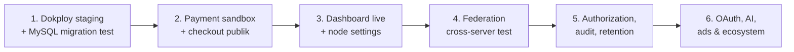

# Laporan Progres Pengembangan FPDP

## 1. Snapshot

**Tanggal verifikasi:** 20 September 2026
**Dasar verifikasi:** route, controller, service, repository, migration, UI, test, dan konfigurasi deployment pada repository—bukan hanya dokumen rencana.

FPDP sudah melewati tahap prototype dasar. Identity, local publishing, external aggregation, marketplace dasar, payment abstraction, analytics, dan sebagian besar fondasi federasi tersedia sebagai kode yang dapat diuji. Staging Dokploy sudah live dan tervalidasi, halaman utama (`/`) kini menampilkan personal digital home pemilik node secara live, dan dashboard Overview owner sudah tersambung ke API sungguhan. Fokus berikutnya bukan lagi membuat kerangka, tetapi menghubungkan flow komersial end-to-end (termasuk mekanisme pemilihan payment gateway aktif), melengkapi panel dashboard lain, memvalidasi integrasi eksternal terhadap sandbox/server nyata, dan mengeraskan operasional production.

Ringkasan repository saat laporan ini dibuat:

- **40 migration MySQL** (`0001`–`0040`);
- **30 test script**;
- REST API untuk identity, profile, posts, timeline, external feeds, CV, payments, marketplace, analytics, dan federation;
- UI nyata untuk halaman utama (personal digital home live per node), timeline lokal, profil publik, halaman post, post editor, dan dashboard Overview owner;
- 4 payment gateway adapter: Dummy, Paywuz, Midtrans, dan PayPal (Orders API v2);
- Dockerfile serta Docker Compose khusus Dokploy — sudah di-deploy dan tervalidasi di staging;
- dokumentasi produk dan teknis bilingual.

## 2. Status fase

```mermaid
flowchart LR
    P0["Phase 0<br/>Fondasi engineering"] --> P1["Phase 1<br/>Identity & personal node"]
    P1 --> P2["Phase 2<br/>Konten lokal & timeline"]
    P2 --> P3["Phase 3<br/>Agregasi eksternal"]
    P3 --> P4["Phase 4<br/>Hardening MVP"]
    P4 --> P5["Phase 5<br/>Marketplace & payment"]
    P5 --> P6["Phase 6<br/>Federasi"]
    P6 --> P7["Phase 7+<br/>Ekosistem, AI, scale"]

    classDef done fill:#e3efe9,stroke:#185f48,color:#17211b;
    classDef partial fill:#f2e8d6,stroke:#93631e,color:#17211b;
    classDef planned fill:#f1e3e1,stroke:#a13d37,color:#17211b;
    class P0,P1,P2,P3 done;
    class P4,P5,P6 partial;
    class P7 planned;
```

| Workstream | Status | Ringkasan |
|---|---|---|
| Fondasi engineering | **Selesai** | PSR-4, router, PDO, migration runner, config, JSON envelope, exception mapping, CI |
| Identity & profile | **Selesai untuk MVP** | Register/login/logout/`me`, token hash, rate limit, profile visibility, Google OAuth visitor |
| Konten lokal | **Selesai untuk MVP** | CRUD, draft/publish, visibility, soft-delete, media, canonical URL, cursor timeline, UI |
| External aggregation | **Selesai untuk MVP** | RSS/Atom/Custom API, anti-SSRF HTTP client, sync worker, dedup, persistence, timeline merge |
| Operasional & hardening | **Sebagian** | CI, audit dasar tersedia; staging Dokploy sudah live dan tervalidasi (migration, health check, bootstrap owner); backup/restore recovery exercise belum selesai |
| Marketplace | **Sebagian besar** | Product dan order tersedia; checkout visitor + payment belum tersambung end-to-end |
| Payment | **Sebagian besar** | Dummy, Paywuz, Midtrans, PayPal (Orders API v2), encrypted config, webhook/idempotency; sandbox nyata (semua provider) dan reconciliation belum selesai; belum ada mekanisme pilih gateway aktif untuk checkout |
| Federasi | **Sebagian besar backend** | Keys, discovery, signed inbox/outbox, follow lifecycle, moderation, delivery retry; cross-server/UI belum selesai |
| Dashboard | **Sebagian** | Overview owner sudah live (KPI, traffic chart, top content, recent activity) di `/dashboard`, menggunakan API yang sudah ada; Payments/Analytics/Federation belum jadi panel terpisah, node settings belum live |
| AI & ads | **Direncanakan** | Dokumen strategi tersedia; LLM chat dan ad marketplace belum diimplementasikan |

## 3. Yang sudah tersedia

### 3.1 Platform dan keamanan dasar

- Front controller dan router mendukung route statis, parameter segment, dan canonical `/@handle`.
- Halaman utama (`/`) menampilkan profil publik owner node secara live (personal digital home sesuai visi BRD) ketika node sudah punya owner dengan profile `PUBLIC`; fallback ke placeholder statis untuk instalasi baru atau profile non-public.
- Config membaca default, `.env`, dan environment variable native container.
- Password memakai hashing; bearer token di-hash saat disimpan dan dapat dicabut.
- Register/login memiliki rate limiting.
- HTTP client external memblokir target private/internal, membatasi redirect, timeout, dan ukuran response.
- JSON response menggunakan success/error envelope yang konsisten.
- GitHub Actions menjalankan syntax check dan test suite.

### 3.2 Identity, profile, dan visitor

- Registrasi membuat node, owner user, dan profile dalam satu flow.
- Login, logout, `/api/v1/me`, baca profile publik, dan update profile tersedia.
- Profile visibility: `PUBLIC`, `UNLISTED`, `PRIVATE`.
- Google OAuth visitor memakai state bertanda tangan dan token visitor yang di-hash.

### 3.3 Konten lokal dan media

- Create/read/update/soft-delete post.
- Draft/publish/unpublish melalui `published_at`.
- Visibility post dan ownership enforcement.
- Canonical post/profile URL.
- Cursor pagination untuk post dan timeline.
- Maksimal 10 media berurutan per post (`IMAGE`, `VIDEO`, `AUDIO`, `FILE`).
- URL media wajib HTTPS, tanpa embedded credential; alt text dibatasi.
- UI nyata: timeline, profile, post page, post editor.

### 3.4 Konten eksternal

- Connector RSS, Atom, dan Custom API.
- Normalisasi YouTube dari official feed dan privacy-enhanced embed support.
- Feed-source management, sync trigger, sync worker, deduplication, persistence, dan statistik.
- External items dapat digabungkan ke timeline dengan source attribution.

### 3.5 CV dan visitor monetization foundation

- Owner upload CV ke `storage/` di luar webroot.
- Public metadata, access request, payment-aware grant, dan gated download.
- Mengganti dokumen membatalkan grant lama.
- Google OAuth membedakan visitor dari owner.

### 3.6 Marketplace dan payment

- Product CRUD dan order dengan immutable product snapshot.
- Order status lifecycle dan ownership validation.
- `PaymentGatewayInterface`, factory, Dummy, Paywuz, Midtrans, dan PayPal (Orders API v2) adapters.
- Adapter PayPal menangani two-step capture (approve lalu capture) lewat lazy-capture di `getPaymentStatus()`, refund berdasarkan capture id (bukan order id), verifikasi webhook lewat API `verify-webhook-signature` PayPal (bukan HMAC lokal), dan menolak currency yang tidak didukung PayPal termasuk IDR secara eksplisit.
- Payment dan transaction persistence.
- Webhook verification serta duplicate-event handling.
- Gateway credentials dapat disimpan terenkripsi AES-256-GCM melalui API dan tidak dikembalikan ke client.
- Dashboard payment summary tersedia sebagai API.
- **Catatan gap:** belum ada mekanisme untuk owner atau visitor memilih gateway aktif — gateway checkout masih ditentukan lewat parameter/env var eksplisit per fitur (mis. `CV_PAYMENT_GATEWAY` untuk akses CV), bukan pilihan di UI.

### 3.7 Federasi

- Ed25519 node identity dan signing key.
- Public capability discovery.
- Remote-node key discovery dan cache.
- Signed public inbox dan authenticated outbox.
- Follow, Accept, Reject, Undo, dan Block processing.
- Incoming/outgoing follow direction.
- Federated connections dan latest-post preview pada public profile API.
- Remote-node trust state (`UNKNOWN`, `TRUSTED`, `BLOCKED`).
- Delivery queue, retry, exponential backoff, deduplication, dan timestamp-window replay reduction.
- Federation summary serta capability settings API.

### 3.8 Analytics dan dashboard

- Privacy-conscious daily visitor hashing menggunakan HMAC dan `APP_KEY`; IP mentah tidak disimpan.
- Profile view, post view, outbound click, dan shop-conversion events.
- Ringkasan 7 hari, unique visitors, traffic chart, dan top content.
- Dashboard overview mengagregasi post, timeline mix, products, orders, revenue, federation, analytics, dan recent activity.
- **UI Overview owner live** di `/dashboard` (vanilla JS + PHP, tanpa framework, memakai `/api/v1/me/dashboard/overview` yang sudah ada): status node, 6 KPI tile (published posts, products, pending orders, revenue bulan ini, followers, unique visitors), grafik bar 7-hari (views vs unique visitors, palet warna tervalidasi colorblind-safe), daftar top content, dan recent activity. Terverifikasi lewat browser sungguhan (Playwright): login flow, render data live, hover tooltip pada chart, nol console error.

### 3.9 Deployment

- Web installer untuk VPS/shared hosting.
- Docker image PHP 8.3 + Apache.
- Dokploy Compose: app + MySQL 8.4, health check, persistent volumes, migration otomatis, dan bootstrap owner.
- Production secret validation dan web-installer lock.
- Panduan Dokploy, VPS, serta shared hosting tersedia dalam English dan Bahasa Indonesia.

## 4. Yang masih sebagian selesai

### 4.1 Production validation

- Docker image tidak dibangun pada workspace pengembangan ini karena Docker CLI tidak tersedia di sini, tetapi build image dan deployment ke staging Dokploy sudah dijalankan di server dan dikonfirmasi berhasil oleh pemilik project (19 September 2026): seluruh migration jalan bersih, health check lulus, bootstrap owner berhasil membuat akun pertama, dan domain/TLS aktif.
- Seluruh migration belum diuji end-to-end pada MySQL 8 disposable dalam test suite repository (CI); validasi migration sejauh ini berasal dari staging run di atas, bukan dari job CI otomatis.
- Backup/restore/rollback baru terdokumentasi, belum diuji lewat recovery exercise.
- Availability extension `sodium` pada image hasil build perlu diverifikasi eksplisit.

### 4.2 Checkout dan marketplace

- Order belum membuat payment melalui gateway dalam checkout visitor publik.
- Belum ada checkout UI, receipt, payment-status polling, cancellation, dan refund experience.
- `SHOP_CONVERSION` saat ini mengikuti pembuatan order owner, belum merepresentasikan checkout visitor secara akurat.
- External product labels dan federated order request belum tersedia.

### 4.3 Payment production

- Paywuz dan Midtrans diuji dengan fake HTTP requester, belum terhadap sandbox provider nyata.
- Refund/partial refund Midtrans setelah `PAID` tercatat sebagai transaction event tetapi belum selalu merekonsiliasi status payment menjadi `REFUNDED`.
- Belum ada settlement/payout ledger, gateway-fee accounting, dan reconciliation job.
- Rotasi `APP_KEY` belum dapat melakukan re-encryption credential gateway otomatis.

### 4.4 Dashboard dan settings

- Mockup dashboard belum terhubung ke API live.
- Content, Timeline, Integrations, Products, dan Orders memiliki domain endpoint, tetapi belum menjadi panel dashboard terintegrasi.
- Node settings belum tersedia: theme, layout, custom CSS, default/enabled languages, dan node config.
- Security settings belum tersedia: 2FA dan session management.

### 4.5 Federasi production

- Belum ada test dua instance FPDP pada host/domain berbeda.
- Belum ada dashboard federation live untuk follow, trust, block, moderation, dan capability.
- Replay protection belum memakai nonce cache; timestamp window dan activity-id dedup masih menjadi proteksi utama.
- Capability yang disimpan belum menegakkan akses fitur.
- Data follow lama mungkin memerlukan backfill arah `INCOMING`/`OUTGOING`.

### 4.6 Authorization, audit, dan analytics hardening

- Belum ada middleware role/permission terpusat untuk membedakan owner/admin.
- Perubahan payment credential dan remote-node trust belum semuanya masuk audit trail.
- Endpoint public outbound-click belum mempunyai rate limiting khusus.
- `analytics_events` belum memiliki retention/cleanup job.
- Audit coverage belum mencakup seluruh aksi administratif sensitif.

## 5. Belum dimulai

- OAuth connector production untuk Instagram/Meta, LinkedIn, X, Threads, TikTok, dan Shopee.
- LLM provider configuration, profile/CV-grounded chatbot, paid chat session, serta AI usage/cost controls.
- Advertising marketplace: ad slot, pricing, booking, approval, dan delivery window.
- Production plugin/adapter marketplace.
- Federated commerce end-to-end.
- Multi-node administration, shared/object storage, dan horizontal scaling.
- License file dan formal contribution policy.

## 6. Prioritas berikutnya

Urutan rekomendasi:

1. ~~Deploy satu staging node melalui Dokploy dan validasi build, health check, volume, bootstrap, serta seluruh migration pada MySQL 8.~~ **Selesai** — staging Dokploy live dan tervalidasi (19 September 2026).
2. Uji Paywuz dan Midtrans terhadap sandbox sungguhan.
3. Sambungkan public checkout → order → payment → webhook → fulfillment/refund.
4. Ubah dashboard mockup menjadi UI live, dimulai dari Overview, Payments, Analytics, dan Federation yang API-nya sudah ada.
5. Implementasikan node appearance/language settings dan security settings.
6. Jalankan dua node nyata untuk interoperability federation.
7. Tambahkan RBAC middleware, audit sensitif, analytics rate limiting, dan retention job.
8. Baru lanjutkan social OAuth, AI chatbot, advertising, dan ecosystem work.

## 7. Risiko dan keputusan operasional

- Deployment saat ini diasumsikan **satu owner dan satu app replica per node**.
- Jangan scale app sebelum migration locking serta shared/object storage tersedia.
- MySQL dan `storage/` harus dipulihkan dari recovery point yang konsisten.
- Code rollback tidak otomatis membalikkan forward migration.
- `APP_KEY` melindungi OAuth state, analytics HMAC, dan encrypted gateway credential; rotasinya memerlukan prosedur khusus.
- Registration publik dapat membuat node tambahan; production policy perlu menentukan apakah registration dibuka atau dibatasi.
- Payment dan federation wajib diuji dengan sistem remote nyata sebelum diklaim production-ready.

## 8. Validasi terakhir

- **29/29 test script lulus** pada environment pengembangan terakhir.
- PHP syntax untuk konfigurasi dan owner bootstrap lulus.
- Bootstrap owner tervalidasi terhadap database SQLite test.
- `git diff --check` lulus.
- Docker build/Compose rendering tidak dijalankan pada workspace pengembangan ini karena Docker CLI tidak tersedia di sini; acceptance step ini sudah dijalankan langsung di server Dokploy dan dikonfirmasi berhasil oleh pemilik project.
- `ExternalContentTest` lulus tetapi Windows sempat memberi warning cleanup file SQLite yang masih terbuka; bukan kegagalan fungsi, tetapi test cleanup dapat diperbaiki.

## 9. Referensi

- [Roadmap](ROADMAP.id.md)
- [WBS](WBS-TASK.md)
- [PRD](PRD.md)
- [ERD](ERD.id.md)
- [API Contract](API-CONTRACT.id.md) dan [OpenAPI](openapi.yaml)
- [Konsep Federasi](FEDERATION-CONCEPT.id.md)
- [Panduan Dokploy](DOKPLOY-DEPLOYMENT.id.md)
- [Mockup](mockup/README.md)
