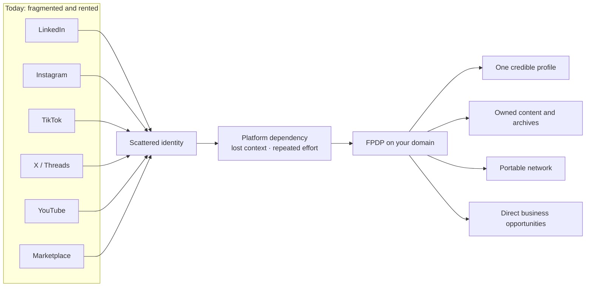
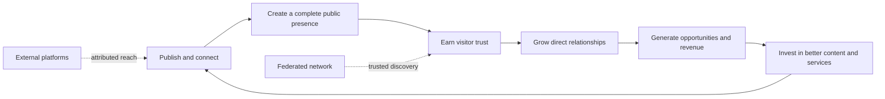

# Why FPDP — Professional Product Narrative and Value Proposition

> **One digital home. Your identity, audience, content, relationships, and opportunities—under your control.**

## 1. The short pitch

Your digital life may look connected, but it is usually fragmented. Your professional identity lives on LinkedIn, your audience on Instagram or TikTok, your ideas on X or Threads, your videos on YouTube, and your products on a marketplace. Every platform offers reach, yet each one controls the rules, the presentation, and access to the people who follow you.

FPDP gives those scattered activities a permanent home: your own domain.

It brings your profile, original posts, attributed social content, professional portfolio, federated network, services, and monetization opportunities into one independent digital presence. You can continue using the platforms that already work for you without allowing any one of them to become the only place where people can find, understand, or support you.

FPDP is not asking you to abandon social media. It gives everything you do there a center of gravity that you own.

## 2. Why readers need it

Most people are building valuable digital assets on rented ground:

- an algorithm decides which followers see their work;
- a policy change can reduce reach or remove an account;
- audiences and relationships cannot easily move elsewhere;
- content is split across incompatible profiles and feeds;
- visitors must reconstruct who you are from multiple links;
- monetization depends on platform rules, fees, and supported providers;
- years of work strengthen a platform's brand more than the creator's own identity.

The result is not merely inconvenience. It is lost context, weaker trust, duplicated work, dependency risk, and missed opportunities.

FPDP turns a collection of accounts into an owned digital asset.

## 3. What changes with FPDP

### From a profile to a digital home

A conventional profile is a page inside someone else's product. An FPDP node is a digital home with your identity at the center. It can grow from a simple public profile into publishing, portfolio, federation, services, products, payments, and new integrations without changing its fundamental address.

### From scattered posts to a coherent story

Your local writing and attributed external content can appear in one timeline. Visitors no longer need to open six platforms to understand your expertise, interests, recent work, and point of view.

### From followers to durable relationships

Federation allows independent users and nodes to connect directly. Public profiles can introduce trusted connections and their latest attributed posts, creating discovery through relationships rather than a single central algorithm.

### From platform dependence to provider choice

FPDP is designed around replaceable connectors and gateways. A social provider, content source, payment gateway, or AI provider can be changed without redefining the owner's entire digital presence.

## 4. Benefits that matter

| Benefit | What the user gains | Why it matters |
|---|---|---|
| Ownership | A stable identity and canonical domain | The address and reputation remain yours across platform changes |
| Clarity | Profile, work, posts, network, and offers in one place | Visitors understand your value faster |
| Reach without fragmentation | External content remains visible with source attribution | Existing channels continue working while strengthening your home base |
| Trust | Transparent authorship, origin, canonical links, and relationship context | Readers can verify where content and connections come from |
| Resilience | Reduced dependence on one algorithm, provider, or gateway | One policy or service failure does not erase the whole presence |
| Efficiency | One destination to share and maintain | Less duplicate profile work and fewer disconnected link pages |
| Discovery | Federated connections and attributed latest-post previews | Audiences discover relevant people through trusted networks |
| Monetization flexibility | Direct products, services, premium access, ads, and provider-neutral payments | Owners can build revenue without surrendering the entire customer relationship |
| Extensibility | Adapter-based integrations and multilingual presentation | The digital home can evolve as needs and providers change |

## 5. Value for each audience

### Creators and independent professionals

Turn attention into a reputation that compounds on your own domain. Bring together your best thinking, portfolio, video, social activity, CV, services, and trusted network so new visitors understand not only what you posted today, but why your work matters.

### Freelancers and consultants

Shorten the path from discovery to trust. A prospect can review your expertise, recent work, professional connections, services, and contact options without piecing together an identity from unrelated profiles.

### Sellers and small businesses

Connect content, credibility, products, and payments in one journey. Educational posts can lead naturally to a service or product while the business retains the freedom to choose suitable payment and integration providers.

### Communities and independent networks

Build connection without requiring everyone to surrender identity to a new central platform. Each participant owns a node, while federation enables discovery, following, moderation, and attributed exchange between nodes.

### Visitors and customers

Get a clearer, more trustworthy view of a person or business: who they are, what they publish, who they connect with, what they offer, and where each piece of information originated.

## 6. The ownership flywheel

Every useful action should strengthen the owner's domain—not disappear into a third-party feed.

The difference is where the value accumulates. With FPDP, each article, connection, profile visit, and customer interaction can make the owner's independent presence more useful over time.

## 7. Why now

Digital identity is becoming more distributed while platform risk is becoming more visible. Creators publish across more channels, professionals need stronger proof of expertise, audiences expect trustworthy attribution, and businesses want direct customer relationships. At the same time, provider APIs, algorithms, fees, and policies keep changing.

The practical response is not isolation. It is independence with interoperability: own the home, connect the channels, preserve provenance, and retain the freedom to change providers.

## 8. Positioning statement

For creators, professionals, sellers, and communities whose identity and audience are fragmented across digital platforms, **FPDP is a federated personal digital home** that unifies identity, content, trusted connections, and commercial opportunities on an owner-controlled domain. Unlike a conventional social profile or link-in-bio page, FPDP is designed to preserve provenance, support direct federation, and remain independent of any single content, payment, or technology provider.

## 9. Copy blocks ready for use

### Hero

**Your digital life deserves a home—not another rented profile.**

Bring your identity, work, social content, trusted network, and opportunities together on a domain you control. Keep using the platforms you value while building an independent presence that becomes more useful over time.

**Primary CTA:** Build your digital home  
**Secondary CTA:** Explore how federation works

### Short promotional copy

Your audience may be scattered, but your identity does not have to be. FPDP turns your domain into a connected digital home for your profile, publishing, network, portfolio, and business—without locking you into one platform or provider.

### Trust message

Every item keeps its source. Every remote connection keeps its identity. Every canonical link points visitors to the original. FPDP is designed to connect the web without hiding where information came from.

### Closing CTA

Do not wait for the next algorithm or policy change to decide how people find you. Create a digital home that you control, connect the channels you already use, and let every new post, relationship, and opportunity strengthen an asset that is truly yours.

## 10. Honest product note

FPDP is being delivered in phases. Identity, authentication, local publishing, a local timeline, a post editor, public profiles, visitor authentication, and CV access foundations are available in the current application. Full external synchronization, public federated-connection delivery, commerce, analytics, AI interaction, and production payment providers remain roadmap capabilities. The value proposition describes the intended complete product; roadmap and progress documents identify current delivery status.

