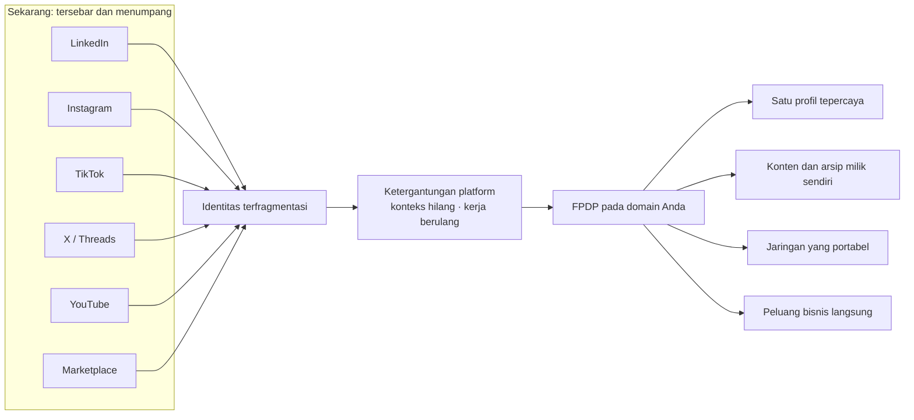
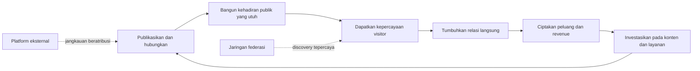

# Mengapa FPDP — Narasi Produk dan Value Proposition Profesional

> **Satu rumah digital. Identitas, audiens, konten, relasi, dan peluang Anda—dalam kendali Anda.**

## 1. Pitch singkat

Kehidupan digital Anda mungkin terlihat saling terhubung, tetapi sebenarnya tersebar. Identitas profesional berada di LinkedIn, audiens di Instagram atau TikTok, gagasan di X atau Threads, video di YouTube, dan produk di marketplace. Setiap platform memberi jangkauan, tetapi platform pula yang mengendalikan aturan, tampilan, serta akses menuju orang-orang yang mengikuti Anda.

FPDP memberi semua aktivitas yang tersebar itu sebuah rumah permanen: domain Anda sendiri.

FPDP menyatukan profil, post orisinal, konten sosial beratribusi, portfolio, jaringan federasi, layanan, dan peluang monetisasi dalam satu kehadiran digital independen. Anda tetap dapat menggunakan platform yang sudah bermanfaat tanpa menjadikan salah satunya sebagai satu-satunya tempat orang menemukan, memahami, atau mendukung Anda.

FPDP tidak meminta Anda meninggalkan media sosial. FPDP memberi seluruh aktivitas tersebut sebuah pusat gravitasi yang Anda miliki.

## 2. Mengapa pembaca memerlukannya

Kebanyakan orang sedang membangun aset digital bernilai di atas tanah sewaan:

- algoritma menentukan follower mana yang melihat karya mereka;
- perubahan kebijakan dapat mengurangi jangkauan atau menghapus akun;
- audiens dan relasi sulit dipindahkan;
- konten tersebar pada profil dan feed yang tidak kompatibel;
- visitor harus menyusun sendiri gambaran tentang seseorang dari banyak tautan;
- monetisasi bergantung pada aturan, biaya, dan provider pilihan platform;
- kerja bertahun-tahun lebih memperkuat brand platform daripada identitas kreatornya.

Dampaknya bukan sekadar merepotkan. Konteks hilang, kepercayaan lebih sulit dibangun, pekerjaan berulang, risiko ketergantungan meningkat, dan peluang bisnis terlewat.

FPDP mengubah kumpulan akun menjadi aset digital milik sendiri.

## 3. Perubahan yang diberikan FPDP

### Dari profil menjadi rumah digital

Profil konvensional adalah halaman di dalam produk milik pihak lain. Node FPDP adalah rumah digital yang menempatkan identitas Anda sebagai pusatnya. Ia dapat berkembang dari profil publik sederhana menjadi media publikasi, portfolio, federasi, layanan, produk, pembayaran, dan integrasi baru tanpa mengganti alamat utamanya.

### Dari post yang tersebar menjadi cerita yang utuh

Tulisan lokal dan konten eksternal beratribusi dapat tampil dalam satu timeline. Visitor tidak lagi perlu membuka enam platform untuk memahami keahlian, minat, pekerjaan terbaru, dan sudut pandang Anda.

### Dari follower menjadi relasi yang lebih tahan lama

Federasi memungkinkan user dan node independen terhubung langsung. Profil publik dapat memperkenalkan koneksi tepercaya beserta post terbaru mereka, sehingga discovery muncul dari hubungan yang relevan—bukan hanya algoritma pusat.

### Dari ketergantungan menjadi kebebasan memilih provider

FPDP dirancang menggunakan connector dan gateway yang dapat diganti. Social provider, sumber konten, payment gateway, atau AI provider dapat berubah tanpa mengubah seluruh identitas digital owner.

## 4. Benefit yang benar-benar terasa

| Benefit | Keuntungan pengguna | Mengapa penting |
|---|---|---|
| Kepemilikan | Identitas stabil dan domain canonical | Alamat serta reputasi tetap milik Anda ketika platform berubah |
| Kejelasan | Profil, karya, post, jaringan, dan penawaran dalam satu tempat | Visitor lebih cepat memahami nilai Anda |
| Jangkauan tanpa fragmentasi | Konten eksternal tetap tampil dengan atribusi | Channel yang ada terus bekerja sambil memperkuat rumah digital |
| Kepercayaan | Author, asal, canonical link, dan konteks relasi transparan | Pembaca dapat memverifikasi sumber informasi |
| Ketahanan | Tidak bergantung pada satu algoritma, provider, atau gateway | Gangguan satu layanan tidak menghapus seluruh kehadiran digital |
| Efisiensi | Satu destinasi untuk dibagikan dan dirawat | Lebih sedikit pekerjaan duplikat dan link page yang terpisah |
| Discovery | Koneksi federasi dan preview post terbaru beratribusi | Audiens menemukan orang relevan melalui jaringan tepercaya |
| Fleksibilitas monetisasi | Produk, layanan, akses premium, iklan, dan payment provider-neutral | Owner dapat membangun revenue tanpa menyerahkan seluruh relasi pelanggan |
| Kemampuan berkembang | Integrasi berbasis adapter dan tampilan multibahasa | Rumah digital dapat mengikuti kebutuhan dan perubahan provider |

## 5. Nilai untuk setiap jenis pengguna

### Creator dan profesional independen

Ubah perhatian menjadi reputasi yang terus bertumbuh di domain sendiri. Satukan gagasan terbaik, portfolio, video, aktivitas sosial, CV, layanan, dan jaringan tepercaya agar visitor memahami bukan hanya apa yang Anda post hari ini, tetapi mengapa karya Anda penting.

### Freelancer dan konsultan

Perpendek perjalanan dari ditemukan hingga dipercaya. Calon klien dapat menilai keahlian, karya terbaru, relasi profesional, layanan, dan cara menghubungi Anda tanpa menyusun identitas dari berbagai profil terpisah.

### Seller dan bisnis kecil

Hubungkan konten, kredibilitas, produk, serta pembayaran dalam satu perjalanan. Konten edukatif dapat mengarahkan visitor secara alami menuju layanan atau produk, sementara bisnis tetap bebas memilih payment dan integration provider.

### Komunitas dan jaringan independen

Bangun koneksi tanpa meminta semua orang menyerahkan identitas kepada platform pusat baru. Setiap peserta memiliki node sendiri, sementara federasi menyediakan discovery, follow, moderasi, dan pertukaran beratribusi antar-node.

### Visitor dan pelanggan

Dapatkan gambaran yang lebih jelas dan tepercaya tentang seseorang atau bisnis: siapa mereka, apa yang diterbitkan, dengan siapa mereka terhubung, apa yang ditawarkan, dan dari mana setiap informasi berasal.

## 6. Ownership flywheel

Setiap aktivitas yang bermanfaat seharusnya memperkuat domain owner—bukan hilang di dalam feed pihak ketiga.

Perbedaannya terletak pada tempat nilai tersebut terakumulasi. Dengan FPDP, setiap artikel, koneksi, kunjungan profil, dan interaksi pelanggan dapat membuat kehadiran independen owner semakin bernilai.

## 7. Mengapa sekarang

Identitas digital semakin tersebar, sementara risiko platform semakin terlihat. Creator mempublikasikan karya di lebih banyak channel, profesional membutuhkan bukti keahlian yang kuat, audiens mengharapkan atribusi yang tepercaya, dan bisnis menginginkan relasi langsung dengan pelanggan. Pada saat yang sama, API, algoritma, biaya, dan kebijakan provider terus berubah.

Jawaban praktisnya bukan mengisolasi diri. Jawabannya adalah independensi yang tetap interoperable: miliki rumahnya, hubungkan channel-nya, pertahankan asal informasi, dan simpan kebebasan untuk mengganti provider.

## 8. Positioning statement

Untuk creator, profesional, seller, dan komunitas yang identitas serta audiensnya tersebar di berbagai platform digital, **FPDP adalah federated personal digital home** yang menyatukan identitas, konten, koneksi tepercaya, dan peluang komersial pada domain yang dikontrol owner. Berbeda dari profil media sosial atau link-in-bio konvensional, FPDP dirancang untuk mempertahankan provenance, mendukung federasi langsung, dan tetap independen dari satu content, payment, atau technology provider.

## 9. Copy siap pakai

### Hero

**Kehidupan digital Anda membutuhkan rumah—bukan satu lagi profil sewaan.**

Satukan identitas, karya, konten sosial, jaringan tepercaya, dan peluang Anda pada domain yang Anda kendalikan. Tetap gunakan platform yang Anda sukai sambil membangun kehadiran independen yang semakin bernilai dari waktu ke waktu.

**CTA utama:** Bangun rumah digital Anda  
**CTA sekunder:** Pelajari cara kerja federasi

### Copy promosi singkat

Audiens Anda boleh tersebar, tetapi identitas Anda tidak harus demikian. FPDP mengubah domain Anda menjadi rumah digital yang terhubung untuk profil, publikasi, jaringan, portfolio, dan bisnis—tanpa mengunci Anda pada satu platform atau provider.

### Pesan kepercayaan

Setiap konten mempertahankan sumbernya. Setiap koneksi remote mempertahankan identitasnya. Setiap canonical link membawa visitor menuju sumber asli. FPDP dirancang untuk menghubungkan web tanpa menyembunyikan asal informasi.

### Closing CTA

Jangan menunggu perubahan algoritma atau kebijakan berikutnya menentukan bagaimana orang menemukan Anda. Bangun rumah digital yang Anda kendalikan, hubungkan channel yang sudah Anda gunakan, dan biarkan setiap post, relasi, serta peluang memperkuat aset yang benar-benar milik Anda.

## 10. Catatan produk yang jujur

FPDP dikembangkan secara bertahap. Identity, authentication, local publishing, timeline lokal, post editor, profil publik, visitor authentication, dan fondasi akses CV tersedia pada aplikasi saat ini. Sinkronisasi eksternal penuh, delivery koneksi federasi publik, commerce, analytics, interaksi AI, dan production payment provider masih berada dalam roadmap. Value proposition ini menjelaskan produk lengkap yang dituju; roadmap dan progress report menjelaskan status implementasi aktual.

