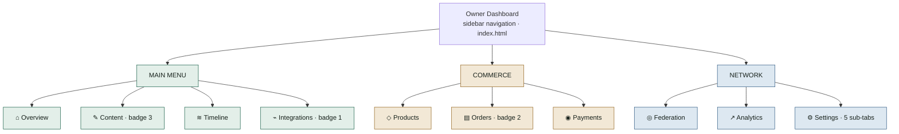
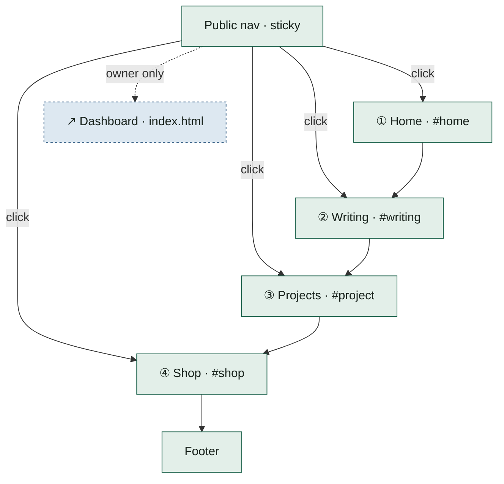
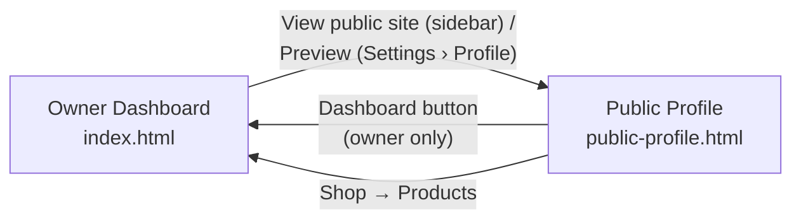

# FPDP Mockup Navigation Map — English

## 1. Scope

This document maps the menu structure of the two interactive HTML mockups for FPDP: the **Owner Dashboard** (`index.html`) and the **Public Profile / Personal Digital Home** (`public-profile.html`), and what a user can do on each menu.

Data shown in the mockup is fictional and is not connected to the FPDP backend. See the [mockup guide](README.md) for how to run it locally.

## 2. Owner Dashboard

The Owner Dashboard is a single page (`index.html`) with a sidebar holding 10 menu items across 3 groups. Clicking a menu swaps the visible panel (`data-page-target` attribute) without a page reload.

Outside the sidebar, the topbar provides a search box, a language picker, notifications, and a "New post" shortcut to the Content menu. The bottom of the sidebar shows the owner's node card and a "View public site" link to the Public Profile.

### 2.1 Main menu

| Menu | What it does |
|---|---|
| ⌂ Overview | The first page after login: metrics for profile views, content reach, federation followers, and current-month revenue; node health status; recent activity; quick actions; timeline mix (local/external/federated). |
| ✎ Content (badge 3) | Create new content and manage every post through the All content, Post, Draft, and Media tabs. Each item has a published/draft status and public / private / unlisted visibility. |
| ≋ Timeline | A unified feed: local posts, RSS-imported posts, and federated posts in one timeline, filterable by source. |
| ⌁ Integrations (badge 1) | Connect external content sources (RSS, Atom, Custom API), monitor sync status, and retry failed connections. |

### 2.2 Commerce

| Menu | What it does |
|---|---|
| ◇ Products | Add and manage products/services for sale: name, price, stock, and active / draft status. |
| ▤ Orders (badge 2) | Track customer orders with fulfilled, processing, or pending payment status. |
| ◉ Payments | View available balance, pending settlement, transaction success rate, configure the payment gateway, and see recent transactions. |

### 2.3 Network

| Menu | What it does |
|---|---|
| ◎ Federation | Manage the node identity (`@handle`), moderation (blocked nodes, open reports), follower/following counts, and node capabilities (PROFILE, CONTENT, PRODUCTS, PAYMENTS). |
| ↗ Analytics | Unique visitors, content views, outbound clicks, shop conversion, a 7-day traffic chart, and top content. |
| ⚙ Settings | 5 sub-tabs: **Profile** (display name, handle, bio, primary domain + preview link to the public page), **Appearance** (light/dark theme, accent color), **Language & region** (UI language, timezone, date format), **Security** (password, two-factor authentication, active sessions), **Node configuration** (node name, registration mode, API base URL). |

## 3. Public Profile (Personal Digital Home)

The public profile is a single scrolling page (`public-profile.html`). The top nav holds 4 anchor links to the 4 sections below it, in scroll order, plus one owner-only button back to the dashboard.

| Section | What it does |
|---|---|
| ① Home | Introductory hero: name, tagline, short bio, "Follow this node" and "Contact me" buttons. |
| ② Writing | A grid of recent writing from three sources at once — local, external RSS import, and federation — each with a source label and origin link. |
| ③ Projects | A showcase of one featured project with a description and an "Explore project" link. |
| ④ Shop | A banner inviting collaboration (workshops, digital guides, review sessions) that links to the Products menu in the dashboard. |

The "Dashboard" button in the top-right corner of the public nav is only relevant for a logged-in owner; it is not part of the page's scroll order but an exit link to `index.html`.

## 4. How the two views connect

The dashboard and the public profile are two separate files linked by a few navigation points.

- **Dashboard → Public** — a "View public site" link appears at the bottom of the sidebar and on the Overview page; a "Preview" link lives in Settings › Profile.
- **Public → Dashboard** — the "Dashboard" button in the public nav is only meaningfully shown to a logged-in owner.
- **Shop → Products** — the Shop banner on the public profile links to the Products menu in the dashboard, reflecting the same catalog from both the owner's and the reader's side.

## 5. References

- [How to run the mockup](README.md)
- Dashboard: [index.html](index.html)
- Public profile: [public-profile.html](public-profile.html)
- [FPDP documentation index](../README.md)
