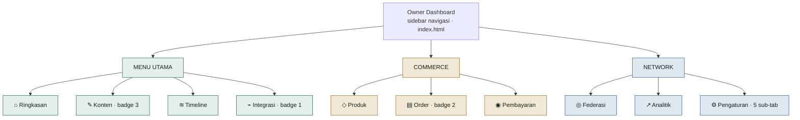
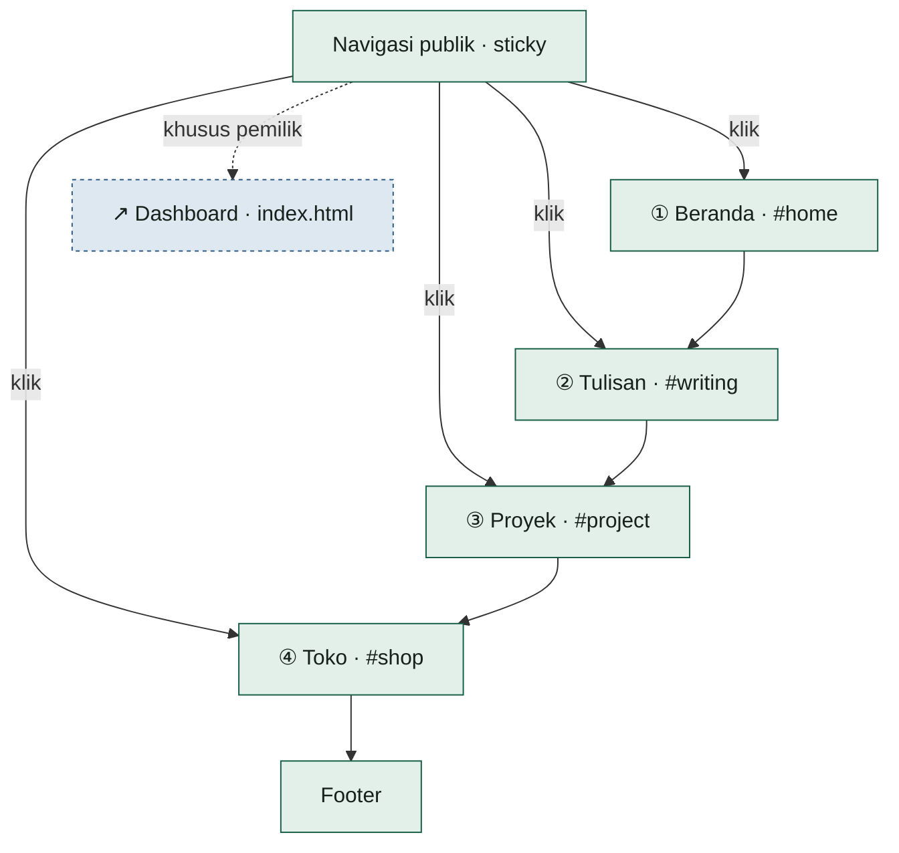
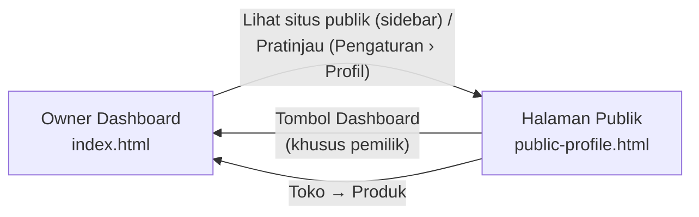

# Peta Navigasi Mockup FPDP — Bahasa Indonesia

## 1. Ruang lingkup

Dokumen ini memetakan struktur menu pada dua tampilan interactive HTML mockup FPDP: **Owner Dashboard** (`index.html`) dan **Halaman Publik / Personal Digital Home** (`public-profile.html`), beserta apa yang bisa dilakukan pengguna pada setiap menu.

Data pada mockup bersifat fiktif dan belum terhubung ke backend FPDP. Lihat [Petunjuk mockup](README.md) untuk cara menjalankannya secara lokal.

## 2. Owner Dashboard

Owner Dashboard adalah satu halaman (`index.html`) dengan sidebar berisi 10 menu dalam 3 kelompok. Mengklik menu menukar panel yang tampil (atribut `data-page-target`) tanpa reload halaman.

Di luar sidebar, topbar menyediakan kotak pencarian, pemilih bahasa, notifikasi, dan tombol pintas "Post baru" menuju menu Konten. Bagian bawah sidebar menampilkan kartu node pemilik dan tautan "Lihat situs publik" menuju Halaman Publik.

### 2.1 Menu Utama

| Menu | Fungsi |
|---|---|
| ⌂ Ringkasan | Halaman pertama setelah login: metrik kunjungan profil, jangkauan konten, pengikut federasi, dan pendapatan bulan berjalan; status kesehatan node; aktivitas terbaru; aksi cepat; komposisi timeline (lokal/eksternal/federasi). |
| ✎ Konten (badge 3) | Membuat konten baru dan mengelola semua post lewat tab Semua konten, Post, Draft, dan Media. Setiap item memiliki status terbit/draft dan visibilitas publik / privat / tidak terdaftar. |
| ≋ Timeline | Feed gabungan: post lokal, post hasil impor RSS, dan post dari federasi dalam satu linimasa, dengan filter per sumber. |
| ⌁ Integrasi (badge 1) | Menghubungkan sumber konten eksternal (RSS, Atom, Custom API), memantau status sinkron, dan mencoba ulang koneksi yang gagal. |

### 2.2 Commerce

| Menu | Fungsi |
|---|---|
| ◇ Produk | Menambah dan mengelola produk/jasa yang dijual: nama, harga, stok, dan status aktif / draft. |
| ▤ Order (badge 2) | Memantau pesanan pelanggan beserta status selesai, diproses, atau menunggu pembayaran. |
| ◉ Pembayaran | Melihat saldo tersedia, settlement tertunda, tingkat keberhasilan transaksi, mengatur payment gateway, dan riwayat transaksi. |

### 2.3 Network

| Menu | Fungsi |
|---|---|
| ◎ Federasi | Mengelola identitas node (`@handle`), moderasi (node diblokir, laporan terbuka), jumlah pengikut/mengikuti, dan capability node (PROFILE, CONTENT, PRODUCTS, PAYMENTS). |
| ↗ Analitik | Statistik pengunjung unik, tayangan konten, klik keluar, konversi toko, grafik traffic 7 hari, dan daftar konten teratas. |
| ⚙ Pengaturan | 5 sub-tab: **Profil** (nama tampilan, handle, bio, domain utama + pratinjau ke halaman publik), **Tampilan** (tema terang/gelap, warna aksen), **Bahasa & wilayah** (bahasa UI, zona waktu, format tanggal), **Keamanan** (password, autentikasi dua faktor, sesi aktif), **Konfigurasi node** (nama node, mode registrasi, API base URL). |

## 3. Halaman Publik (Personal Digital Home)

Halaman publik adalah satu halaman scroll tunggal (`public-profile.html`). Nav atas berisi 4 tautan anchor menuju 4 bagian di bawahnya sesuai urutan scroll, ditambah satu tombol khusus pemilik untuk kembali ke dashboard.

| Bagian | Fungsi |
|---|---|
| ① Beranda | Hero perkenalan: nama, tagline, deskripsi singkat pemilik, tombol "Ikuti node ini" dan "Hubungi saya". |
| ② Tulisan | Grid tulisan terbaru dari tiga sumber sekaligus — lokal, hasil impor RSS eksternal, dan federasi — masing-masing dengan label sumber dan tautan asal. |
| ③ Proyek | Showcase satu proyek unggulan pemilik lengkap dengan deskripsi dan tautan "Jelajahi proyek". |
| ④ Toko | Banner ajakan kerja sama (workshop, panduan digital, sesi review) yang tautannya menuju menu Produk di dashboard. |

Tombol "Dashboard" di pojok kanan atas nav publik hanya relevan untuk pemilik yang sedang login; tombol ini bukan bagian dari urutan scroll halaman, melainkan tautan keluar menuju `index.html`.

## 4. Keterhubungan dua tampilan

Dashboard dan halaman publik adalah dua file terpisah yang saling bertaut lewat beberapa titik navigasi.

- **Dashboard → Publik** — tautan "Lihat situs publik" muncul di bagian bawah sidebar dan di halaman Ringkasan; tautan "Pratinjau" ada di Pengaturan › Profil.
- **Publik → Dashboard** — tombol "Dashboard" di nav publik hanya tampil relevan untuk pemilik yang sedang login.
- **Toko → Produk** — tautan pada banner Toko di halaman publik menuju menu Produk di dashboard, mencerminkan katalog yang sama dari sisi pemilik maupun pembaca.

## 5. Referensi

- [Petunjuk menjalankan mockup](README.md)
- Dashboard: [index.html](index.html)
- Halaman publik: [public-profile.html](public-profile.html)
- [Indeks dokumentasi FPDP](../README.md)
